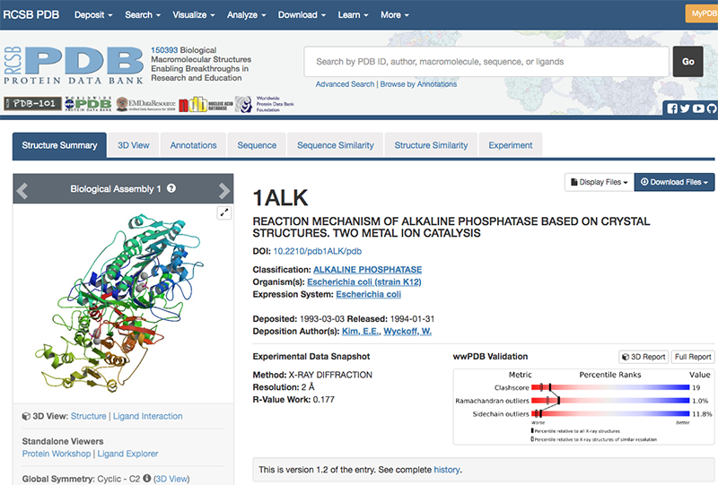
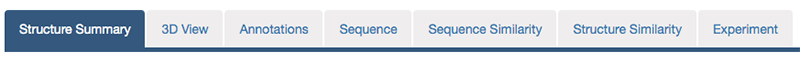
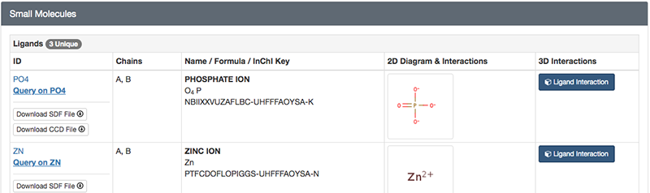

# Chapter 1. PDBに登録されている生体分子構造をPyMOLで眺めてみる
## 1. 目的
酵素などのタンパク質は、それぞれ固有のアミノ酸配列をもち、それが固有の立体構造に折れたたまります。これにより、アミノ酸配列上では離れていた残基同士が接近し、それらが協同して他の分子と相互作用したり化学反応を触媒したりすることができるようになります。タンパク質を含む生体分子が機能を果たすためには、その立体構造が本質的に重要です。生体分子は、ナノメートル（$10^{-9}\ \rm{m}$）オーダーの微小なものですが、X線結晶構造解析法やNMR法、最近ではクライオ電子顕微鏡などの手法を用いて、その立体構造（分子を構成している各原子の$xyz$座標）を決定することができます。それらの構造データは、公共の立体構造データベースに蓄積され、誰もが自由に無料で利用できるようになっている。コンピュータを用いると、これらの立体構造データにインターネットを介してアクセスし、さらに分子グラフィックスソフトウェアを用いてその構造を表示することが可能となります。

人間の肉眼では見えない生体分子をこのようにコンピュータ上で可視化することで、その機能に対する理解をいっそう深めることができます。ここでは練習として、加水分解酵素「**アルカリホスファターゼ**」のアミノ酸配列や立体構造に関するデータをデータベースから取得し、タンパク質の配列－構造－機能の関係を理解することを目的としていきます。それでは早速行ってみましょう。

（ちなみに**アルカリホスファターゼ**は、我々の健康診断の時に肝臓の機能を測る指標としても用いられています。**ALP**の数値のやつです。）

### 2. Protein Data Bank (PDB)にアクセスする
お使いのパソコンにインストールされているウェブブラウザ（Edge, Safari, Google Chrome, Firefoxなど）の検索エンジンに、「PDB」と入れて検索すると、[RCSB PDB](https://www.rcsb.org/)のホームページが表示されます。


画面右上のボックスに「alkaline phosphatase」と入力し，ボックス右のGoボタンを押します。


メニュー左側に現れている「Refinements」の「ORGANISM」に表示されている「Escherichia coli」をクリックします。これで大腸菌由来の「alkaline phosphatase」に検索を絞り込むことができます。


右上の「Displaying 25 Results」の「25」を「All」に変更し，表示された結果の中から「1ALK」を探してクリックします（リストの一番下付近にあります）。


PDBの各エントリには、このように4文字の記号（**PDB ID**）が付けられている。なおPDB IDがあらかじめわかっているときは、テキストボックスにPDB IDを入れてGoボタンを押すことでも、目的の構造のページに移動することができます。これによって、1ALKエントリの内容が表示されます。



最初のページには、このエントリのタイトル、登録日、由来する生物種、立体構造のグラフィックスなどが表示されています。さらに画面上方のタブをクリックすると、このタンパク質に関するさまざまなデータにアクセスできます。現在表示されているのは「Structure Summary」タブの内容です。



このStructure Summaryのタブのページで、以下のデータに注目してみましょう。

「**Macromolecules**」にはこのエントリのタンパク質の簡単な説明が記載されています。検索条件で指定したとおり、大腸菌（Escherichia coli）のアルカリホスファターゼであり、さらに分子量が94687.01であること、 449残基のアルカリホスファターゼ分子がA、 Bの2本のチェイン（鎖）として含まれていることなどがわかります。


「**Small Molecules**」にはこのエントリに含まれるタンパク質以外の低分子化合物や金属などの情報が記載されています。リン酸塩(**PO4**)、亜鉛イオン(**ZN**)、マグネシウムイオン(**MG**)が結合していることがわかります。このアルカリホスファターゼは、本来リン酸エステル化合物を加水分解する酵素であり、リン酸塩はこの酵素の**阻害剤**として結合している無機リン酸です。



## 2. PDB上でタンパク質のさらに詳しい情報を取得する
先述のPDB ID: 1ALK上の上方のタブには

## 3. PDBデータのダウンロード
PDBの構造情報ファイルをダウンロードし、その中身を確認してみましょう。

**分子の立体構造データ**の実体は、**その分子を構成している各原子の$xyz$座標データの集まり**です。PDB ID: 1ALKのStructure Summaryのタブに戻って右上の**Display Files**を左クリックし、さらに**PDB Format**を左クリックすると、開かれたタブの中にPDBデータの中身が表示されます。

最初に`HEADER`レコードや`REMARK`レコード、`SEQRES`レコードなどのヘッダ部があり、下方の`ATOM`（あるいは`HETATM`）レコードに分子を構成する各原子の$xyz$座標などが並んでいます。ヘッダ部には、この分子が由来する生物種や文献情報、構造決定方法に関する情報、アミノ酸配列、単量体か多量体か、構造中に含まれる金属や補酵素の情報などが書かれており、先程まで見ていたPDB ID: 1ALKのウェブページ上ではこれらの情報がわかりやすく整形されて表示されています。座標データは、20種類の標準アミノ酸は`ATOM`レコードに、それ以外の基質や金属、修飾アミノ酸などは`HETATM`レコードに記述されています。1ALKの`ATOM/HETATM`レコードに、タンパク質のAチェイン、 Bチェイン、続いて亜鉛（`ZN`）、マグネシウム（`MG`）、リン酸（`PO4`）、水分子（`HOH`）の座標データが並んでいることを確認してみましょう。


```
HEADER:		PDB IDやタンパク質の種類，データ登録年月日
TITLE:		このデータを得た研究内容の簡単な説明
SOURCE:		その分子の由来（遺伝子名，生物種など）
AUTHOR:		著者名
JRNL:		立体構造が発表された文献情報
REMARK:		X線結晶解析の解像度やその他のコメントなど
SEQRES:		アミノ酸・塩基配列
HET:		標準アミノ酸・塩基以外の金属原子，基質などの情報
HELIX/SHEET/TURN:  2次構造情報
SSBOND:		ジスルフィド（S-S）結合
ATOM:		原子座標など
HETATM:		アミノ酸やヌクレオチド以外の原子（金属，基質化合物など）の座標など
TER: 		チェイン（chain, 鎖）の終わり
END:		エントリの終わり
```

なお、構造ファイルのデータフォーマットは、これまで伝統的に用いられてきた**PDB format**に代わって、2019年7月1日からは**PDBx/mmCIF format**が標準形式として採用されることになっています。このファイル形式は、人間にはわかりにくいがコンピュータで処理しやすい形式になっています。余裕があればこのフォーマットも新規タブで開いてみましょう。

では、大腸菌のアルカリホスファターゼの立体構造データをダウンロードして、手元のコンピュータの中で可視化し、実際の立体構造を見てみましょう。このための可視化ソフトウェアとして、ここでは無料で利用でき、かつ多くの種類のコンピュータ上で動作することができる**PyMOL**を利用します。

再びRCSB PDBの1ALKのページに戻って、画面右上の**Download Files**を左クリックし、メニューの中の**PDB Format**を右クリックして**対象をファイルに保存**を選択します。


ここで、ファイル名を`1alk.pdb`とします。PDBファイルが`ダウンロード`のフォルダにダウンロードされるので、そこから`デスクトップ`にファイルを移動させます。

## 4. PyMOLの起動
（書きかけです）