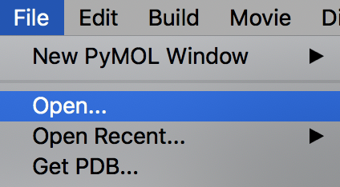
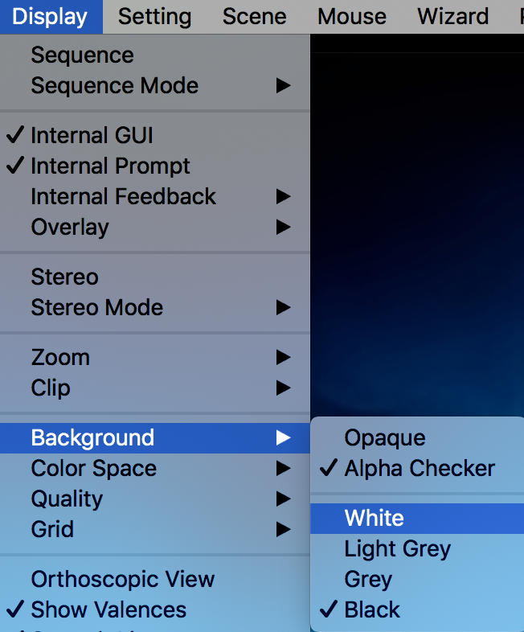
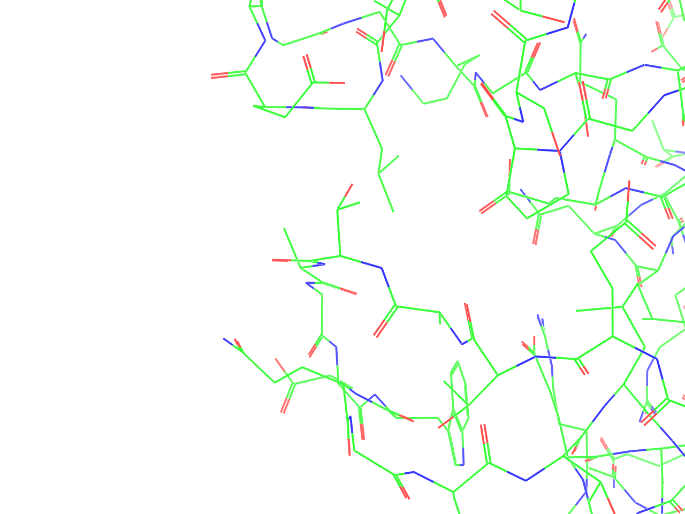
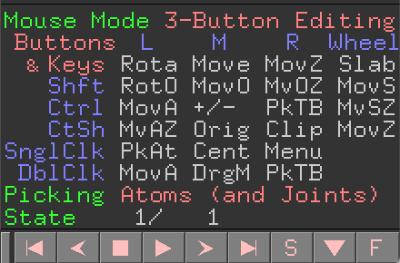
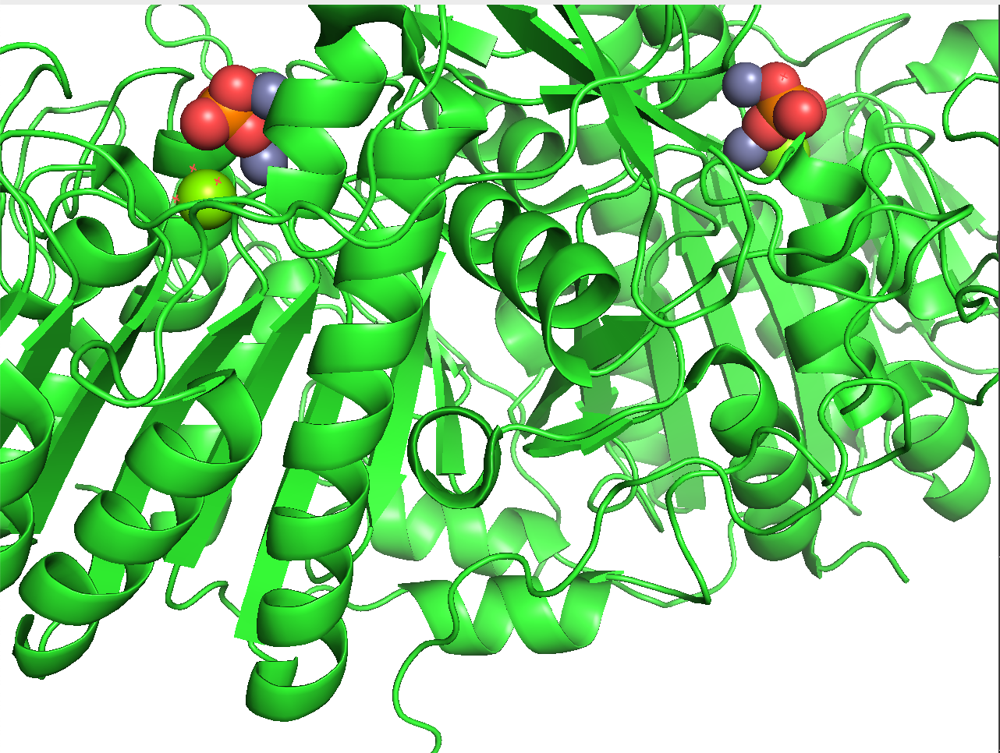
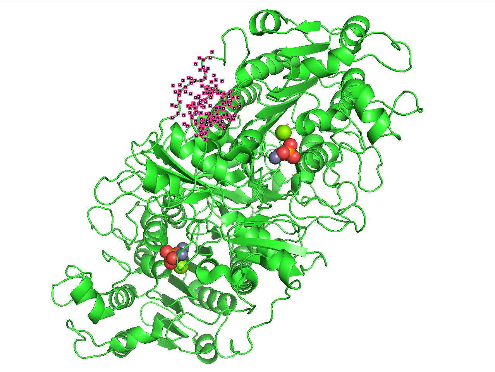
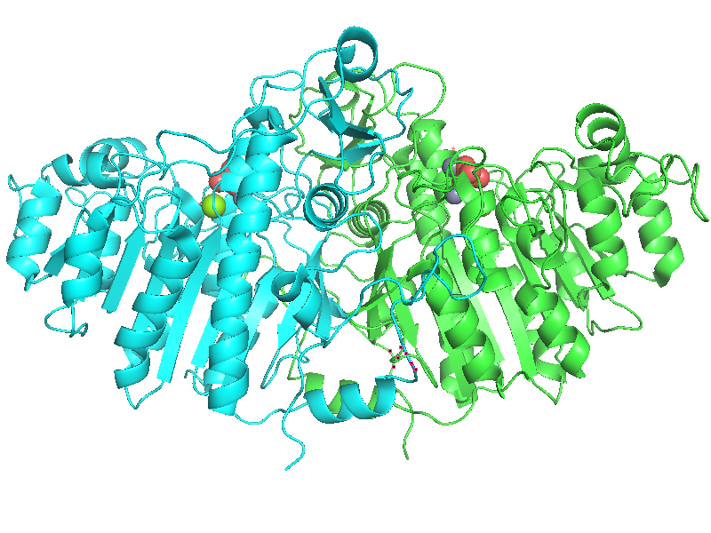
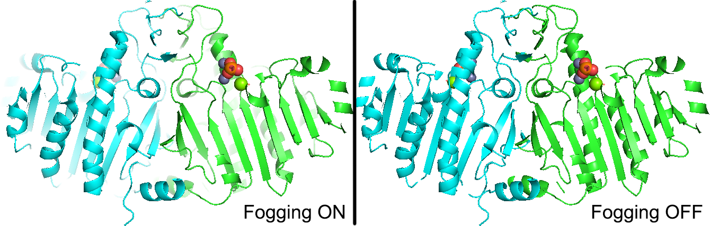

## 1. PyMOLチュートリアル
### 1-1. PyMOLを使ってタンパク質を観察してみる
まずは基本的な使い方に慣れてみるということで、ここではPDBのID: 1ALKに登録されている、大腸菌由来のアルカリフォスファターゼを例に示します。WindowsならMicrosoft Edge、MacであればSafariなどのウェブブラウザから、 https://www.rcsb.org/structure/1alk にアクセスしてみます。

## 2. GUIの使い方
### GUIとは
GUIとはGraphical User Interfaceのことで、マウスを使ってタンパク質オブジェクトを操作したり、設定を変更したりできるユーザーインターフェースのことです。

### 分子構造のロード
メニュー左上の[File]から、[Open...]を選び、PyMOLに表示させたい構造ファイルを選択します。ここでは、先程ダウンロードした `1alk.cif` ファイルを例として、ダブルクリックして表示させてみます。

すると、画面に1ALKのアルカリフォスファターゼの構造が表示されました。はじめは黒背景に緑のタンパク質がオブジェクトが浮かんでいると思いますが、ここで続けて、メニューの[Display]から[Background]->[White]を選択すると、白背景にすることができます。

 

### 配列の表示
分子構造をロードしたら、ここでPyMOL画面の右下に注目してみます。ここには様々な記号や文字が並んでいますが、ここのSボタンを押してみましょう。

このSボタンを押すと、画面に分子の配列情報が現れます。もう一度Sボタンを押すと文字列が隠れます。

ここに表示される配列の文字列は、タンパク質の場合にはA, C, Dなどアミノ酸の1文字表記、核酸構造の場合にはDA, DT, DG, DCで2文字表記となっています。RNAの場合には1文字表記ですが、タンパク質の場合と異なり、各文字にスペースが挿入されて表示されます。リガンドやその他のについては3文字表記で表されることが多いです。これらの表記は、ロードする構造ファイル内の記述に依存してします。

配列の表示・非表示は、上部メニューの[Display]→[Sequence]にチェックを入れたり外したりすることでも行うことができます。

以下に、配列表示ウィンドウ上でのマウス操作を方法を記します。macOSの場合はCtrlはCmdキーになります。
- **左クリック＋ドラッグ**
    - 分子の一部を選択した状態にできます。選択した箇所にはハイライトが付きます。タンパク質の場合は残基ごと、核酸の場合は塩基ごと、それ以外の場合は1分子ごとに選択します。
- **Shift+左クリック**
    - 上記の選択範囲を拡張・縮小することができます。クリックボタンを押し続ける必要はありません。
- **Ctrl+Shift+左クリック**
    - 選択範囲を拡張・縮小しつつ、視点を選択範囲にセンタリングしてくれます。
- **ホイールクリック**
    - クリックした箇所に視点をセンタリングします。
- **Ctrl+ホイールクリック**
    - クリックした箇所に視点を大きくズームします。
- **Ctrl+ホイールクリック+Shift+ドラッグ**
    - Shift+ドラッグで選んだ選択範囲に向かって視点を大きくズームします。
- **右クリック**
    - 選択されていない箇所で右クリックをすると、その位置に存在する配列を選択し、それについての設定変更メニューを表示します。
    - すでに選択されている箇所で右クリックをすると、選択範囲に対する設定変更メニューを表示します。

### オブジェクトパネル
PyMOL画面の右側には、ロードしている分子構造について様々な操作を行えるパネルが表示されています。

画像の例では`all`と`1alk`が表示されています。また、画面上の分子構造をクリックし選択すると、`(sele)`という表示も追加されます。このパネルに表示されている文字のことを**オブジェクト**と呼びます。その右についているA, S, H, L, Cという文字のボタンには、対応するオブジェクトについての表示設定変更・編集を行うためのメニューがたくさん格納されています。それぞれの文字が表す大まかな意味は以下の通り。
- **Action(A)**
    - 視点の移動や分子についての編集、一括設定変更、構造のアラインや名前変更など、オブジェクト全体に関わる様々な設定を行うためのメニューが格納されています。
- **Show (S)**
    - 分子構造の表示形式をONにするためのメニューが格納されています。
- **Hide (H)**
    - 分子構造の表示形式をOFFにするためのメニューが格納されています。
- **Label (L)**
    - 分子構造のすぐそばに表示する文字ラベルを追加するためのメニューが格納されています。
- **Color (C)**
    - 分子構造の色変更を行うためのメニューが格納されています。

### 分子構造の表示形式のON/OFF
タンパク質の構造情報をロードしたとき、デフォルト設定では、20種類のアミノ酸についてはCartoon表示形式と呼ばれる漫画風な表現形式になっています。このCartoon表示形式では、αヘリックスを形成している部分については大きな螺旋で描かれ、βストランド（βシート）を形成している部分については、進行方向に向かって矢印が伸びる表現で描かれています。

タンパク質を構成するアミノ酸を1つ1つ強調して見てみたい場合には、**Cartoon**, **Line**, **Stick**, **Ribbon**, **Sphere**, **Dot**, **Surface**, **Mesh** 表示などの、他の表示形式をONにするという操作を行います。この表示形式の設定は、各オブジェクト構造について個別に行います。例えば、先程ロードした1alkのタンパク質オブジェクトについて他の表示形式をONにしたい場合は、図のように、1alkの**Sマーク部分（図の赤四角部分のボタン）** をクリックします。反対に、OFFにしたい場合は**Hマーク部分（図の青四角部分のボタン）** を押し、各表示形式を選択することでOFFになります。

 

<!--
set_view (\
     0.990649223,   -0.127824500,    0.047657397,\
     0.136341795,    0.915909708,   -0.377514422,\
     0.004605473,    0.380482703,    0.924775600,\
    -0.000116501,   -0.000019159,  -50.788997650,\
    29.517896652,    2.209085464,   19.883510590,\
     0.894756913,  100.680503845,  -20.000000000 )
-->

各表示形式のサンプルを以下に示します。

- **Cartoon表示**
    - 
    - タンパク質やDNA・RNAを表示するときにおすすめです。タンパク質の場合はαヘリックスやβシートが先述のように螺旋や矢印で示されます。DNA/RNAが存在する場合には、各塩基の概形や5'末端→3'末端のつながりが強調して表示されます。
- **Line表示**
    -  
    - 各原子間の結合が細い線で表示されます。上の図では、左にLine表示だけをONにしたものを、右にCartoon表示形式をLine表示とともにONにした場合を右図に示しています（以降、見やすくするためにCartoon表示をONにした上で、他の表示形式を載せます）。
    - 各原子は構造情報ファイルの座標のATOMまたはHETATMレコードに書かれている座標情報（$x$, $y$, $z$の3次元ベクトル）をもとにプロットされ、各原子座標の距離が一定以内にあれば、自動的にその近い2点が直線で結ばれて表示される仕様となっていることに気をつけてください。
- **Stick表示**
    -  
    - 各原子間の結合がLine表示よりも太いStickで表示されます。Stickは円筒状に表現されます。

- **Ribbon表示**
    -  
    - タンパク質または核酸の鎖部分のみを単純な線で表現する形式です。

- **Sphere表示**
    -  
    - 各原子を大きな球体で表現します。Line, Stick表示と異なり、各原子間は直線で結ばれません。

- **Dot表示**
    -  
    - Sphere表示の表面を点で表現したような形式です。

- **Surface表示**
    -  
    - 各原子の表面を滑らかに描画する形式です。分子の大きさによっては、レンダリングに少し時間がかかります。

- **Mesh表示**
    -  
    - Surface表示と似ていますが、表面の描画を網掛けで表現します。

### マウス操作
PyMOLではマウスを使うことでタンパク質を様々な位置、角度から見ることができます。ここで、まずは画面右下のこの部分に着目します。

この赤い四角の部分の一番上には現在**Mouse Mode 3-Button Viewing**と書かれています。ここで、赤い四角の範囲のどこかをクリックすると

Mouse Modeが**3-Button Editing**という表示になりました。また、青い四角の部分も、**Picking Atoms (and Joints)** に変化しました。まずは、この**Viewing Mode**と**Editing Mode**の2つがあることを理解しておきましょう。2つのモードは上記の赤い四角の部分を押すことで入れ替わります。以下ではまず3-Button Viewingにしておきます。

#### 3-Button Viewing Mode
Mouse Mode : 3-Button Viewingでできる操作と、対応するマウスの動きを以下で説明します。操作方法の簡単なヘルプは、上図の赤い四角の部分に英語で書かれています。例えば、Rotaは回転操作、Moveは並進操作、と言った簡単なものですが、もし忘れてしまってもここに着目すれば、操作を思い出すことができるでしょう。

- **回転 (Rota)**
    - **マウスの左ボタンを押しながらマウスを動かす（ドラッグ）** すると、表示されている分子を回転させることができます。
- **並進 (Move)**
    - **マウスのホイールボタンを押しながらドラッグ** すると、表示されている分子を視点に対して平行に移動させることができます。
- **ズームイン・アウト (MovZ)**
    - **マウスの右ボタンを押しながらマウスを前後にドラッグ、またはCtrlとShiftキーを押しながらマウスのホイールを上下** させると、分子構造を拡大・縮小することができます。
- **選択 (+/-)**
    - **表示されているオブジェクトの原子の上でマウスの左ボタンを押す** と、四角のマークが付きます。 
    この四角マークは、現在選択されている原子の範囲を示しています。この左クリックによる選択はクリックするたびに選択範囲に追加され、もう一度押すと選択範囲から外されます。
- **センタリング (Cent)**
    - **表示されているオブジェクトの原子の上でマウスのホイールボタンを押す** と、その原子が画面中央に来るように視点が移動します。また、回転操作の中心もその点に移動します。
- **Origin指定 (Orig)**
    - **表示されているオブジェクトの原子の上でCtrlとShiftを押しながらマウスのホイールボタンを押す** と、その原子を回転中心の原点(origin)に指定することができます。上記センタリングのときと異なり、視点は移動しません。
- **ドラッグで範囲指定して選択範囲に追加/除去 (+Box/-Box)**
    - **Shiftを押しながらマウスの左ボタンをドラッグ** すると、画面上に黒い四角が現れ、ボタンを離すと、その四角で囲まれた部分が選択範囲に追加されます。同様の操作を繰り返すと、その範囲も選択範囲に追加されます**（+Box）** 。
    - **Shiftを押しながらマウスのホイールボタンをドラッグ** すると同様に黒い四角が現れますが、この操作では四角で囲んだ範囲を選択範囲から除去することができます**（-Box）**   
- **メニュー表示 (Menu)**
    - **マウスの左ボタンをダブルクリック** または **右ボタンをクリック** で、メニューを開きます。メニュー内容はクリックした位置によって内容が変化します。
    - 何もない箇所でクリックすると[Main Pop-Up]メニューが表示されます。 
    - オブジェクトの上でクリックすると、クリックした場所に存在する原子についての設定変更を行うメニューが表示されます。 
- **原子ピッキング（PkAt/Pk1）**
    - オブジェクト上の原子の上で**Ctrlボタンを押しながらホイールクリック**、または**マウス右ボタンのダブルクリック**を行うと、その原子をピッキングした状態になります(**PkAt**)。  このピッキング状態は先述の選択範囲とは異なる選択形式で、図のような球体のマーカーが付きます。このピッキングは画面上に同時に4原子まで選択することができ、各ピッキングマーカーは図のように二重、三重、四重の球体マーカーで示されます。
    - **Ctrlボタンを押しながら右クリック (Pk1)** の場合では、上の操作と異なり、1つめの原子ピッキングのみを行います。
    - ピッキングされた原子が2つ、3つ、4つになると、自動でそのピッキングされた原子についての**距離(distance)**、**角度(angle)**、**二面角(dihedral)** を表示してくれます。
- **クリッピング（Clip）**
    - **Shiftとマウスの右ボタン（またはCtrl+Shift+マウス右ボタン）を押しながらマウスを上下左右に動かす** と、分子の内部を覗けたり霧をかけたりすることができます。分子内部の一部の領域を強調した画像を取りたいときに作ります。
    - この機能は2枚の**クリッピング平面（Clipping plane）** によって調節しています。マウスの上下の動きは前面のクリッピング平面(front clipping plane)の位置を、左右の動きは背面のクリッピング平面(rear clipping plane)の位置を調節できます 図解  **画面上にはこの2枚のClipping Planeの間に存在する領域だけが表示されます**。
    - マウスを画面下に移動させるとfront clipping planeは視点から見て奥へ移動し、分子の内部が見えるようになります。反対に、マウスを上へ移動させると、clipping planeは手前に移動します。 
    - マウスを左に移動させるとrear clipping planeが視点から見て奥へ移動します。反対に手前に移動させると、rear clipping planeが手前に移動し、分子の奥側が霧がかかって徐々に見えなくなります。 
    - 霧は画面上部のメニューの[Display]→[Depth Cue(Fogging)]のチェックでON/OFFを選択できます（デフォルトはONです）。 
- **スラビング（Slab）**
    - スラブとは英語で厚板、平板という名詞、または「平板にする」という動詞です。PyMOLにおいて**スラブ（Slab、Visible Slabとも）とは、上述の2枚のクリッピング平面の間に挟まれた可視化領域のこと**を指します。
    - **マウスホイールを回転させる** ことで、スラブの厚さを調節することができます。クリッピングとともに、分子構造の内部領域をみたい時に有用です。
    - 画面上部メニューの[Display]→[Clip]には[8 Angstroam Slab]を始めとして30 Åまでの厚さのスラブを選ぶことができます。[Nothing]を選択した場合には、全原子が含まれるように自動的にスラブの厚みを調節します。
- **スラブの移動（MovS）**
    - **Shiftを押しながらマウスホイールを回転させる** と、スラブ領域を、その厚みを保ったまま手前・奥に移動させることができます。効果を実感したい場合は、例として[8 Angstroam Slab]設定をした直後に使ってみるとわかりやすいでしょう。
- **スラブに対する視点の移動（MvSZ）**
    - **Ctrlを押しながらマウスホイールを回転させる** と、スラブ平面に対して視点を移動させることができます。視点がスラブ内部に入ることもできます。

#### 3-Button Editing Mode
Viewingモードと異なり、Editingモードでは、**原子の座標情報を変更する** ことができます。一度原子の座標を変更してしまうともとに戻せないことが多いので、分子構造を観察することが目的である場合にはこのEditingモードを使わない方が良いでしょう。一方、シミュレーションの初期構造生成で原子の座標をあえて変更する必要がある場合には有用かもしれません。

Editing Modeでマウスの左ボタンをクリックすると、先程の原子ピッキングが働き、4点までピッキングすることができます。Editing Modeの本領はここからで、

- **回転 (Rota)**
    - **マウスの左ボタンを押しながらマウスを動かす（ドラッグ）** すると、表示されている分子を回転させることができます。
- **並進 (Move)**
    - **マウスのホイールボタンを押しながらドラッグ** すると、表示されている分子を視点に対して平行に移動させることができます。
- **ズームイン・アウト (MovZ)**
    - **マウスの右ボタンを押しながらマウスを前後にドラッグ、またはCtrlとShiftキーを押しながらマウスのホイールを上下** させると、分子構造を拡大・縮小することができます。

### セッションの保存

## 3. コマンドライン
