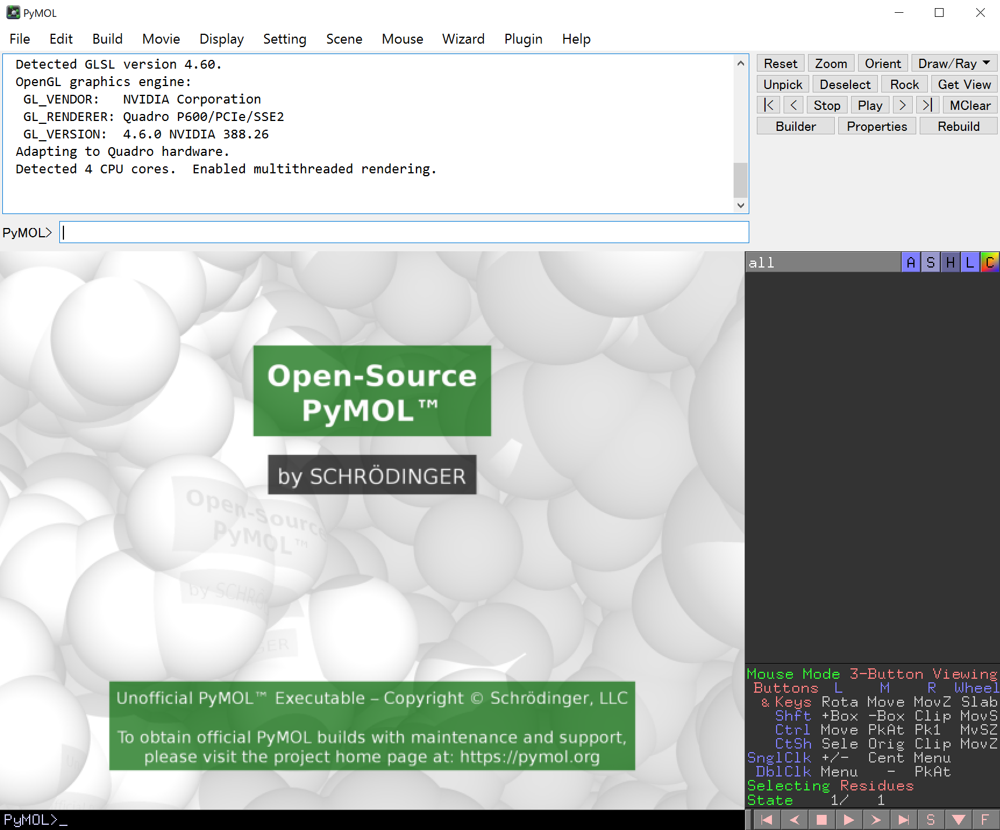

## インストール方法
大きく分けて、**公式ウェブサイトで配布されているバイナリを入れる方法**（バイナリ版）と、**自身でPyMOLをソースコードからビルド＆コンパイルし、インストールする方法**（オープンソース版）の2通りがあります。初心者に対しては確実に前者の方をおすすめしますが、**ライセンス認証を求められる**（一応無視しても使えるが少し煩わしい）というデメリットがあり、反対に後者のやり方では、ライセンス認証は求められないものの、インストールがやや難しく、玄人向けと言えます。

|            |                                             バイナリ版                                             |                                           オープンソース版                                           |
| :--------- | :------------------------------------------------------------------------------------------------: | :--------------------------------------------------------------------------------------------------: |
| メリット   | **インストールがとても簡単**<br>APBSを始めとした、いくつかのプラグインがプリインストールされている |                                       **ライセンス認証が不要**                                       |
| デメリット |                               **起動時にライセンス認証を求められる**                               | **インストールが煩雑**<br>プラグインが同梱されていない（手動で追加インストールすることが求められる） |
| 備考       |        有料ライセンスならば、専用の追加機能を利用できる（特にSchrödinger Maestroとの連携）         |                                                                                                      |

PyMOLライセンスは基本的に有料で、1年または3年契約なのですが、教育用のサブスクリプション(Educational Subscription)ライセンスは、ウェブ上で申請することで**無料**で発行されます。いずれのライセンスを取得する場合でも、まずhttps://pymol.org/2/buy.html にアクセスし、申請フォームを埋めることでライセンス発行の手続きを進めることができます。

### バイナリ版のインストール方法

バイナリ版のインストール方法はとても簡単で、[公式ウェブサイト](https://pymol.org/2/)のDownloadのところからインストーラーを取得することができます。Windows, macOS, Linuxいずれの場合も、基本的にはインストーラーを展開して指示に従ってインストールを進めるだけでOKのはずです。

### オープンソース版のインストール方法
オープンソース版のインストール方法は、OSの種類によって大きく異なります。

#### Windows 10の場合

tonets先生のQiita記事 https://qiita.com/tonets/items/1927058e4297fc1c060d をアップデートする形で書きます。

WindowsではまずPython3が使える環境を構築する必要があります。これには様々な流儀がありますが、Anacondaを使う流儀で紹介します。

まずAnacondaを使ってPythonをインストールします。このときのバージョンはPython3.8です。

https://www.anaconda.com/products/individual

インストーラーをダウンロードしてきたら基本的にはデフォルトのままNextを押していきます。個人（only me）にインストールするか、システム全体にインストールするかを聞かれるところがありますが、ここでは個人を選択しておきます。

インストールされた場所を確認します。おそらく`C:\Users\ユーザー名\Anaconda3\`に `python.exe`があります。

コマンドプロンプトを立ち上げて（ショートカットキーWin+Rを押したあと、`cmd`と入力すると早い、もしかすると管理者権限が必要かも）、`cd C:\Users\ユーザー名\Anaconda3`としてAnaconda3のディレクトリに移動した後

```
python.exe -m pip install --upgrade pip
```

として、`pip`をアップグレードする処理が働くかどうかを確認します。

ここでもし

```
pip is configured with locations that require TLS/SSL, however the ssl module in Python is not available.
```
というエラーが出る場合、OpenSSLの設定がうまくできていないみたいなので、以下のような回避策を行います。

Windowsのスタートボタンにある検索メニューに**環境変数名の編集**と入力し、環境変数の変数を行います。ここではPathの部分をダブルクリックし、画像のように環境変数名を編集して追加します。


一番下の設定は、私の環境では`Anaconda3\pkgs\openssl-1.1.1h-he774522_0\Library\bin`でしたが、Anacondaのバージョンによって微妙にopensslのディレクトリ名が変わるので、適宜確認してから入力してください。

この環境変数を追記したら、改めてコマンドプロンプトをいったん閉じて開き直し、`pip`のアップグレードがうまく行われることを確認してください。

うまくアップグレードされたようでしたら、次にPyMOLのビルドに必要なパッケージをダウンロードしインストールします。必要なファイルは https://www.lfd.uci.edu/~gohlke/pythonlibs/ の**Pymol-open-source**にある

- pymol_launcher-2.1-cp38-cp38-win_amd64.whl
- pymol-2.4.0-cp38-cp38-win_amd64.whl
- Pmw-2.0.1-py3-none-any.whl

と、**NumPy**のところにある

- numpy-1.19.5+mkl-cp38-cp38-win_amd64.whl

です。注意点として、`cpXX`の数字は必ずAnacondaのPythonバージョンと合わせてください。例えばAnacondaのPythonバージョンがPython 3.8.xならば、`cp38`を選びます。時間が経つに連れ、バージョンがともにアップデートされていきますので、それに合わせます。また、`win32`と`win_amd64`がありますが、これは今の時代でしたら基本的には`win_amd64`の方を使います。`win32`はたぶんそのうち絶滅します。また、現在`pymol-2.5.0a0`も存在していますが、基本的に`a0`は未完成の試作品なので、安定動作を取りたい人は手を出さないほうが良いでしょう。

これらを揃えたら、先程の`Anaconda3`の`python.exe`があったディレクトリに入れておきます。そしてコマンドプロンプトを開き、以下の順でインストールを行います。

```
C:\Users\ユーザー名>cd C:\Users\ユーザー名\Anaconda3
C:\Users\ユーザー名\Anaconda3> python.exe -m pip install Pmw-2.0.1-py3-none-any.whl
C:\Users\ユーザー名\Anaconda3> python.exe -m pip install numpy-1.19.5+mkl-cp38-cp38-win_amd64.whl
C:\Users\ユーザー名\Anaconda3> python.exe -m pip install pymol-2.4.0-cp38-cp38-win_amd64.whl
C:\Users\ユーザー名\Anaconda3> python.exe -m pip install pymol_launcher-2.1-cp38-cp38-win_amd64.whl
```

pymolのインストールはPmw, numpyの後にやりましょう。

以上でインストールが完了します。`C:\Users\ユーザー名\Anaconda3` の下に `PyMOL.exe` ができています。これをダブルクリックすればPyMOLが立ち上がります。


ドックにこのアイコンを登録しておけば簡単に開くことができます。

ところで、このインターフェイスはレガシーなTcl/Tkによる描画で、現在PyMOL側はこの表示を推奨していません。そこで、モダンなPyQt5を使った描画に変更します。これは簡単で

```
C:\Users\ユーザー名>cd C:\Users\ユーザー名\Anaconda3
C:\Users\ユーザー名\Anaconda3> python.exe -m pip install pyqt5
```

を行うだけです。途中


エラーメッセージが出ることもありますが、最後にSuccessfully installedと書かれていれば問題ありません。

この設定をした後に改めてPyMOL.exeを開けば、インターフェイスが変化しています。



こちらの方が文字やボタンがきれいに表示されるので個人的に好きです。

#### macOSの場合
以下の環境を想定しています。

##### マシン環境
-   macOS 11.1 (Big Sur), 2.8GHz Intel Core i7, メモリ16GB
-   [ターミナルからHomebrewをインストール](http://brew.sh/index_ja.html)してある
-   [Xquartzをインストール](http://xquartz.macosforge.org/landing/)してある

また、Homebrewで入れたものを優先的に使うよう、`~/.bash_profile(or ~/.bashrc)`などの設定ファイルにHomebrewのパッケージの優先度を上げるための

    export PATH="/usr/local/bin:$PATH"

を追記しておきます。

##### 概要
PyMOL 2以降では**legacyで時代遅れなpython2がなくても動作するようになったようです**。よって現行のPython 3.7のみで動作させることができるようです。またGUIインターフェースとしてこれまでtcl-tkを使っていたようでしたが、これもPyQt（ぱいきゅーと）5などのきれいなインタフェースを利用できるようになりました。ただし、相変わらずPyMOLはたくさんのプログラム依存の上に成り立っているため、少なくとも以下のプログラムをインストールしておく必要があります（PyMOL 2.3.0時点）。

- C++11 compiler (e.g. gcc 4.7+)
- Python 2.7+
- Pmw (Python Megawidgets) (optional, for legacy GUI/plugins)
- OpenGL
- GLEW
- GLUT (freeglut) (optional, enable with --glut)
- libpng
- freetype
- libxml2 (optional, for COLLADA export, disable with --no-libxml)
- msgpack-c 2.1.5+ (optional, for fast MMTF loading and export,
    disable with --use-msgpackc=no)
- mmtf-cpp (for fast MMTF export, disable with --use-msgpackc=no)
- PyQt5, PyQt4, PySide2 or PySide (optional, will fall back to Tk
    interface if compiled with --glut)
- glm
- catch2 (optional, enable with --testing)

を用意しておく必要があります。optionalとついているものは無くても動作しますが、今回はcatch2以外の全部を使用してインストールを試みます。mmtfというのはpdbの最新式バイナリ型PDBファイルで、ファイルサイズを非常に高効率で圧縮できるのが特徴です（ https://mmtf.rcsb.org/index.html ）。PyMOL 2.2からmmtf形式へのエクスポートにも対応したようです。興味がある方はこれも入れてインストールしてみましょう。

#### Homebrewで一発インストールする方法(推奨)

アプリケーション > ユーティリティ > ターミナルを開き、[Homebrewをインストール](http://brew.sh/index_ja.html)してあることが条件です。この状態で、ターミナルから、

```bash
brew install pymol
```

と入力します。これで一発でインストールすることができます。終わったら、**一度Command+Qキーでターミナルを完全に閉じてから**、もう一度ターミナルを開いて

```bash
pymol #または /usr/local/bin/pymol
```

でオープンソース版pymolが立ち上がります。このときターミナルにメッセージが流れるのが煩わしいと感じる場合は

```bash
pymol > /dev/null 2>&1 &
```

で開くのも良いでしょう。

#### CentOS 7.5の場合
##### 環境
-   CentOS 7.5
-   sudo権限が使える場合

##### インストール方法
上のMacと似たような流れでインストールすることができます。また必要なパッケージのほとんどは管理者のyumを使ってシステムに直接インストールできるのでとても簡単です。rootでない管理者の場合はyumの前にsudoをつけて実行します。

```bash
yum -y install epel-release
yum -y install gcc gcc-c++ python-devel tkinter glew-devel freeglut-devel \
libpng-devel freetype-devel libxml2-devel glm-devel msgpack
yum -y install python36u-pip
# pip3.6の場所の確認
which pip3.6
# 現在使用中のpython3環境にpip3.6で追加パッケージをインストールする
pip3.6 install --upgrade pip
pip3.6 install sip pyqt5 pmw
pip3.6 install msgpack-python msgpack-tool mmtf-python
# PyMOL 2.3のソースコードをダウンロードして、ビルド＆インストール
cd /path/to/pymol-open-source
# rm -rf build #インストールでエラーが出てしまった場合、再インストールを試す前にbuildディレクトリを消しておく
python3.6 setup.py build install --prefix=/path/to/pymol/2.3 --glut --use-msgpackc=c++11
```

だいたいこの流れでインストールができると思います。ただし、もしGTX 1080TiなどのNVIDIAグラフィックドライバを積んでいる場合にはそちらに切り替えたほうがPyMOLのGUI操作がサクサクになると思われますので、その設定もしておくと良いでしょう。
参考：[CentOS 7 上で PyMOL をソースからビルド](https://qiita.com/inferist/items/770a88151d27fa117111)

#### Ubuntu 18.04の場合
##### 環境
-   Ubuntu 18.04
-   sudo権限が使える場合

##### インストール方法
`apt`を使ってパッケージをインストールした後、後はだいたいCentOS 7のときと流れは同じです。Python 3のバージョンは3.6、3.7どちらを使っても大丈夫です（下の例では3.6にしています）。

```bash
sudo apt install freeglut3-dev python2.7-dev python3.6-dev \
libxml2-dev gcc tcl8.6-dev tk8.6-dev python3-tk \
libmsgpack-dev libpng-dev libglew2.0 libfreetype6-dev \
libglm-dev libglew-dev python-pyqt5.qtopengl
# python3.6に対応したpipのインストール
sudo apt install python3-pip
# 現在使用中のpython3環境にpip3で追加パッケージをインストールする
sudo pip3 install --upgrade pip
sudo pip3 install sip pyqt5 pmw
sudo pip3 install msgpack-python
# 新しい依存パッケージmmtf-cppを/usr/localにインストール https://github.com/rcsb/mmtf-cpp
sudo apt install ninja-build cmake
wget https://github.com/rcsb/mmtf-cpp/archive/v1.0.0.tar.gz
tar zxvf v1.0.0.tar.gz
cd v1.0.0
mkdir build ; cd build
cmake -G Ninja ..
sudo ninja install
# PyMOL 2.3のソースコードをダウンロードして、ビルド＆インストール
wget https://github.com/schrodinger/pymol-open-source/archive/v2.3.0.tar.gz
tar zxvf v2.3.0.tar.gz
cd pymol-open-source-2.3.0
# rm -rf build #インストールでエラーが出てしまった場合、再インストールを試す前にbuildディレクトリを消しておく
python3 setup.py build install --prefix=/path/to/pymol/2.3 --glut --use-msgpackc=c++11
```

### プラグインのインストール方法

#### PyMOL 2からのプラグイン
バイナリ版PyMOL2.0に存在したプラグインはこちらのソースビルド版には初期状態で入っていません。しかし特にAPBS pluginなどは論文で使う研究者も多いはずです。macOSの場合、すでにこのバイナリ版PyMOLを持っているならば、`/Applications/PyMOL.app/Contents/share/pymol/data/startup/`にあったプラグインを`~/apps/pymol/2.3/lib/python3.7/site-packages/pymol/pymol_path/data/startup`に持ってくると使うことができます。

```bash
# 手動インストールの場合はこっち
# cp -rp /Applications/PyMOL.app/Contents/share/pymol/data/startup/* /path/to/pymol/2.3/lib/python3.7/site-packages/pymol/pymol_path/data/startup
# homebrewでインストールした場合はこっち
cp -rp /Applications/PyMOL.app/Contents/share/pymol/data/startup/* /usr/local/Cellar/pymol/2.3.0/libexec/lib/python3.7/site-packages/pymol/pymol_path/data/startup/
```

APBSやPDB2PQRのプラグインへのPATHは各自設定してください。
