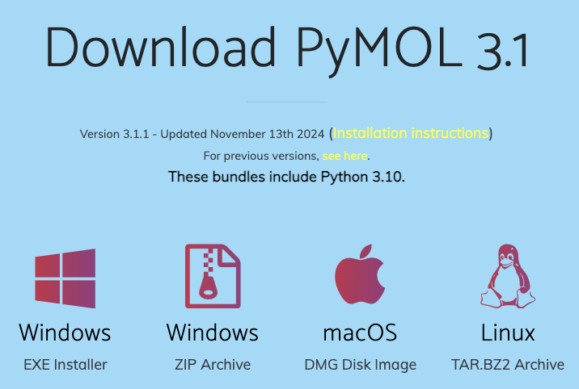

## インストール方法

2024年現在、PyMOLのインストール方法は、大きく分けて

- **公式ウェブサイトで配布されているバイナリを入れる方法**（バイナリ版）と、
- **自身でPyMOLをソースコードからビルド＆コンパイルし、インストールする方法**（オープンソース版）

の2通りがあります。初心者に対しては確実に前者の方をおすすめしますが、**ライセンス認証を求められる**（一応無視しても使えるが少し煩わしい）というデメリットがあり、反対に後者のやり方では、ライセンス認証は求められないものの、インストールがやや難しく、玄人向けと言えます。

|            |                                             バイナリ版                                             |                                           オープンソース版                                           |
| :--------- | :------------------------------------------------------------------------------------------------: | :--------------------------------------------------------------------------------------------------: |
| メリット   | **インストールがとても簡単**<br>APBSを始めとした、いくつかのプラグインがプリインストールされている |                                       **ライセンス認証が不要**                                       |
| デメリット |                               **起動時にライセンス認証を求められる**                               | **インストールが煩雑**<br>プラグインが同梱されていない（手動で追加インストールすることが求められる） |
| 備考       |        有料ライセンスならば専用の追加機能を利用できる（特にSchrödinger Maestroとの連携）         |                                                                                                      |

PyMOLライセンスは基本的に有料で、1年または3年契約なのですが、教育用のサブスクリプション(Educational Subscription)ライセンスは、ウェブ上で申請することで**無料**で発行されます。いずれのライセンスを取得する場合でも、まず<https://pymol.org/2/buy.html> にアクセスし、申請フォームを埋めることでライセンス発行の手続きを進めることができます。

### バイナリ版のインストール方法

バイナリ版のインストール方法はとても簡単で、[公式ウェブサイト](https://pymol.org/2/)のDownloadのところからインストーラーを取得することができます。Windows, macOS, Linuxいずれの場合も、基本的にはインストーラーを展開して指示に従ってインストールを進めるだけでOKです。



Windowsの場合はEXE InstallerとZIP archiveの2つがあります。Installerの場合は指示に従ってインストール操作を行ってください。ZIP版の場合は展開してそのままダブルクリックを行うことでも使用可能になります。macOSの場合はdmg Installerがあり、これをダブルクリックしてインストールするだけでOKです。

### オープンソース版のインストール方法

オープンソース版のインストール方法は、OSの種類によって大きく異なります。

#### Windows 10の場合

（内容が古くなっているので消去しました。）

#### macOSの場合

アプリケーション > ユーティリティ > ターミナルを開き、[Homebrewをインストール](https://brew.sh/ja/)してあることが条件です。この状態で、ターミナルから、

```bash
brew install pymol
```

と入力します。これで一発でインストールすることができます。終わったら、**一度Command+Qキーでターミナルを完全に閉じてから**、もう一度ターミナルを開いて

```bash
pymol
```

でオープンソース版pymolが立ち上がります。このときターミナルにメッセージが流れるのが煩わしいと感じる場合は

```bash
pymol > /dev/null 2>&1 &
```

で開くのも良いでしょう。
