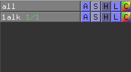
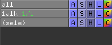

## PyMOLの用語集

気づいたら書いていきます。

### オブジェクト (object)

PyMOL上の**オブジェクト**とは、PyMOL上に表示された構造ファイル、または選択範囲のことです。特に、PyMOLの右側のメニューはオブジェクトを操作する**オブジェクトパネル**と呼ばれます。

PyMOLでは構造情報だけでなく、選択範囲についてもオブジェクトのように扱うことができ、`(sele)`として表示されます。この他にも()で示されるオブジェクトが登場することがありますが、それらは選択範囲のオブジェクトであり、構造情報のオブジェクトとは区別されます。

### セグメント（segment identifier）

**セグメント**とは、構造ファイルの中のsegment identifier(segment ID)に登録されている情報のことです。かつて`.pdb`ファイル形式が主流だった頃、segment identifierは原子の座標を記述する`ATOM`, `HETATM`レコードの中の73〜76行目に記述するようになっていました。特に、同一chain IDにありながらある種の原子のグループごとに分けて記述したい場合（例：共有結合しているタンパク質とリガンドを分けたい時）に用いられましたが、今はChain IDで分けるのが主流となっています。segment identifierは現在廃止された仕様ですが、PyMOLやChimera, CHARMMなど一部のプログラムは未だにこれを利用することができます。
