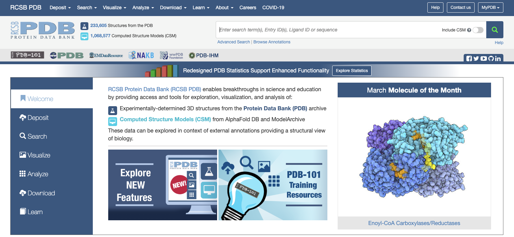
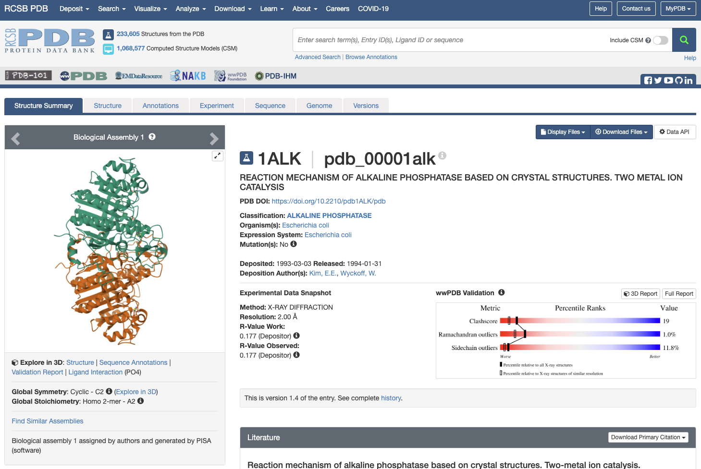

## Protein Data Bank (PDB)にアクセスする

お使いのパソコンにインストールされているウェブブラウザ（Edge, Safari, Google Chrome, Firefoxなど）の検索エンジンに、「PDB」と入れて検索すると、[RCSB PDB](https://www.rcsb.org/)のホームページが表示されます。

画面右上のボックスに「alkaline phosphatase」と入力し，ボックス右のGoボタンを押します。

メニュー左側に現れている「Refinements」の「ORGANISM」に表示されている「Escherichia coli」をクリックして▶ボタンをクリックします。これで大腸菌由来の「alkaline phosphatase」に検索を絞り込むことができます。

表示された結果の中から「1ALK」を探してクリックします。

PDBの各エントリには、このように4文字の記号（**PDB ID**）が付けられています。なお、PDBのIDがあらかじめわかっている場合はテキストボックスにPDB IDを入れてGoボタンを押すことでも目的の構造のページに移動することができます。これによって、1ALKエントリの内容が表示されます。

最初のページには、このエントリのタイトル、登録日、由来する生物種や立体構造のグラフィックスなどが表示されています。さらに画面上方のタブをクリックすると、このタンパク質に関するさまざまなデータにアクセスできます。現在表示されているのは「Structure Summary」タブの内容です。

このStructure Summaryのタブのページで、以下のデータに注目してみましょう。

「**Macromolecules**」にはこのエントリのタンパク質の簡単な説明が記載されています。検索条件で指定したとおり、大腸菌（Escherichia coli）のアルカリホスファターゼであり、さらに分子量が94687.01であること、 449残基のアルカリホスファターゼ分子がA、 Bの2本のチェイン（鎖）として含まれていることなどがわかります。

「**Small Molecules**」にはこのエントリに含まれるタンパク質以外の低分子化合物や金属などの情報が記載されています。リン酸塩(**PO4**)、亜鉛イオン(**ZN**)、マグネシウムイオン(**MG**)が結合していることがわかります。このアルカリホスファターゼは、本来リン酸エステル化合物を加水分解する酵素であり、リン酸塩はこの酵素の**阻害剤**として結合している無機リン酸です。

