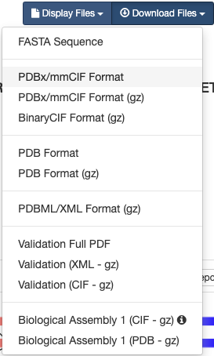

## PDBデータのダウンロード
PDBの構造情報ファイルをダウンロードし、その中身を確認してみましょう。

**分子の立体構造データ**の実体は、**その分子を構成している各原子の\\( xyz \\)座標データの集まり**です。PDB ID: 1ALKのStructure Summaryのタブに戻って右上の**Display Files**を左クリックし、さらに**PDB Format**を左クリックすると、開かれたタブの中にPDBデータの中身が表示されます。

最初に`HEADER`レコードや`REMARK`レコード、`SEQRES`レコードなどのヘッダ部があり、下方の`ATOM`（あるいは`HETATM`）レコードに分子を構成する各原子の\\( xyz \\)座標などが並んでいます。ヘッダ部には、この分子が由来する生物種や文献情報、構造決定方法に関する情報、アミノ酸配列、単量体か多量体か、構造中に含まれる金属や補酵素の情報などが書かれており、先程まで見ていたPDB ID: 1ALKのウェブページ上ではこれらの情報がわかりやすく整形されて表示されています。座標データは、20種類の標準アミノ酸は`ATOM`レコードに、それ以外の基質や金属、修飾アミノ酸などは`HETATM`レコードに記述されています。1ALKの`ATOM/HETATM`レコードに、タンパク質のAチェイン、 Bチェイン、続いて亜鉛（`ZN`）、マグネシウム（`MG`）、リン酸（`PO4`）、水分子（`HOH`）の座標データが並んでいることを確認してみましょう。


```
HEADER:		PDB IDやタンパク質の種類，データ登録年月日
TITLE:		このデータを得た研究内容の簡単な説明
SOURCE:		その分子の由来（遺伝子名，生物種など）
AUTHOR:		著者名
JRNL:		立体構造が発表された文献情報
REMARK:		X線結晶解析の解像度やその他のコメントなど
SEQRES:		アミノ酸・塩基配列
HET:		標準アミノ酸・塩基以外の金属原子，基質などの情報
HELIX/SHEET/TURN:  2次構造情報
SSBOND:		ジスルフィド（S-S）結合
ATOM:		原子座標など
HETATM:		アミノ酸やヌクレオチド以外の原子（金属，基質化合物など）の座標など
TER: 		チェイン（chain, 鎖）の終わり
END:		エントリの終わり
```

なお、構造ファイルのデータフォーマットは、これまで伝統的に用いられてきた**PDB format**に代わって、2019年7月1日からは**PDBx/mmCIF format**が標準形式として採用されることになっています。このファイル形式は、人間にはわかりにくいがコンピュータで処理しやすい形式になっています。余裕があればこのフォーマットも新規タブで開いてみましょう。

では、大腸菌のアルカリホスファターゼの立体構造データをダウンロードして、手元のコンピュータの中で可視化し、実際の立体構造を見てみましょう。このための可視化ソフトウェアとして、ここでは無料で利用でき、かつ多くの種類のコンピュータ上で動作することができる**PyMOL**を利用します。

再びRCSB PDBの1ALKのページに戻って、画面右上の**Download Files**を左クリックし、メニューの中の**PDB Format**を右クリックして**対象をファイルに保存**を選択します。



ここで、ファイル名を`1alk.pdb`とします。PDBファイルが`ダウンロード`のフォルダにダウンロードされるので、そこから`デスクトップ`にファイルを移動させます。