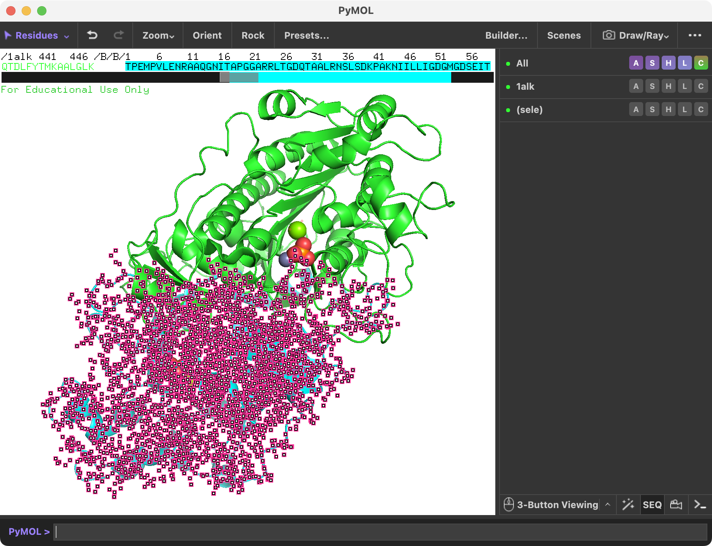

### チェインごとの色分け
このアルカリホスファターゼがホモ2量体であることをわかりやすく表示するために、Aチェインを緑色（デフォルト）、Bチェインを水色（cyan）で表示してみます。PyMOL右下の画面に`S`という小さなボタンがあるので、ここを押すと、タンパク質が表示されている画面の上にアミノ酸配列が現れます（参考： [配列の表示について](../ch02/dispseq.md) ）。

今表示されたアミノ酸配列の上で、マウスを使ってチェインBをすべて選択します。次に、色の設定を参考にしてチェインBを水色に変更します（参考：[色の設定](../ch02/color.md) ）。

※ PyMOLの画面上に存在する入力欄`PyMOL> `の所（中段上と一番下の2ヶ所に存在しますが、どちらに入力してもOK）で上や下の矢印キーを押すと、それまでに入力したコマンドを再び呼び出すことができます。また左右の矢印キーを使って、以前使ったコマンドを自由に編集できます。同じコマンドを何度も入力するのは面倒なので、上下左右の矢印キーを上手に使いましょう。