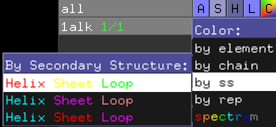

### 二次構造ごとの色分け
この大腸菌アルカリホスファターゼを、今度は二次構造による色分けを使って表示してみます（参考： [色の設定について](../ch02/color.md) ）。

オブジェクトパネルにおける`1ALK`のCのところをクリックし、Colorのメニューのところで、[by ss]にマウスを重ねます。色分けの種類はデフォルトで3種類用意されており、どれを使っても問題ありませんが、ここでは一番上の例（ヘリックス:赤; シート:黄; ループ:緑）のカラーリングで表示してみます。

このように表示されるはずです。

ここで、大腸菌アルカリホスファターゼの立体構造のCATHによる分類は、"Alpha Beta 3-Layer(aba) Sandwich"とされています。Cartoon表示で見る角度を調節して、このタンパク質の立体構造がCATHの分類通りにAlpha Betaの3層構造を形成していることを確認してみましょう。