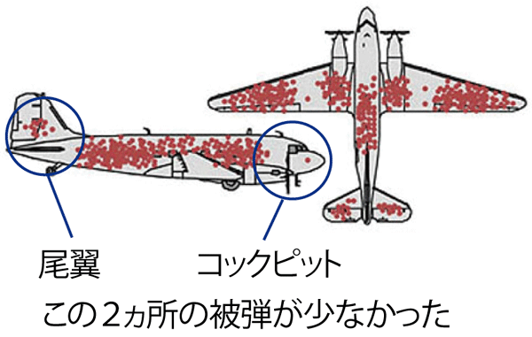

# タンパク質の位置依存的なアミノ酸保存度の違いを理解する

これまで見てきたように、タンパク質の内部は疎水性アミノ酸で充填されており、外側には水に溶けやすい親水性残基を露出することで水溶液中に存在しているというのがタンパク質の構築原理でした。一方、タンパク質は構造を保つだけでなく、リガンドを結合したり、化学反応を触媒したりする**機能**を持つことが生体内で特に重要です。言い換えれば、タンパク質は限られた20種類のアミノ酸をうまく使い分けることで、**内部構造を保ちつつ、そして機能も発現させなければならない**という二面性を持っています。

しかし、タンパク質を使って生きている生物というものは不思議なもので、すでにヒトと大腸菌のアルカリホスファターゼで見てきた通り、同じ機能を持つタンパク質であっても、それを構成しているアミノ酸配列を調べてみると、配列間の相同性が2〜3割しかないということもよく見られます。これは一体どういうことでしょうか？

以上のことを、アルカリホスファターゼについて確認してみましょう。まずは、PDBsumというタンパク質についての情報をまとめたウェブサイト上に行ってみます。ここには、[アミノ酸の生物種間での保存度が1残基ずつカラーリングされているページ](http://www.ebi.ac.uk/thornton-srv/databases/cgi-bin/pdbsum/GetPage.pl?pdbcode=1alk&template=protein.html&o=RESCONS&l=1&chain=A&c=999&r=wiring)があります。このカラーリングは、水色ほど保存度が低く（異なる種由来のアルカリホスファターゼでは）

答えを言えば、タンパク質は**その機能を失わず、かつタンパク質の形を安定に保つという生命活動にとって合理的な目的さえ果たせれば、それを構成するアミノ酸配列はある程度自由に構成することができる**からです。アルカリホスファターゼの例で言えば、リン酸モノエステル化合物を加水分解するという機能を損なわず、かつタンパク質全体の構造が壊れなければ、使うアミノ酸は何でもOKなわけです。

ところで、2019年12月現在までに、様々な生物から得られた1.8億ほどのアミノ酸配列が[Uniprotデータベース](https://www.uniprot.org/)上に存在しています。アルカリホスファターゼについても、ヒト・大腸菌以外にも様々な種由来のアミノ酸配列が登録されています。バイオインフォマティクスの分野で有名な[BLAST](https://blast.ncbi.nlm.nih.gov/Blast.cgi)や[HMMER](http://hmmer.org/)などの配列検索ツールを使えば、この最大1.8億の配列データベースの中から、興味対象のアミノ酸配列（例：アルカリホスファターゼ）の類縁の配列を超高速に取得してくることができます。これらは、長い生物の進化の歴史の中で、タンパク質をコードするDNAに「変異」が入ることで異なるアミノ酸に翻訳されたり、欠損が生じたり、挿入が生じたりすることがあっても、なお機能を失わずタンパク質の形を保って生き残ってきたタンパク質たちです。先程の配列解析ツールを使えば、ものにもよりますが、クエリ（IT用語で「問い合わせ」・「情報要求」）としたアルカリホスファターゼのアミノ酸配列に対し、数百〜数千の類縁配列を取得することができるでしょう。

取得したたくさんの類縁配列は、配列アライメントのソフトウェアを使うことできれいに並べて表示することができます。ここで注意してもらいたいことに、配列を並べたときに、ほぼまったく変異が入らない位置があることがわかります。

（現在書きかけです）

<!--
実はこの配列解析の結果には**選択バイアス**の一種である**生存バイアス**があることに気付くでしょうか？　アミノ酸の変異は外側に

この画像を見たことがある方もいらっしゃるかもしれません。これは、第2次世界大戦中でアメリカ軍の基地に帰還することができた爆撃機の被弾箇所（赤色）を表す図です。帰還した爆撃機の損傷部分は、命中しても安全に帰還できる箇所を示しており、他の箇所に命中したものは生還できないのです。
-->