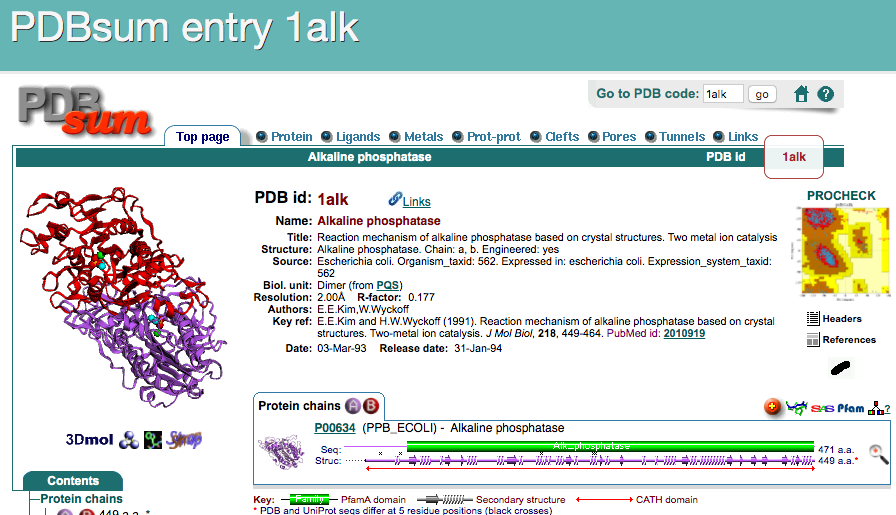
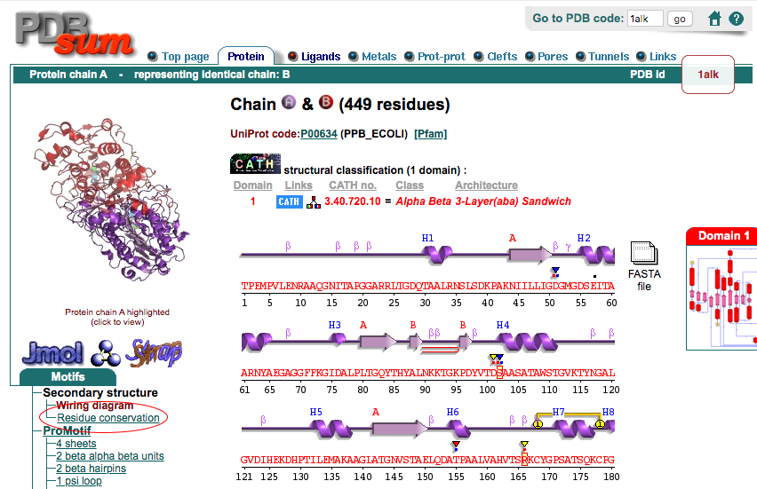
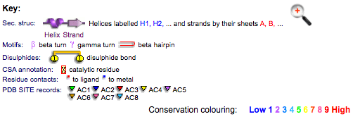
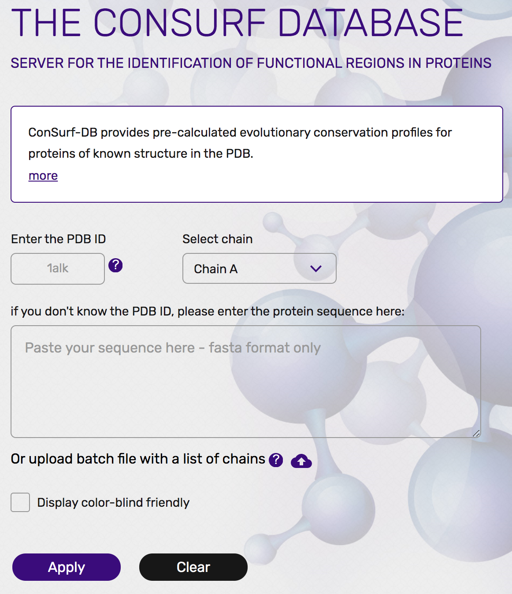

## タンパク質の位置依存的なアミノ酸保存度の違いを理解する

これまで見てきたように、タンパク質の内部は疎水性アミノ酸で充填されており、外側には水に溶けやすい親水性残基を露出することで水溶液中に存在しているというのがタンパク質の構築原理でした。一方、タンパク質は構造を保つだけでなく、リガンドを結合したり、化学反応を触媒したりする**機能**を持つことが生体内で特に重要です。言い換えれば、タンパク質は限られた20種類のアミノ酸をうまく使い分けることで、**内部構造を保ちつつ、そして機能も発現させなければならない**という二面性を持っています。

しかし、タンパク質を使って生きている生物というものは不思議なもので、すでにヒトと大腸菌のアルカリホスファターゼで見てきた通り、同じ機能を持つタンパク質であっても、それを構成しているアミノ酸配列を調べてみると、配列間の相同性が2〜3割しかないということもよく見られます。これは一体どういうことでしょうか？

以上のことを、アルカリホスファターゼについて確認してみましょう。まずは、**PDBsum** ([https://www.ebi.ac.uk/thornton-srv/databases/cgi-bin/pdbsum/GetPage.pl?pdbcode=index.html](https://www.ebi.ac.uk/thornton-srv/databases/cgi-bin/pdbsum/GetPage.pl?pdbcode=index.html)) というデータベースに登録されているデータを用います。PDBsumはPDBに登録された生体分子の構造データを加工したデータベースの1つで、配列・構造情報・リガンド結合・文献情報などをわかりやすくまとめてあります。ここのトップページのフォームに、調べたいPDBデータのIDを入れてFindボタンを押します。

すると、PDB ID: 1ALKについてのページに移ります。このトップページには構造の図とともに、タンパク質の分類・リガンド情報・化学反応・一次文献情報・この構造を引用している論文一覧……などが表示されています。

さらに、上部にあるタブをクリックすることで、さらに他の詳細な情報を表示させることができます。ここではProteinタブをクリックしてみましょう。

Proteins タブ、ページ左側にあるMotifsメニューのSecondary structure, Residue conservationをクリックすると（上図の赤丸部分）、アミノ酸の生物種間での保存度が1つずつカラーリングされているページが現れます。

この1文字表記のアミノ酸配列を見てみると、青〜緑〜黄〜赤までのカラーリングがなされていることに気づくと思います。**このカラーリングはこの大腸菌アルカリホスファターゼの類縁配列上で、そのアミノ酸の位置がどれほど保存されているかを表しています**（ページ下部に説明が書かれてあります）。言い換えれば、大腸菌アルカリホスファターゼについて他の類縁配列とのマルチプルシーケンスアライメントを作成してみたとき、ある位置のアミノ酸の種類が他の類縁配列上でも同じであればその位置のアミノ酸の保存度は高く、逆に他の類縁配列上でバラバラな様子が観測されていればその位置のアミノ酸の保存度は低くなります。例えば、この大腸菌アルカリホスファターゼのcatalytic residueである**Ser102**, **Arg166**のアミノ酸の保存度は最も高い9で示されています。この他にも、**PDB SITE records**（※なにかのリガンドが結合しているアミノ酸につくレコード）のマークが付いているアミノ酸はいずれも高い保存度を示していることが見て取れます。しかし、大腸菌アルカリホスファターゼのアミノ酸配列全体を見渡してみると、他にも保存度が高いところがあるのが伺えますし、逆に保存度が低いアミノ酸はなぜ低くなっているのか、という疑問も残ります。

そこでこの疑問を考察するために、これからこの保存度の情報をPyMOLで表示させた大腸菌アルカリホスファターゼ構造の上に表示させてみます。

先程のResidue Conservationのページの下の方を見ると、この保存度は**Consurf-DB**というデータベースに保存されてあります（[https://consurfdb.tau.ac.il/](https://consurfdb.tau.ac.il/) ）。このページにアクセスして、大腸菌アルカリホスファターゼのPDB IDとChain IDを以下の画像のように入力してみましょう。

すると、まもなくPDB: 1ALKについての保存度情報についてのページに遷移します。ここで、下の方にある**High Resolution Figures**のところから、PyMOLの方のマークをクリックして、PyMOLのセッションファイル（`consurf_pymol_session.pse`）をダウンロードします。

このダウンロードしてきたファイルをPyMOLで開いてみましょう。

ここで、保存度のカラーリングはChain Aのみに行われており、Chain Bについては情報が存在していないためグレー表示となっていることに注意してください。

このダウンロードしてきた構造をPyMOL上で様々な角度から眺めていると、**タンパク質構造の内側は保存度が高く、外側は保存度が小さい**ことに気付かれると思います。これは偶然ではなく、前項の[タンパク質の疎水性親水性残基の分布を確認する](hydrophobicity.md)で確認した通り、タンパク質構造の内部は疎水性アミノ酸によって隙間なく密にしておくことで、タンパク質構造を安定に支えておく必要があるからです。つまり、内部を支えるアミノ酸が不用意に別のアミノ酸に変化してしまうと構造を支えられなくなって機能を保てなくなってしまいます。また構造の外側に位置するアミノ酸であっても、**活性残基、およびその周辺の残基**は特に保存されていることがわかります。これはもちろんタンパク質の機能を直接担う責任重大なアミノ酸だから、と考えることができます。反対に、外側に露出しているアミノ酸はある程度どのアミノ酸を使ってもタンパク質構造全体の安定性という観点からすると大きな問題ではないため、アミノ酸の保存度が低くても機能に支障が出ないというわけです。

タンパク質は**その機能を失わず、かつ構造を安定に保つという最低限の目的さえ果たせれば、そのアミノ酸配列はある程度自由に構成することができます**。アルカリホスファターゼの例で言えば、リン酸モノエステル化合物を加水分解するという機能を損なわず、かつタンパク質全体の構造が壊れなければ、そのアミノ酸配列はある程度許容されることになり、長い進化の課程で大腸菌やヒトのものといった様々なバリエーションが生まれていったと考えることができます。
