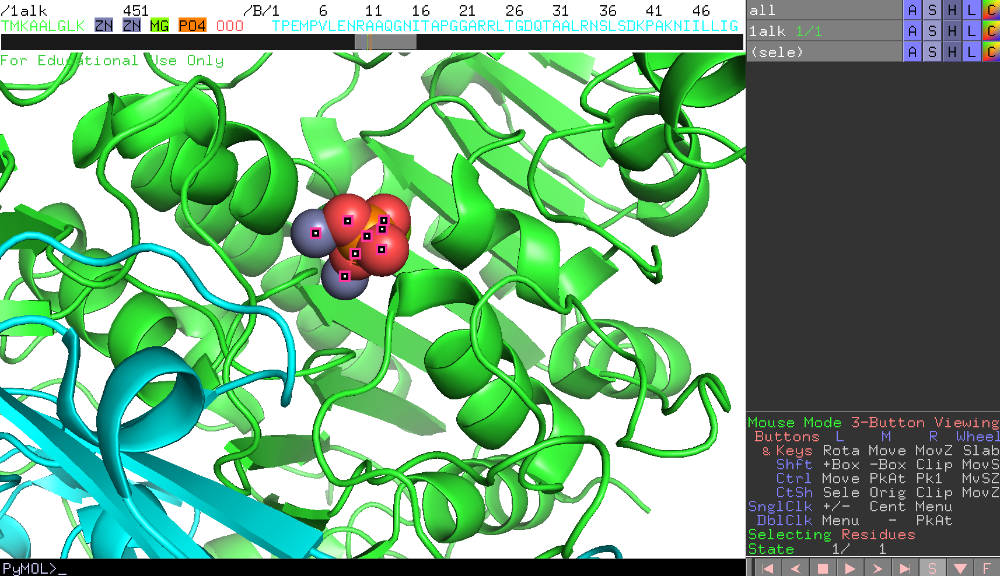
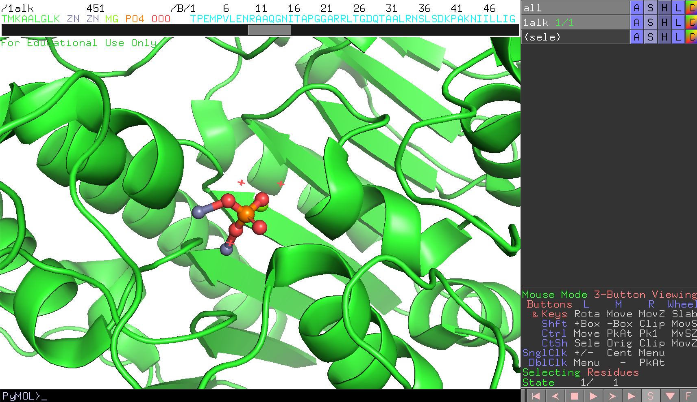
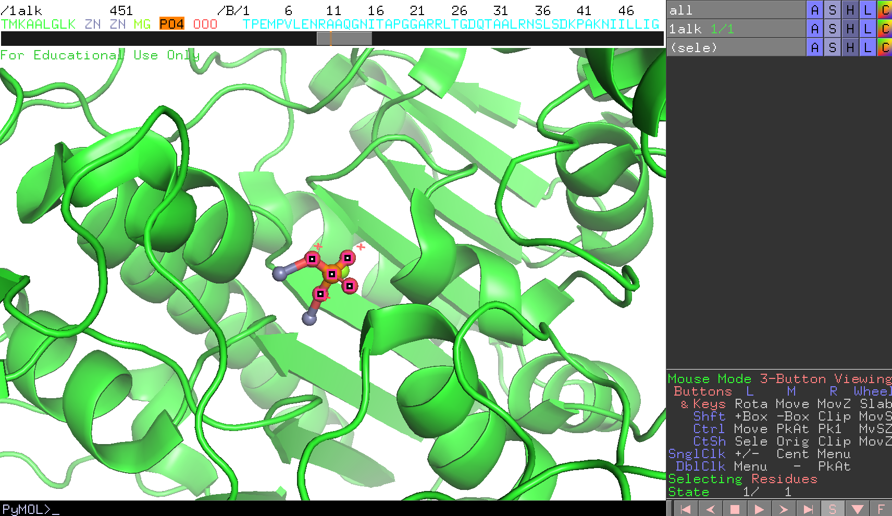
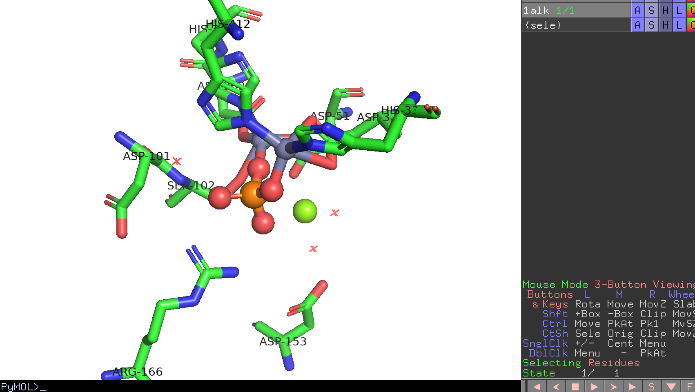

### リガンド結合部位への注目

ここから、タンパク質内の**リン酸や金属が結合している部分**に注目してみます。まず、全体構造の中のどこに結合しているかを確認してみます。

- PyMOL内で[配列を表示](../ch02/dispseq.md)させます。
- 表示された配列のところで、Chain Aの`ZN`2つと`MG`,`PO4`をすべて**選択**します。
- 次に、[オブジェクトパネル](../ch02/objpanel.md)においてその選択範囲`(sele)`についてStickとSpheresで表示させてみます（→[分子構造の表示形式のON/OFF](../ch02/showandhide.md)）。

デフォルト設定では、sphere表示で表されるボールがかなり大きくなっているので、ここではいったん小さくしてみます。これは`PyMOL >`のところにコマンドを打つことで設定できます。

    set sphere_scale, 0.4

これで球が小さく表示されました。

ここで、表示をチェインA（A鎖）だけにし、Bチェインはhideで隠します（→[分子構造の表示形式のON/OFF](../ch02/showandhide.md)）。リン酸や金属は各チェインに1組ずつ結合していることがわかります。

チェインAのリン酸(`PO4`)が画面の中心にくるよう設定してみます。これはこの`PO4`を選択した上で右クリックを押してメニューを表示させ、`center`を選択することでできます。
参考：[マウス操作](../ch02/mouse.md)と[各モードにおける操作一覧]((../ch02/buttontable.md))

マウス操作で、画面を拡大して見やすくしておきます。

タンパク質のCartoon表示をオフにします（→[分子構造の表示形式のON/OFF](../ch02/showandhide.md)）。

チェインAのリン酸から4.6 Å以内にある水分子以外のアミノ酸残基を表示させます。チェインAのリン酸`PO4`だけが選択された状態で以下のコマンドを打ちます。

    select byres resn * within 4.6 of sele
    show sticks, sele

ここで、`byres`は「残基単位での選択」を意味する設定であり、とある残基が1原子でもリン酸から4.6 Åの距離以内に存在するのであれば、その残基をすべて選択するようにしています。その後、2行目のコマンドで選択した範囲を`sticks`で表示させます（オブジェクトパネルでも可能）

Zn，Mgは原子種ごとの色分け（→[色の設定](../ch02/color.md)）にします。

リン酸付近にどのようなアミノ酸種が分布しているかを確認するために、先程の選択範囲`(sele)`について、[ラベルの設定](../ch02/label.md)で`label` -> `residues`を選択します。

PyMOL画面を回転させて、どのアミノ酸がこのリガンド結合部位に存在しているかをすべてメモします。終わったら、再び現在までの作業内容をセッションファイルに保存しておきます。ファイル名はたとえば`1alk_active_site.pse`などとしておくと分かりやすくて良いでしょう。

