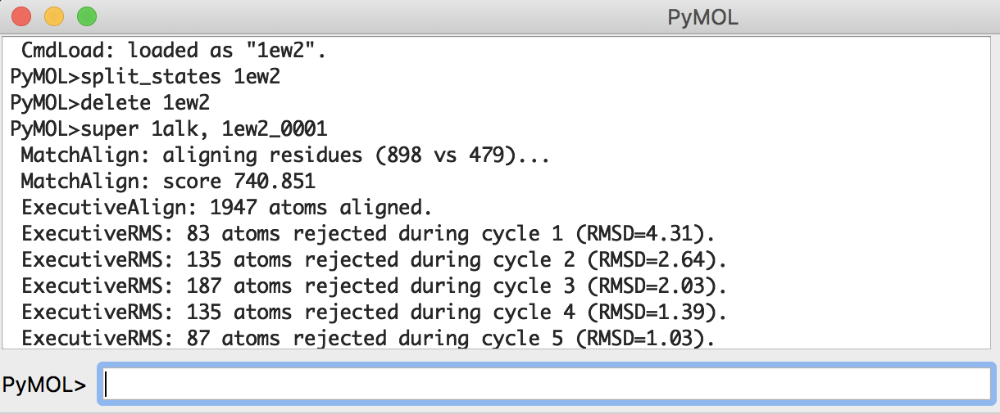

## ヒトアルカリホスファターゼとの構造比較

ヒトアルカリホスファターゼも立体構造が解かれ、PDBに登録されている（[PDB ID: 1EW2](https://www.rcsb.org/structure/1EW2)）。大腸菌アルカリホスファターゼとの類似点・相違点を調べてみよう。

ヒトアルカリホスファターゼと大腸菌アルカリホスファターゼのアミノ酸一致度は30%弱である。つまり平均すると10箇所のうち7箇所以上はアミノ酸が異なっていることになります。では、**ヒトアルカリホスファターゼは大腸菌アルカリホスファターゼとまったく異なるやり方でリン酸エステル化合物の加水分解を行っているのだろうか？それとも似た反応機構をもっているのでしょうか**。立体構造の観点から調べてみましょう。

### ヒトアルカリホスファターゼの構造ファイルのダウンロード
まず大腸菌のときと同様に、RCSB PDBから1EW2のPDBファイルをダウンロードします（参考：[分子構造のロード](../ch02/loadmol.md)）。次に、すでに1ALKの構造を開いているPyMOLの中で、この1EW2の構造ファイルをロードします。しかし、ここで1ALKのときと違いChain Aしか表示されていないことに気付くでしょう。1EW2も1ALKと同様にBiological unitはホモダイマーですが、この構造ファイルには結晶の対称性を考慮してチェイン1本分の座標しか入っていない状態になっています。このような場合はPyMOLの機能を使って、結晶の対称性からもう1本のチェインの座標データを生成することができます。

[Biological unitを考慮した分子構造のロード](../ch02/loadmol.html#biological-unitを考慮した分子構造のロード)のページを参考に、1EW2の構造を2量体でロードします。1EW2の各チェインは`1ew2_0001`, `1ew2_0002`と表示されることになります。ここで、わかりやすくするために大腸菌のアルカリホスファターゼを緑色に、今開いたヒトアルカリホスファターゼの2量体を水色で表示させておきます。


### 2つのアルカリホスファターゼの構造の重ね合わせ
では、大腸菌とヒトのアルカリホスファターゼの構造をそれぞれ重ね合わせることで比較してみましょう。ここではPyMOLの`super`という重ね合わせ用のコマンドを使います。

今、画面には`1alk`と`1ew2_0001`, `1ew2_0002`のオブジェクトが存在しているはずです。ここで、`1alk`オブジェクトを`1ew2_0001`オブジェクトに重ね合わせることを以下のコマンドで行います（※**`1ew2_0001`を`1alk`に、ではないことに注意**）。このコマンドは

    super 1alk, 1ew2_0001

です。これを行うと、


図のように大腸菌ホスファターゼとヒトアルカリホスファターゼを重ねることができます（図では背景をグレーにしています）。また、画面上部のPyMOLコンソール画面には2つの構造のRMSD値が表示されます。



```
PyMOL>super 1alk, 1ew2_0001
 MatchAlign: aligning residues (898 vs 479)...
 MatchAlign: score 740.851
 ExecutiveAlign: 1947 atoms aligned.
 ExecutiveRMS: 83 atoms rejected during cycle 1 (RMSD=4.31).
 ExecutiveRMS: 135 atoms rejected during cycle 2 (RMSD=2.64).
 ExecutiveRMS: 187 atoms rejected during cycle 3 (RMSD=2.03).
 ExecutiveRMS: 135 atoms rejected during cycle 4 (RMSD=1.39).
 ExecutiveRMS: 87 atoms rejected during cycle 5 (RMSD=1.03).
 Executive: RMSD =    0.864 (1320 to 1320 atoms)
```

この結果、0.864 Åというとても小さなRMSD値が得られました。これはこの2つの構造の差が小さいことを表しています。