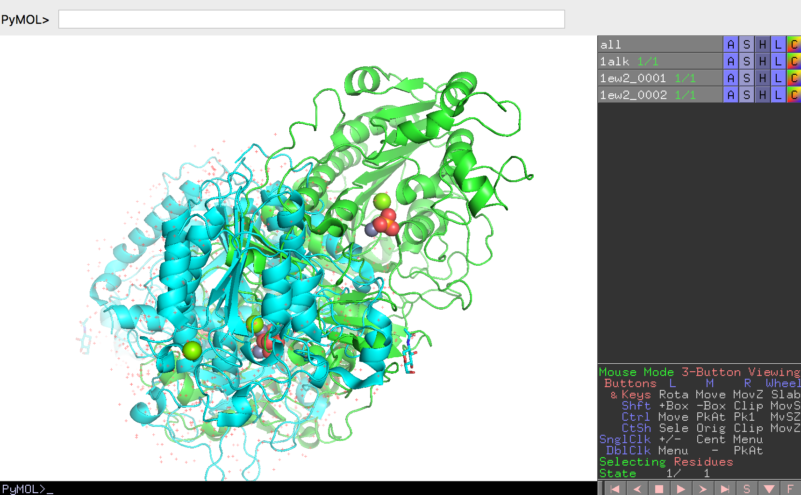

## ヒトアルカリホスファターゼとの構造比較

ヒトアルカリホスファターゼも立体構造が解かれ、PDBに登録されている（[PDB ID: 1EW2](https://www.rcsb.org/structure/1EW2)）。大腸菌アルカリホスファターゼとの類似点・相違点を調べてみよう。

ヒトアルカリホスファターゼと大腸菌アルカリホスファターゼのアミノ酸一致度は30%弱である。つまり平均すると10箇所のうち7箇所以上はアミノ酸が異なっていることになります。では、**ヒトアルカリホスファターゼは大腸菌アルカリホスファターゼとまったく異なるやり方でリン酸エステル化合物の加水分解を行っているのだろうか？それとも似た反応機構をもっているのでしょうか**。立体構造の観点から調べてみましょう。

### ヒトアルカリホスファターゼの構造ファイルのダウンロード
まず大腸菌のときと同様に、RCSB PDBから1EW2のPDBファイルをダウンロードします（参考：[分子構造のロード](../ch02/loadmol.md)）。次に、すでに1ALKの構造を開いているPyMOLの中で、この1EW2の構造ファイルをロードします。しかし、ここで1ALKのときと違いChain Aしか表示されていないことに気付くでしょう。1EW2も1ALKと同様にBiological unitはホモダイマーですが、この構造ファイルには結晶の対称性を考慮してチェイン1本分の座標しか入っていない状態になっています。このような場合はPyMOLの機能を使って、結晶の対称性からもう1本のチェインの座標データを生成することができます。

[Biological unitを考慮した分子構造のロード](../ch02/loadmol.html#biological-unitを考慮した分子構造のロード)のページを参考に、1EW2の構造を2量体でロードします。1EW2の各チェインは`1ew2_0001`, `1ew2_0002`と表示されることになります。ここで、わかりやすくするために大腸菌のアルカリホスファターゼを緑色に、今開いたヒトアルカリホスファターゼの2量体を水色で表示させておきます。

### 2つのアルカリホスファターゼの構造の重ね合わせ
では、大腸菌とヒトのアルカリホスファターゼの構造をそれぞれ重ね合わせることで比較してみましょう。ここではPyMOLの`super`という機能を使います。

7.6	両者のアミノ酸一致度を確認したいときは，UCSF ChimeraのTools > Sequence > Align Chain sequences を選び、続いて“Make Sequence Alignment from Chainsの窓でCtrlボタンを押しながら2つの配列（ともにChain A）を選択し、Applyボタンを押す（Alignment ProgramはClustal Omegaを使う）。“Clustal Omega Alignment”の窓が現れたら、InfoのメニューからPercent Identityを選択し、Compare:とwith:の欄にそれぞれ1ALK, 1EW2の配列を選択し、Applyボタンを押す。すると、Clustal Omega Alignmentの窓の下にアミノ酸一致度（%）が表示される。
