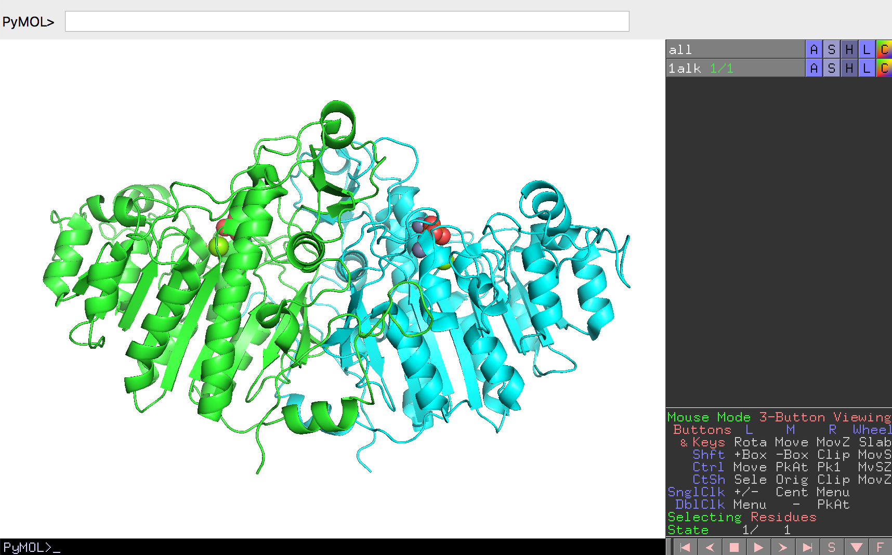

## タンパク質の疎水性・親水性残基の分布を確認する

タンパク質を構成しているアミノ酸は通常20種類ですが、その20種類のアミノ酸を化学的な性質に基づいて**親水性・疎水性**で分類することがあります。この親水性とは水に対して親和性が高いという意味で、疎水性は反対に親和性が低いということを意味します。特に、**水素結合を形成しやすい**側鎖を持つアミノ酸は**親水性アミノ酸**と呼ばれ、そうでないものは**疎水性アミノ酸**と呼ばれます。

親水性アミノ酸は以下のアミノ酸が該当します。pH 7.0の中性溶液中で持つ電荷についても示します。
- 酸性アミノ酸（負電荷を持つ）
    - アスパラギン酸（Asp, D）
    - グルタミン酸（Glu, E）
- 塩基性アミノ酸（正電荷を持つ）
    - リジン（Lys, K）
    - アルギニン（Arg, R）
- 中性アミノ酸
    - スレオニン（Thr, T）
    - セリン（Ser, S）
    - アスパラギン（Asn, N）
    - グルタミン（Gln, Q）
    - ヒスチジン（His, H）

また、これらの親水性度・疎水性度を数値化した研究も存在しています（[*J. Mol. Biol.* 179:125-142 (1984)](https://www.sciencedirect.com/science/article/abs/pii/0022283684903097?via%3Dihub)）。これによれば、

|アミノ酸 | 疎水性度 |
|------| ------: |
|Ala| 0.620|
|Arg|-2.530|
|Asn|-0.780|
|Asp|-0.900|
|Cys| 0.290|
|Gln|-0.850|
|Glu|-0.740|
|Gly| 0.480|
|His|-0.400|
|Ile| 1.380|
|Leu| 1.060|
|Lys|-1.500|
|Met| 0.640|
|Phe| 1.190|
|Pro| 0.120|
|Ser|-0.180|
|Thr|-0.050|
|Trp| 0.810|
|Tyr| 0.260|
|Val| 1.080|

となっています（値が高いほど疎水性、低いほど親水性）。

一方で、これまで見てきたようにタンパク質はある1つの決まった形を取るように折りたたまっています。このとき親水性・疎水性アミノ酸はタンパク質構造上でどのように分布しているかを、PyMOLに表示した大腸菌アルカリホスファターゼを例にとって確認してみましょう。

まずあらためて大腸菌アルカリホスファターゼ（PDB ID: 1ALK）をロードし直しておきます。



続いて、この構造を上の表で登場したアミノ酸の親水性・疎水性基準に従って、アミノ酸の側鎖を色分けしてみます。親水性のアミノ酸（表で0以下の値を持つアミノ酸）をすべて水色に、疎水性アミノ酸をすべてオレンジ色に塗ってみます。このとき、すべてのアミノ酸をマウスで選ぶのは大変なので、PyMOLのコマンドラインを活用します。

PyMOLソフトウェアの`PyMOL>`と書かれている欄にまず`select hydrophobic,(resn ala+cys+gly+val+ile+leu+phe+pro+met+trp+tyr)`と入れてEnterキーを入力すると、疎水性アミノ酸たちが`hydrophobic`という名前の選択範囲が保存されます。この後、この選択範囲をオレンジ色にするために`color orange, hydrophobic`というコマンドを入力します。同様にして、すべての親水性アミノ酸を`hydrophilic`という名前の選択範囲として登録しておき、これをシアン色に色付けします。最後に、これらのアミノ酸残基の体積を強調するためにSphere表示にしてみます。

以上のコマンドは

``` bash
# 疎水性残基をhydrophobicという名前の選択範囲として保存
select hydrophobic,(resn ala+cys+gly+val+ile+leu+phe+pro+met+trp+tyr)
# 選択範囲hydrophobicをorange色にする
color orange,hydrophobic
# 親水性残基をhydrophobicという名前の選択範囲として保存
select hydrophilic,(resn arg+asn+asp+gln+glu+his+lys+ser+thr)
# 選択範囲hydrophilicをcyan色にする
color cyan, hydrophilic
# すべての残基をsphere表示にする
show spheres, all
```

と打っていくことで達成されます。

<video width="100%" height="100%" controls autoplay loop>
<source src="./image/hyph2.mp4" type="video/mp4">
</video>

このように色付けをしてみると、大腸菌アルカリホスファターゼの表面には親水性の残基が比較的多く分布していることがわかります。

ここで、PyMOLのマウス機能の1つである[Slab](../ch02/buttonaction.md#スラビングslab)を使ってタンパク質の中を覗いてみます。Slabはマウスのホイールを回転させて行います（Macbookなどに付属しているタッチパッドで行う場合は、タッチパッドに2本指を置いて上下に動かします）

<video width="100%" height="100%" controls autoplay loop>
<source src="./image/hyph3.mp4" type="video/mp4">
</video>

すると、アルカリホスファターゼのタンパク質構造の内部には**疎水性アミノ酸がとても密に詰まっていることがわかる**と思います。その一方で、表面にはやはり親水性アミノ酸が分布していることから、**タンパク質構造の外側には親水性アミノ酸が、内側には疎水性アミノ酸が**それぞれ分布していることがわかります。

このことはアルカリホスファターゼに限らず他の多くのタンパク質についても一般に成立します。ただこのアミノ酸の分布は親水性・疎水性アミノ酸の性質からすると当然のことを言っているに過ぎないと思われるかもしれません。しかしながら、これらの大きな疎水性アミノ酸のかたまり、通称**疎水性コア**は、タンパク質構造を安定に保つために重要な役割を果たしています。

水溶液中で安定に存在できる球状タンパク質は、疎水性アミノ酸が周囲の水分子と反発することによって親水性アミノ酸を外側へ、疎水性アミノ酸は内側へ集中させることから生まれる**疎水性相互作用**によって構造を形成していくことが知られています。そしてこの疎水性コアは疎水性アミノ酸同士の側鎖が密にパッキングすることによって文字通り隙間なく形成されており、これによってタンパク質全体の構造の安定性を大きく伸ばすことに貢献しています。タンパク質構造で注目されがちなのは親水性アミノ酸がよく用いられ外側に露出している活性部位（大腸菌アルカリホスファターゼで言うところのSer102, Arg166周辺）なのですが、こうした構造の成り立ちに関わるアミノ酸の分布のことも重要であることを覚えておくと、タンパク質構造についての理解がより深まると思います。