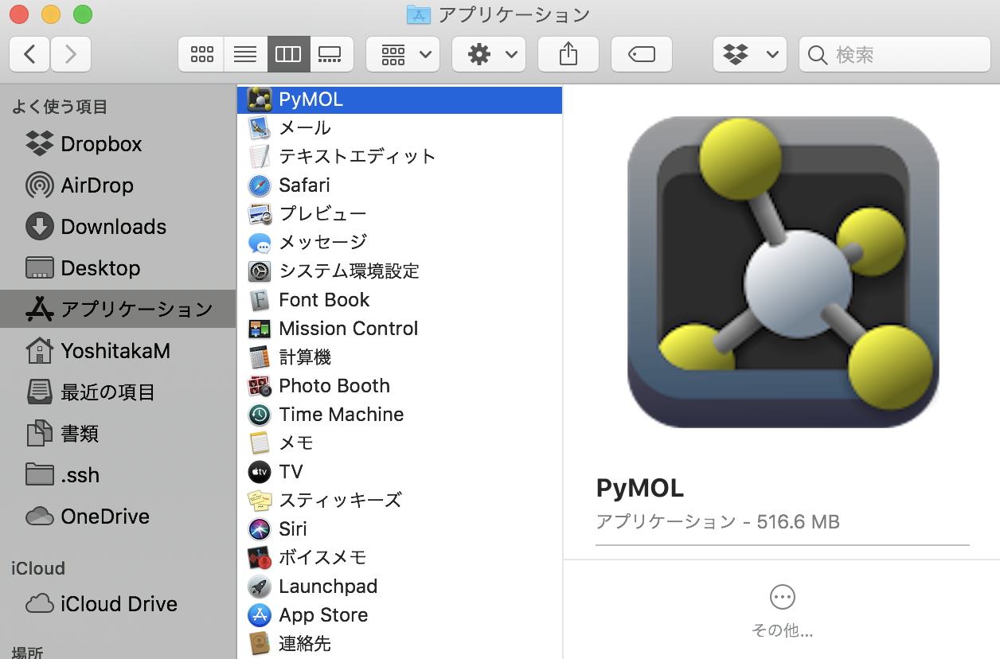

## PyMOLの起動

それではPyMOLを起動してみましょう。起動の仕方は、お使いのパソコン・macによってやり方が変わります。もしまだPyMOLをインストールしていない場合は、[インストール方法](../append01/installation.md)を参照してください。

### Windows 10の場合

（調査中です）

### macOS (バイナリ版)の場合

初心者向けです。バイナリ版をインストールした場合、Finderから[アプリケーション]を選択して中にあるPyMOLをダブルクリックすることで起動できます。

### macOS（オープンソース版の場合）

ターミナル操作に習熟した上級者向けです。オープンソース版はHomebrewを使うことでインストールできます。（参考：[インストール方法](../append01/installation.md)）
インストールに完了した後、[アプリケーション]→[ユーティリティ]→[ターミナル]を選択して、`pymol`と打てば起動します。実用上は `pymol > /dev/null 2>&1 &` とコマンドを打つ方が便利かもしれません。

### Linuxの場合

インストール完了後、ターミナルから `pymol` と打つことで起動します。
