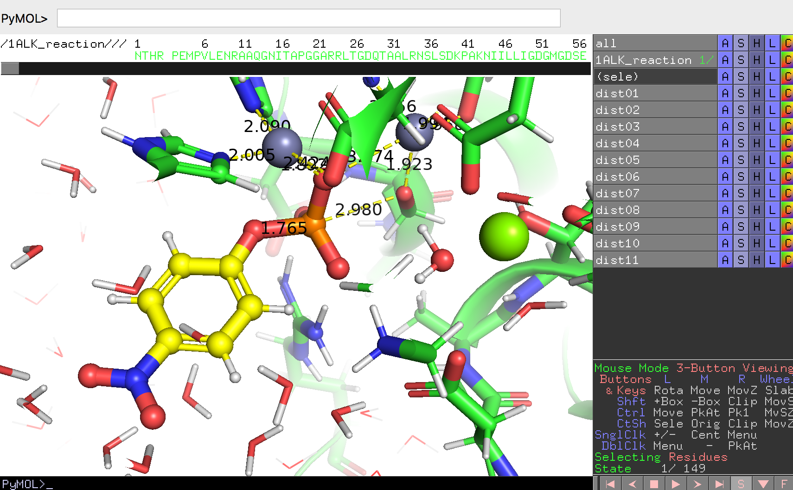

## アルカリホスファターゼの加水分解酵素としての働き

最後に、アルカリホスファターゼが「**ホスファターゼ**」の名前通りに**リン酸モノエステル加水分解酵素**として化学的にどう働いているかを観察してみましょう。

アルカリホスファターゼ（ALP）は以下の反応式のように、*p*-ニトロフェニルリン酸を**加水分解**して*p*-ニトロフェノール（黄色く発色する）を生成することができます。

この反応の様子をPyMOLで見てみましょう。

[このリンク](http://vivace.bi.a.u-tokyo.ac.jp:8008/1alk_reaction.pse)に`1alk_reaction.pse`という名前のPyMOLセッションファイルを置いています。これをダウンロードしてダブルクリック、またはFile -> Openからこのファイルを開いてみましょう。このセッションファイルにはアルカリホスファターゼの単量体とともに、今まで無機リン酸が入っていた箇所に*p*-ニトロフェニルリン酸（残基名：NPH）の構造が見えるはずです。

PyMOL Internal GUIの右下には▶ボタンがあります。この▶ボタンを押すとタンパク質と*p*-ニトロフェニルリン酸が少しずつ動き、化学反応を起こしている様子が可視化されて見えるはずです。

<video width="100%" height="100%" controls autoplay>
<source src="./image/reactionmovie.mp4" type="video/mp4">
</video>

このような動いている様子が見られるのは、このセッションファイルにはあらかじめ149フレーム分の構造データを入れたオブジェクトが含まれているからです。ほとんどすべてのRCSB PDBからダウンロードしてきた結晶構造のデータは静止しているために1フレーム分のデータしかありませんが、NMRで構造決定されたデータですと、タンパク質の「動き」が収録されているものもあります（例としてPDB ID: 1G03）。

このセッションファイルには、`dist01`から`dist11`までの距離オブジェクトも含まれています。この距離オブジェクトは[マウス操作の原子ピッキング（PkAt）機能](../../../ch02/buttontable.md)を用いることで作成することができます。距離を測定したい2点の原子の上でそれぞれCtrlキーを押しながらマウスのホイールクリックを行い、コマンドで`dist`と入力することで距離オブジェクトを生成することができます。