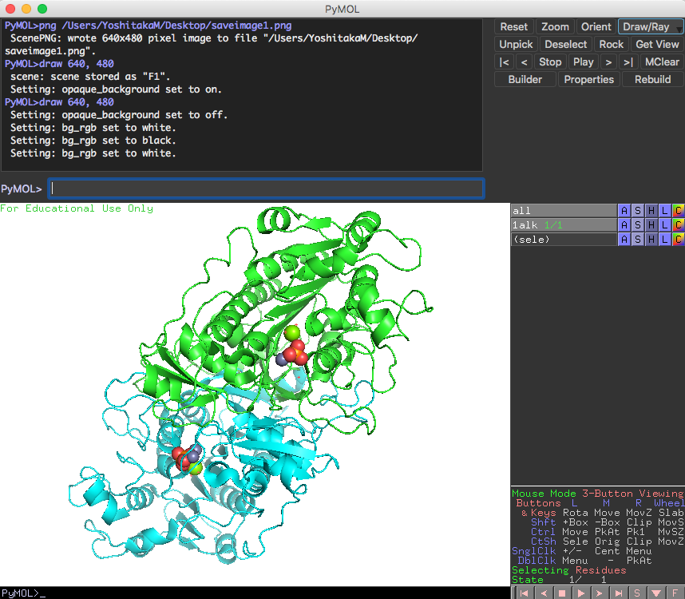

### 画像の保存
画面に映されているタンパク質を画像ファイルとして保存します。ただし、そのまま保存しようとすると背景が黒のままとなってしまいます。

これを白背景で出力します。上部のDispaly > Backgroundメニューから、Whiteを選択します。

この設定の後、PyMOL画面の右上に存在するDraw/Rayボタンを押し、`Draw (fast)`または`Ray (slow)`ボタンを押すと、きれいな画像となって表示されます。

問題がなければ、`Save Image to File`ボタンを押し、ファイル名を設定して保存しましょう。ちなみに、`transparent background`にチェックを入れると背景透過画像を生成することができます（ただし`Ray (slow)`を適用した場合のみ）。背景透過処理を行うとレポートやスライドの上で扱いやすくなるので、ぜひ利用しましょう。

その他の詳しい項目については[画像の保存](../ch02/session.md)を参照してください。