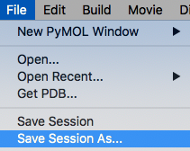
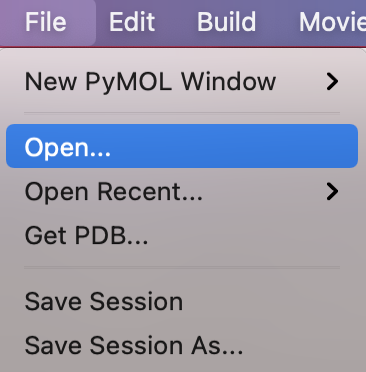
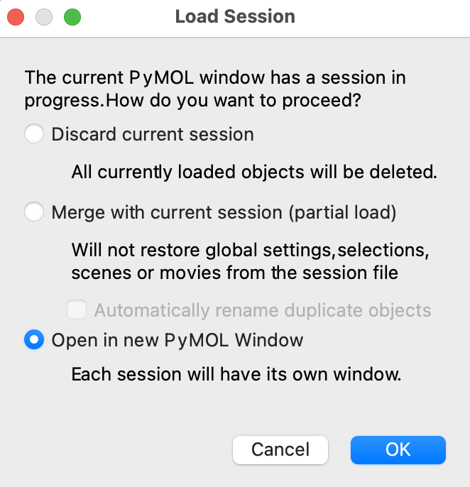

### セッションファイルへの保存

ここまでの作業内容をセッションファイルに保存します。セッションファイルとは、現在のPyMOLの画面の状態をそのまま保存しておくファイルのことです。画面上部にあるFileメニューから`Save session as…`を選んで名前を指定して保存します(`kadai1.pse`など、わかりやすい名前をつけましょう)。（参考：[セッションの保存](../ch02/session.md) ）。

保存したセッションファイルはFile > Openメニューから読み込むことができます。

すでにタンパク質を他に表示させている状態でセッションファイルを読み込もうとすると下図のようなメッセージが現れますが、今開いている画面と別のPyMOL画面でタンパク質を表示させたい場合は、一番下の`Open in new PyMOL Window`を選択することをおすすめします。

※ （上級者向け）上述の`PyMOL>`の入力欄にコマンドを入力することでも可能です。デスクトップ上に保存したい場合は、`cd ~/Desktop`としてWorking Directoryをデスクトップに設定した後、`save kadai1.pse`とすることでセッションファイルを保存できます。
