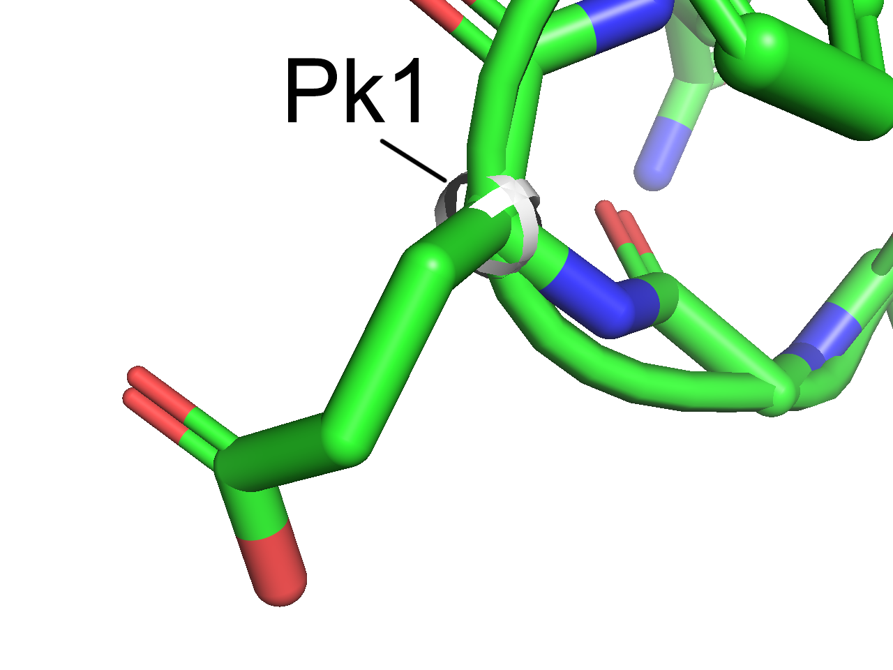
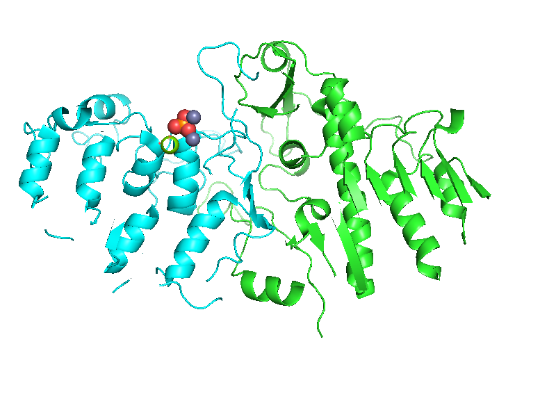
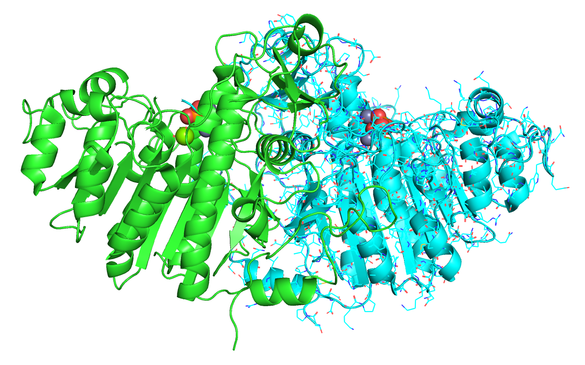
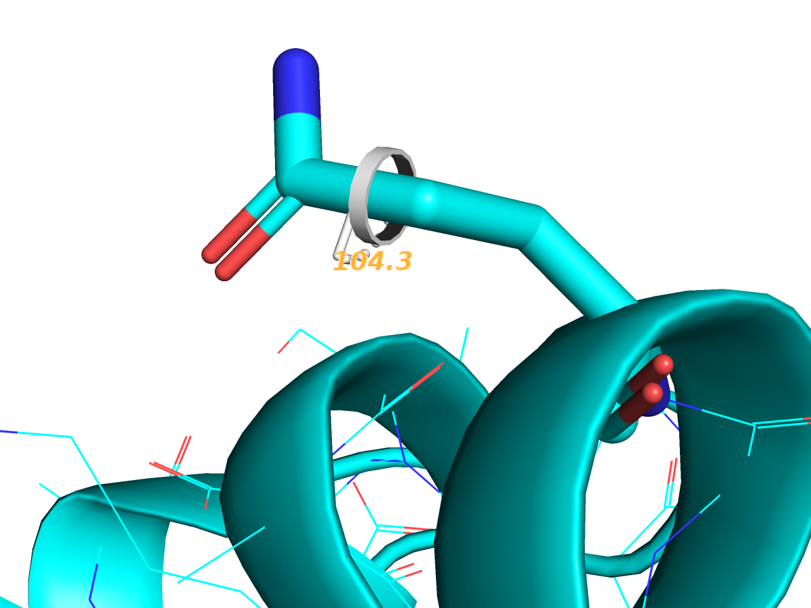
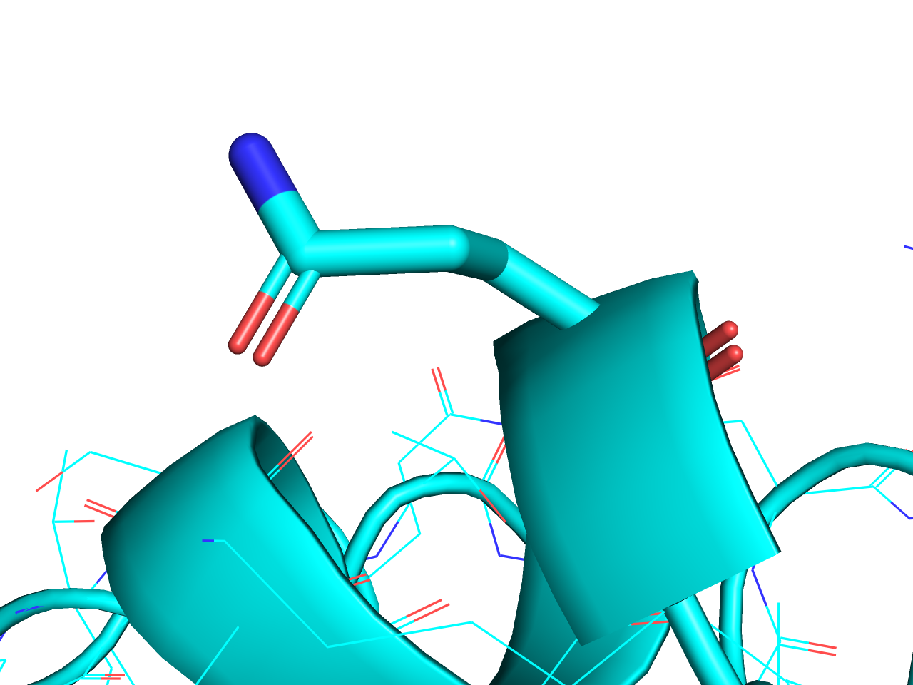
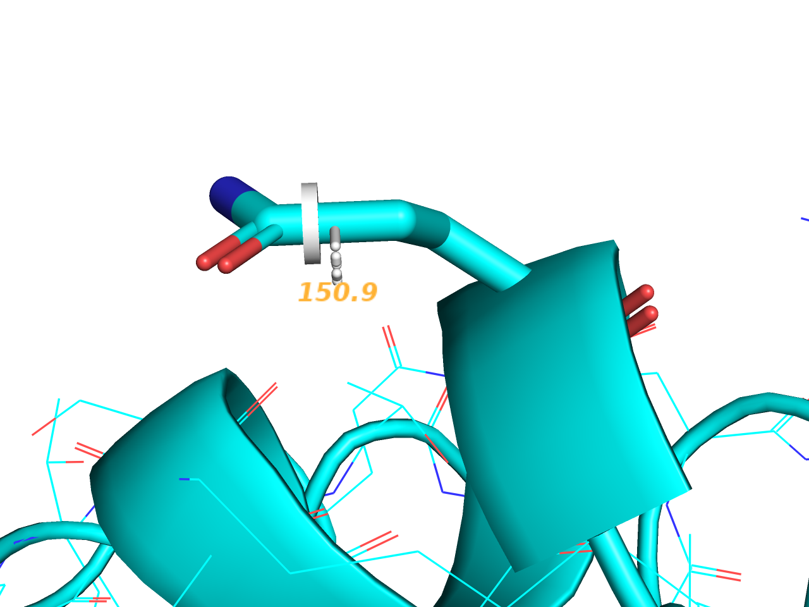
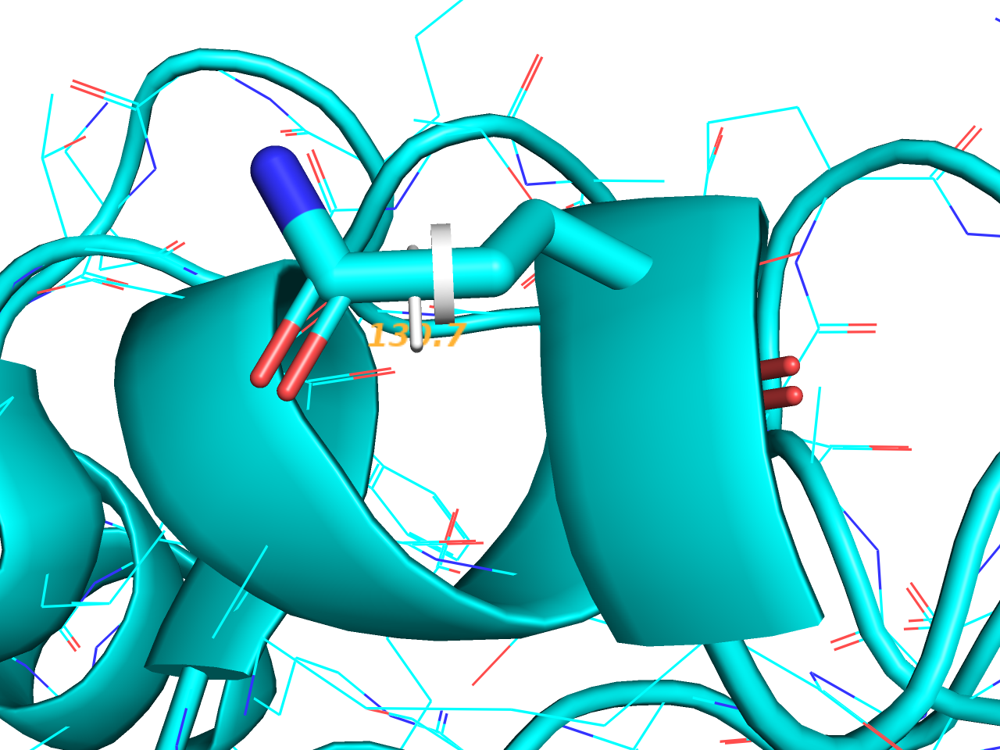

### 操作の詳細

#### 回転 (Rota)
**マウスの左ボタンを押しながらマウスを動かす（ドラッグ）** すると、表示されている分子を回転させることができます。

<video width="100%" height="100%" autoplay loop>
<source src="./image/mouse/rotate.mp4" type="video/mp4">
</video>

#### 並進 (Move)
**マウスのホイールボタンを押しながらドラッグ** すると、表示されている分子を視点に対して平行に移動させることができます。

<video width="100%" height="100%" autoplay loop>
<source src="./image/mouse/move.mp4" type="video/mp4">
</video>

#### ズームイン・アウト (MovZ)
**マウスの右ボタンを押しながらマウスを前後にドラッグ、またはCtrlとShiftキーを押しながらマウスのホイールを上下** させると、分子構造を拡大・縮小することができます。

<video width="100%" height="100%" autoplay loop>
<source src="./image/mouse/movz.mp4" type="video/mp4">
</video>

#### 選択 (+/-)
**表示されているオブジェクトの原子の上でマウスの左ボタンを押す** と、四角のマークが付きます。

<video width="100%" height="100%" autoplay loop>
<source src="./image/mouse/select.mp4" type="video/mp4">
</video>

この四角マークは、現在選択されている原子の範囲を示しています。この左クリックによる選択はクリックするたびに選択範囲に追加され、もう一度押すと選択範囲から外されます。

#### 選択範囲に追加/除去 (+Box/-Box)
選択範囲の追加または除去を行います。**+Box(Shiftを押しながらマウスの左クリック＆ドラッグ)** では画面上に黒い四角が現れ、ボタンを離すと、その四角で囲まれた部分が選択範囲に追加されます。反対に、**-Box(Shiftを押しながらマウスのホイールクリック＆ドラッグ)** では四角で囲んだ範囲を選択範囲から除去することができます。同様の操作を繰り返すことも可能です。

<video width="100%" height="100%" autoplay loop>
<source src="./image/mouse/plusbox.mp4" type="video/mp4">
</video>

#### センタリング (Cent)
**表示されているオブジェクトの原子の上でマウスのホイールボタンを押す** と、その原子が画面中央に来るように視点が移動します。また、回転操作の中心もその点に移動します。

<video width="100%" height="100%" autoplay loop>
<source src="./image/mouse/center.mp4" type="video/mp4">
</video>

#### Origin指定 (Orig)
**表示されているオブジェクトの原子の上でCtrlとShiftを押しながらマウスのホイールボタンを押す** と、その原子を回転中心の原点(origin)に指定することができます。上記センタリングのときと異なり、視点は移動しません。

<video width="100%" height="100%" autoplay loop>
<source src="./image/mouse/origin.mp4" type="video/mp4">
</video>

#### メニュー表示 (Menu)

**マウスの左ボタンをダブルクリック** または **右ボタンをクリック** で、メニューを開きます。メニュー内容はクリックした位置によって内容が変化します。

何もない箇所でクリックすると[Main Pop-Up]メニューが表示されます。 

オブジェクトの上でクリックすると、クリックした場所に存在する原子についての設定変更を行うメニューが表示されます。 

#### 原子ピッキング（PkAt/Pk1）

オブジェクト上の原子の上で**Ctrlボタンを押しながらホイールクリック**、または**マウス右ボタンのダブルクリック**を行うと、その原子をピッキングした状態になります(**PkAt**)。 

このピッキング状態は先述の選択範囲とは異なる選択形式で、図のような球体のマーカーが付きます。このピッキングは画面上に同時に4原子まで選択することができ、各ピッキングマーカーは図のように二重、三重、四重の球体マーカーで示されます。

- **Ctrlボタンを押しながら右クリック (Pk1)** の場合では、上の操作と異なり、1つめの原子ピッキングのみを行います。
- ピッキングされた原子が2つ、3つ、4つになると、自動でそのピッキングされた原子についての**距離(distance)**、**角度(angle)**、**二面角(dihedral)** を表示してくれます。

#### クリッピング（Clip）
Viewing Modeで**Shiftとマウスの右ボタン（またはCtrl+Shift+マウス右ボタン）を押しながらマウスを上下左右に動かす** と、分子の内部を覗けたり霧をかけたりすることができます。分子内部の一部の領域を強調した画像を取りたいときに作ります。

この機能は2枚の**クリッピング平面（Clipping plane）** によって調節しています。マウスの上下の動きは前面のクリッピング平面(front clipping plane)の位置を、左右の動きは背面のクリッピング平面(rear clipping plane)の位置を調節できます 図解  **画面上にはこの2枚のClipping Planeの間に存在する領域だけが表示されます**。

マウスを画面下に移動させるとfront clipping planeは視点から見て奥へ移動し、分子の内部が見えるようになります。反対に、マウスを上へ移動させると、clipping planeは手前に移動します。 

マウスを左に移動させるとrear clipping planeが視点から見て奥へ移動します。反対に手前に移動させると、rear clipping planeが手前に移動し、分子の奥側が霧がかかって徐々に見えなくなります。 

霧は画面上部のメニューの[Display]→[Depth Cue(Fogging)]のチェックでON/OFFを選択できます（デフォルトはONです）。 

#### スラビング（Slab）
スラブとは英語で厚板、平板という名詞、または「平板にする」という動詞です。PyMOLにおいて**スラブ（Slab、Visible Slabとも）とは、上述の2枚のクリッピング平面の間に挟まれた可視化領域のこと**を指します。

Viewing Modeで**マウスホイールを回転させる** ことで、スラブの厚さを調節することができます。クリッピングとともに、分子構造の内部領域をみたい時に有用です。

画面上部メニューの[Display]→[Clip]には[8 Angstroam Slab]を始めとして30 Åまでの厚さのスラブを選ぶことができます。[Nothing]を選択した場合には、全原子が含まれるように自動的にスラブの厚みを調節します。

#### スラブの移動（MovS）
Viewing Modeで**Shiftを押しながらマウスホイールを回転させる** と、スラブ領域を、その厚みを保ったまま手前・奥に移動させることができます。効果を実感したい場合は、例として[8 Angstroam Slab]設定をした直後に使ってみるとわかりやすいでしょう。

#### スラブに対する視点の移動（MvSZ）
Viewing Modeで**Ctrlを押しながらマウスホイールを回転させる** と、スラブ平面に対して視点を移動させることができます。視点がスラブ内部に入ることもできます。

### Editing Mode専用コマンド
以下ではEditing Modeで扱う操作方法について記述します。Editing Modeは**オブジェクト・原子の座標自体に変更を加える**ことが多いため、このモードで操作するときは注意が必要です。もし誤って座標を動かしてしまった場合、数回であれば**Ctrl-z**でUndo（もとに戻す）ことが可能です。

#### オブジェクトの回転(RotO)・XY軸方向への移動(MovO)・Z軸方向への移動(MvOZ)
EditingモードでShiftキーとマウスの左ボタン・ホイールボタン・右ボタンを押しながらマウスを移動させることで、オブジェクトの座標に対しそれぞれ回転・XY軸への並進・Z軸へ移動操作を行うことができます。特に、複数のオブジェクトが存在する場合に効果がわかりやすいです。以下の例では緑色と青色で別々のオブジェクトとした上で、青色オブジェクトに対して操作を適用しています。

　　 
　　

#### 原子の移動(MovA)・Z軸方向への移動(MvAZ)
EditingモードでCtrlキーとマウスの左ボタンを押しながらマウスを移動させることで、マウスカーソル上に存在する原子の座標を移動させることができます。Ctrl+Shiftキーとマウスの左ボタンを押しながらだとZ軸方向への移動が行えます。下の例では、黄緑色の原子（Mgイオン）について操作を適用しています。

　　 

#### 二面角をピッキング(PkTB)

Editingモードで描画されている結合に対してCtrlキーとマウスの右ボタンを押しながら移動させることで、結合の二面角を変更することができます。

　　

2原子を結ぶ結合線上のうち、それぞれの原子に近い位置で操作を実行することで、それぞれ回転される対象が異なることに注意します。
図において、結合線の左半分にマウスカーソルを置いた状態で操作を適用した場合はこの残基の先端のみが回転します。

　　

しかし、結合線の右半分にカーソルを置いた状態で操作を適用すると、タンパク質の方が回転します。

　　

#### 分子構造をドラッグモードにする(DrgM)
Editingモードでホイールボタンをダブルクリックすると、オブジェクト内のひとつながりの分子構造(Molecule)について"drag"状態にします。このドラッグモードではこれまでのカメラ操作のような感覚で分子の座標を変更することが可能になります。

このドラッグモードにするとオブジェクトパネルの下側に専用のメニューが現れます。PDB: 1alkの場合で図の右側の構造についてこの操作を実行すると、Mgイオンを除いた右半分のChainだけが選択された状態になります。これは上述のひとつながりの分子構造に対してのみ適用されるからです。

さらに、このドラッグモードではShiftキーを押しながらのマウス操作方法が**RotD**, **MovD**, **MvDZ**に変化します。このDはDraggedを表しており、ドラッグモードとなっている選択範囲のみに対してそれぞれ**回転操作**・**XY軸方向への移動**・**Z軸方向への移動**を行うことができます。
