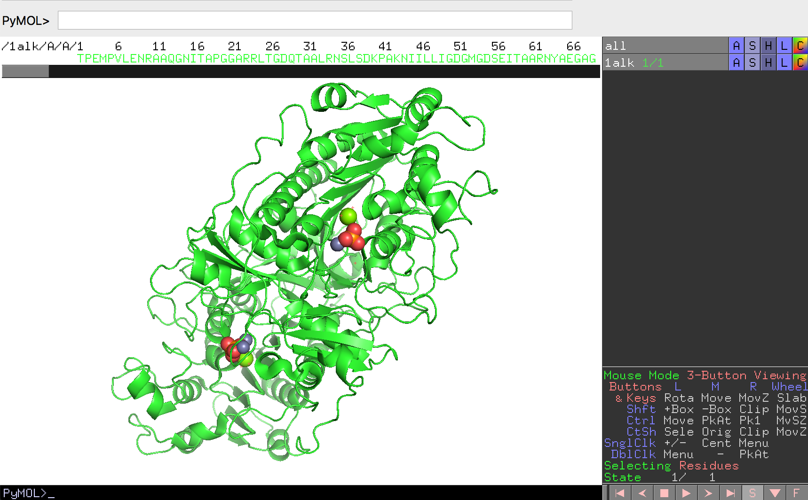

## 配列の表示
分子構造をロードしたら、ここでPyMOL画面の右下に注目してみます。ここには様々な記号や文字が並んでいますが、ここのSボタンを押してみましょう。

このSボタンを押すと、画面に分子の配列情報が現れます。もう一度Sボタンを押すと文字列が隠れます。

ここに表示される配列の文字列は、タンパク質の場合にはA, C, Dなどアミノ酸の1文字表記、核酸構造の場合にはDA, DT, DG, DCで2文字表記となっています。RNAの場合には1文字表記ですが、タンパク質の場合と異なり、各文字にスペースが挿入されて表示されます。リガンドやその他のについては3文字表記で表されることが多いです。これらの表記は、ロードする構造ファイル内の記述に依存してします。

配列の表示・非表示は、上部メニューの[Display]→[Sequence]にチェックを入れたり外したりすることでも行うことができます。

以下に、配列表示ウィンドウ上でのマウス操作を方法を記します。macOSの場合はCtrlはCmdキーになります。
- **左クリック＋ドラッグ**
    - 分子の一部を選択した状態にできます。選択した箇所にはハイライトが付きます。タンパク質の場合は残基ごと、核酸の場合は塩基ごと、それ以外の場合は1分子ごとに選択します。
- **Shift+左クリック**
    - 上記の選択範囲を拡張・縮小することができます。クリックボタンを押し続ける必要はありません。
- **Ctrl+Shift+左クリック**
    - 選択範囲を拡張・縮小しつつ、視点を選択範囲にセンタリングしてくれます。
- **ホイールクリック**
    - クリックした箇所に視点をセンタリングします。
- **Ctrl+ホイールクリック**
    - クリックした箇所に視点を大きくズームします。
- **Ctrl+ホイールクリック+Shift+ドラッグ**
    - Shift+ドラッグで選んだ選択範囲に向かって視点を大きくズームします。
- **右クリック**
    - 選択されていない箇所で右クリックをすると、その位置に存在する配列を選択し、それについての設定変更メニューを表示します。
    - すでに選択されている箇所で右クリックをすると、選択範囲に対する設定変更メニューを表示します。
