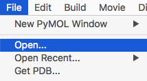
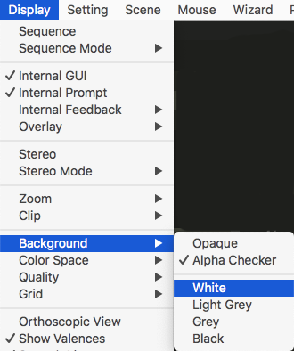
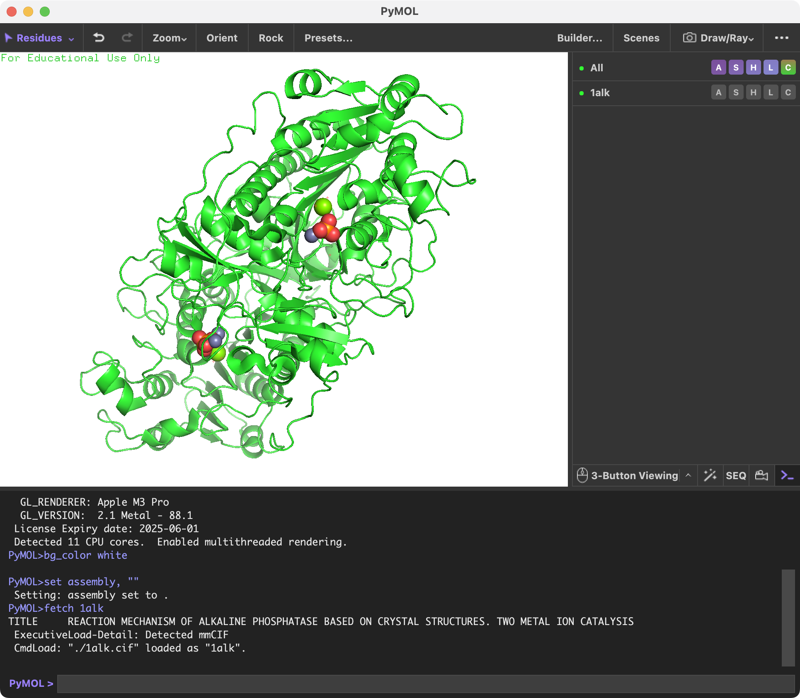
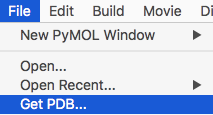
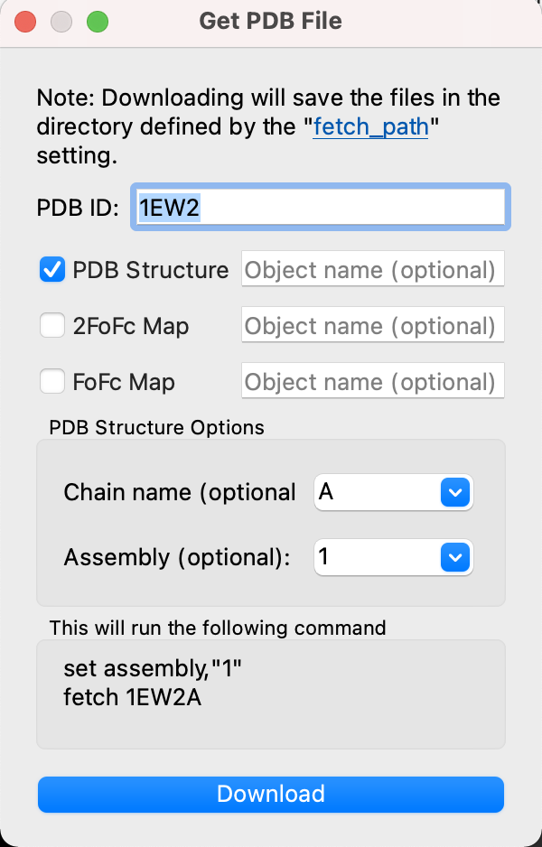

## 分子構造のロード
### 構造ファイルのロード
メニュー左上の[File]から、[Open...]を選び、PyMOLに表示させたい構造ファイルを選択します。ここでは、先程ダウンロードした `1alk.cif` ファイルを例として、ダブルクリックして表示させてみます。



すると、画面に1ALKのアルカリフォスファターゼの構造が表示されました。はじめは黒背景に緑のタンパク質がオブジェクトが浮かんでいると思いますが、ここで続けて、メニューの[Display]から[Background]->[White]を選択すると、白背景にすることができます。

<br>


### サポートしている構造ファイル形式
PyMOLが読み込むことのできる構造ファイルフォーマットはたくさんありますが、まず以下の2つのファイル形式を覚えましょう。

- pdbフォーマット
    - ファイル名の最後に`.pdb`（**拡張子**）がついているのが目印です。PDBが設立された当初から使われているファイルフォーマットで、PyMOLの表示に使う座標情報だけでなく、結晶学（NMR）的情報（B-factor、 空間群、単位格子定数…）、 構造的特徴（2次構造、SS結合… ）、実験情報（解像度、回折実験情報、精密化条件、結晶化条件… ）、生物学的情報（蛋白質名、種名、生物学的単位、EC番号… ）、化学的情報（化合物の名称や構造…）、文献情報などが記載されており、慣れれば人間でも読みやすく、必要最低限の情報が記述されています。しかし、時代が下るとともにこのフォーマットでは限界や不便な点が指摘されるようになりました。特に、近年は結晶解析だけでなくクライオ電子顕微鏡などの技術の発達により、巨大タンパク質の構造決定が次々と報告されるようになりましたが、従来のPDBフォーマットの最も大きな問題点の1つには100,000原子以上からなる構造、または多数のアミノ酸鎖（63チェイン以上）から構成される複合体の構造情報の記述をほとんど想定していなかったことがあります。このため、後述の**mmCIF**形式の利用が推奨されるようになりました。
- mmCIFフォーマット
    - ファイル名の最後に`.cif`がついているのが目印です。元来、mmCIFファイルフォーマットは国際結晶学連合が低分子用に定めていたCIF(Crystallographic Information File)形式を高分子(macromolecular)に拡張したものです。pdbフォーマットでは1ファイル内に記述することができなかった、100,000原子数以上または63チェイン以上の構造記述が可能になっています。例えばPDB: 3J3QのHIV-1 capsidは超巨大分子であり、従来のPDBフォーマットでは配布されていません。**2014年にPDBの標準フォーマットとなり、2019年7月1日からは、PDBに登録する際にmmCIF形式での構造情報登録を義務付けられるようになりました。** このmmCIF形式がこれからのスタンダードとなっていくことは間違いありません。ファイルの中身はpdbフォーマットの内容の上位互換となっており、最近の構造可視化ソフトウェアはすべてこれに対応するよう調整をしています。

他のファイル形式として、以下のものがあります。多くの場合、ファイル名末尾についている拡張子で見分けることが可能です。詳細な記述文法については、ここでは本題ではないので省略します。
- 生体高分子系・電子密度情報
    - CCP4フォーマット: 拡張子は`.ccp4`, `.map`, `.mrc`。電子密度マップ。
    - PDBMLフォーマット: 拡張子は`.xml`, `.pdbml`。コンピュータ間でのデータのやり取りや管理が簡単になるように設計された**XMLファイルフォーマット**をPDB用に特化させたものです。RCSB PDBでも配布されており、mmCIF形式とほぼ同一の情報が書き込まれています。ファイルサイズがmmCIFに比べて大きいことや、中身を見ても人間には読みにくい文法になっていますが、各プログラム言語が持っているXMLパーサ（構文解析器）にかけることでデータ構造の複合体に変換することが容易なため、インフォマティクスの専門家からは好まれるファイル形式です。
    - MMTFフォーマット: 拡張子は`.mmtf`。

    - MacroModelフォーマット: 拡張子は`.mmod`, `.mmd`。Schrödinger社のMacroModelやMaestroで使われているファイルフォーマット。
- 小分子化合物系
    - MOLフォーマット: 拡張子は`.mol`。MDL Information Systems社が開発した、化学構造式を記述する標準フォーマットの1つです。詳細はCTFile formatというガイドに記載されています。
    - MOL Structure Data Fileフォーマット: 拡張子は`.sdf`。上記MOL形式を改良し、複数の構造式を1ファイルに記述でき、さらに様々な付加情報を追記することができるようになっています。
    - SYBYL MOL2フォーマット: 拡張子は`.mol2`。Tripos（現Certara）が開発した、SYBYLと呼ばれるケモインフォマティクスのソフトウェアで使われていたファイルフォーマットです。タンパク質などの巨大分子でもこのファイル形式で書くことが可能です。詳細はSYBYL MOL2 formatというガイドに記載されています。
    - XYZフォーマット: 拡張子は`.xyz`。単純に原子の種類と原子の\\( xyz \\)座標を記述するファイル形式です。http://openbabel.org/wiki/XYZ_(format) に説明があります。

以下の拡張子は、表のように別のファイル拡張子として認識されます。

|入力拡張子|認識されるファイル拡張子|
|--:|--:|
|`ent`, `p5m`|`pdb`|
|`mmd`, `out`, `dat`|`mmod`|
|`map`, `mrc`|`ccp4`|
|`cc2`|`cc1`|
|`sd`|`sdf`|
|`rst7`|`rst`|
|`o`, `dsn6`, `omap`|`brix`|
|`ph4`|`moe`|
|`spi`|`spider`|
|`pym`, `pyc`|`py`|
|`p1m`, `pim`|`pml`|
|`xml`|`pdbml`|


### Biological Unitを考慮した分子構造のロード
タンパク質は1本のアミノ酸ポリペプチド鎖が折り畳まって存在しているのがほとんどですが、タンパク質の種類によっては、多量体の形で初めて安定に存在し機能しうるものもあります。**Biological Unit**（Biological Assemblyとも呼ばれる）とは、実際に生物の中で機能している構造の状態のことを指します。詳しくはPDBjのウェブサイトの「[非対称単位と生物学的単位について](https://pdbj.org/help/pdb_aubu)」も参照してください。

例として`PDB ID: 1ALK`（大腸菌由来アルカリフォスファターゼ）と`PDB ID: 1EW2`（ヒト由来アルカリフォスファターゼ）を比較してみましょう。各構造ファイルを取り扱うRCSB PDBのウェブサイト（ https://www.rcsb.org/structure/1ALK と https://www.rcsb.org/structure/1EW2 ）のStructure Summaryタブで画面左の方には、タンパク質の構造とともに、Global SymmetryとGlobal Stoichiometryの情報が書かれています。


Global Stoichiometryには`Homo 2-mer - A2`という情報が記されています。論文で調べてみても、このタンパク質がそれぞれホモ2量体として生物中で機能していることが示されています。しかしそれぞれのファイルをPyMOLで単純に開いてみますと、1ALKの方にはA chain、B chainの構造が含まれていますが、1EW2の方ではA chainしか含まれていません。これは、**PDBに登録されている原子座標のデータには、必要最小限の「非対称単位」(assymmetric unit)のみ含まれているから** です。

そこで、場合によっては2量体の状態でタンパク質構造を表示してみたいということがあると思います。PyMOL 1.8からはこのBiological Unitを考慮した構造のロードが簡単に行えるようになりましたので、それを`1EW2`ファイルに対してやってみます。以下の画像のように、[File]->[Get PDB...]を選び、続くウィンドウの画面でIDとAssembly情報を入力します。

<br>


これにより、1EW2の構造がホモ2量体構造で表示されました。


このチェインを別々に扱うためには、右側のオブジェクトパネルから`1EW2A`のAボタンをクリックし、[state] -> [split]を開いてクリックします。


すると、`1EW2A_0001`, `1EW2A_0002`というオブジェクトが新たに生成されます。ここまでくれば`1EW2A`オブジェクトは不要ですので、最後に`1EW2A`のAボタンから[delete object]を押せば完了です。


以上がBiological Unitを考慮した分子構造のロード操作ですが、これは一例であり、他にも同等の操作を達成する方法があります。コマンドラインで上記の操作を達成するには
```
set assembly, 1
fetch 1ew2
split_states 1ew2
delete 1ew2
```
でOKです。タイピングが早ければこちらの方が素早くできるでしょう。`set assembly, 1`に相当する設定変更は、上部メニューの[Setting] -> [mmCIF File Loading] -> [Load Assembly (Biological Unit)]にチェックを入れることでも可能です。
