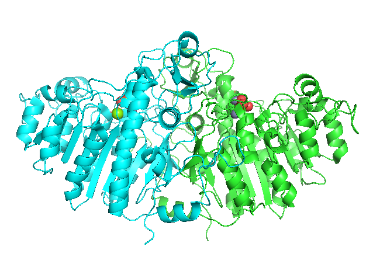
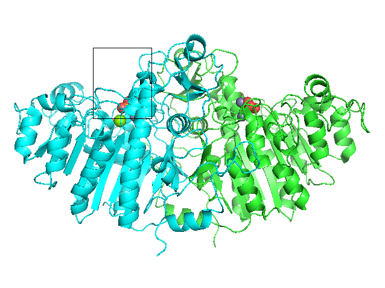

## マウス操作
PyMOLではマウスを使うことでタンパク質を様々な位置、角度から見ることができます。ここで、まずは画面右下のこの部分に着目します。

この赤い四角の部分の一番上には現在**Mouse Mode 3-Button Viewing**と書かれています。ここで、赤い四角の範囲のどこかをクリックすると

Mouse Modeが**3-Button Editing**という表示になりました。また、青い四角の部分も、**Picking Atoms (and Joints)** に変化しました。まずは、この**Viewing Mode**と**Editing Mode**の2つがあることを理解しておきましょう。2つのモードは上記の赤い四角の部分を押すことで入れ替わります。以下ではまず3-Button Viewingにしておきます。

## 3-Button Viewing Mode
Mouse Mode : 3-Button Viewingでできる操作と、対応するマウスの動きを以下で説明します。操作方法の簡単なヘルプは、上図の赤い四角の部分に英語で書かれています。例えば、Rotaは回転操作、Moveは並進操作、と言った簡単なものですが、もし忘れてしまってもここに着目すれば、操作を思い出すことができるでしょう。

- **回転 (Rota)**
    - **マウスの左ボタンを押しながらマウスを動かす（ドラッグ）** すると、表示されている分子を回転させることができます。
- **並進 (Move)**
    - **マウスのホイールボタンを押しながらドラッグ** すると、表示されている分子を視点に対して平行に移動させることができます。
- **ズームイン・アウト (MovZ)**
    - **マウスの右ボタンを押しながらマウスを前後にドラッグ、またはCtrlとShiftキーを押しながらマウスのホイールを上下** させると、分子構造を拡大・縮小することができます。
- **選択 (+/-)**
    - **表示されているオブジェクトの原子の上でマウスの左ボタンを押す** と、四角のマークが付きます。  
    この四角マークは、現在選択されている原子の範囲を示しています。この左クリックによる選択はクリックするたびに選択範囲に追加され、もう一度押すと選択範囲から外されます。
- **センタリング (Cent)**
    - **表示されているオブジェクトの原子の上でマウスのホイールボタンを押す** と、その原子が画面中央に来るように視点が移動します。また、回転操作の中心もその点に移動します。
- **Origin指定 (Orig)**
    - **表示されているオブジェクトの原子の上でCtrlとShiftを押しながらマウスのホイールボタンを押す** と、その原子を回転中心の原点(origin)に指定することができます。上記センタリングのときと異なり、視点は移動しません。
- **ドラッグで範囲指定して選択範囲に追加/除去 (+Box/-Box)**
    - **Shiftを押しながらマウスの左ボタンをドラッグ** すると、画面上に黒い四角が現れ、ボタンを離すと、その四角で囲まれた部分が選択範囲に追加されます。同様の操作を繰り返すと、その範囲も選択範囲に追加されます **（+Box）** 。
    - **Shiftを押しながらマウスのホイールボタンをドラッグ** すると同様に黒い四角が現れますが、この操作では四角で囲んだ範囲を選択範囲から除去することができます **（-Box）**   
- **メニュー表示 (Menu)**
    - **マウスの左ボタンをダブルクリック** または **右ボタンをクリック** で、メニューを開きます。メニュー内容はクリックした位置によって内容が変化します。
    - 何もない箇所でクリックすると[Main Pop-Up]メニューが表示されます。 
    - オブジェクトの上でクリックすると、クリックした場所に存在する原子についての設定変更を行うメニューが表示されます。 
- **原子ピッキング（PkAt/Pk1）**
    - オブジェクト上の原子の上で**Ctrlボタンを押しながらホイールクリック**、または**マウス右ボタンのダブルクリック**を行うと、その原子をピッキングした状態になります(**PkAt**)。  このピッキング状態は先述の選択範囲とは異なる選択形式で、図のような球体のマーカーが付きます。このピッキングは画面上に同時に4原子まで選択することができ、各ピッキングマーカーは図のように二重、三重、四重の球体マーカーで示されます。
    - **Ctrlボタンを押しながら右クリック (Pk1)** の場合では、上の操作と異なり、1つめの原子ピッキングのみを行います。
    - ピッキングされた原子が2つ、3つ、4つになると、自動でそのピッキングされた原子についての**距離(distance)**、**角度(angle)**、**二面角(dihedral)** を表示してくれます。
- **クリッピング（Clip）**
    - **Shiftとマウスの右ボタン（またはCtrl+Shift+マウス右ボタン）を押しながらマウスを上下左右に動かす** と、分子の内部を覗けたり霧をかけたりすることができます。分子内部の一部の領域を強調した画像を取りたいときに作ります。
    - この機能は2枚の**クリッピング平面（Clipping plane）** によって調節しています。マウスの上下の動きは前面のクリッピング平面(front clipping plane)の位置を、左右の動きは背面のクリッピング平面(rear clipping plane)の位置を調節できます 図解  **画面上にはこの2枚のClipping Planeの間に存在する領域だけが表示されます**。
    - マウスを画面下に移動させるとfront clipping planeは視点から見て奥へ移動し、分子の内部が見えるようになります。反対に、マウスを上へ移動させると、clipping planeは手前に移動します。 
    - マウスを左に移動させるとrear clipping planeが視点から見て奥へ移動します。反対に手前に移動させると、rear clipping planeが手前に移動し、分子の奥側が霧がかかって徐々に見えなくなります。 
    - 霧は画面上部のメニューの[Display]→[Depth Cue(Fogging)]のチェックでON/OFFを選択できます（デフォルトはONです）。 
- **スラビング（Slab）**
    - スラブとは英語で厚板、平板という名詞、または「平板にする」という動詞です。PyMOLにおいて**スラブ（Slab、Visible Slabとも）とは、上述の2枚のクリッピング平面の間に挟まれた可視化領域のこと**を指します。
    - **マウスホイールを回転させる** ことで、スラブの厚さを調節することができます。クリッピングとともに、分子構造の内部領域をみたい時に有用です。
    - 画面上部メニューの[Display]→[Clip]には[8 Angstroam Slab]を始めとして30 Åまでの厚さのスラブを選ぶことができます。[Nothing]を選択した場合には、全原子が含まれるように自動的にスラブの厚みを調節します。
- **スラブの移動（MovS）**
    - **Shiftを押しながらマウスホイールを回転させる** と、スラブ領域を、その厚みを保ったまま手前・奥に移動させることができます。効果を実感したい場合は、例として[8 Angstroam Slab]設定をした直後に使ってみるとわかりやすいでしょう。
- **スラブに対する視点の移動（MvSZ）**
    - **Ctrlを押しながらマウスホイールを回転させる** と、スラブ平面に対して視点を移動させることができます。視点がスラブ内部に入ることもできます。

## 3-Button Editing Mode （加筆中）
Viewingモードと異なり、Editingモードでは、**原子の座標情報を変更する** ことができます。一度原子の座標を変更してしまうともとに戻せないことが多いので、分子構造を観察することが目的である場合にはこのEditingモードを使わない方が良いでしょう。一方、シミュレーションの初期構造生成で原子の座標をあえて変更する必要がある場合には有用かもしれません。

Editing Modeでマウスの左ボタンをクリックすると、先程の原子ピッキングが働き、4点までピッキングすることができます。Editing Modeの本領はここからで、

- **回転 (Rota)**
    - **マウスの左ボタンを押しながらマウスを動かす（ドラッグ）** すると、表示されている分子を回転させることができます。
- **並進 (Move)**
    - **マウスのホイールボタンを押しながらドラッグ** すると、表示されている分子を視点に対して平行に移動させることができます。
- **ズームイン・アウト (MovZ)**
    - **マウスの右ボタンを押しながらマウスを前後にドラッグ、またはCtrlとShiftキーを押しながらマウスのホイールを上下** させると、分子構造を拡大・縮小することができます。
