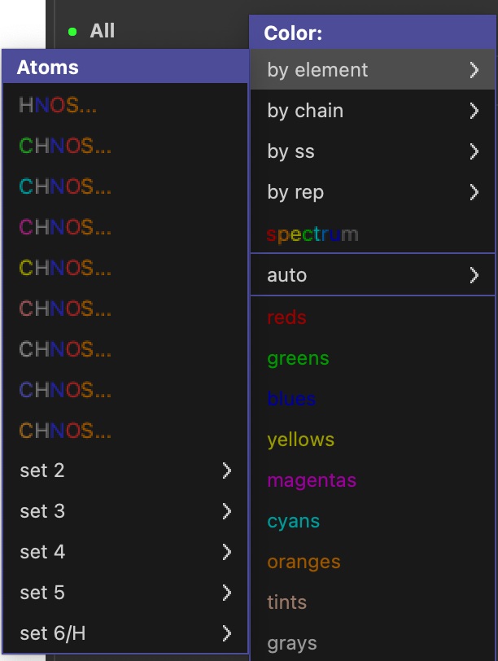
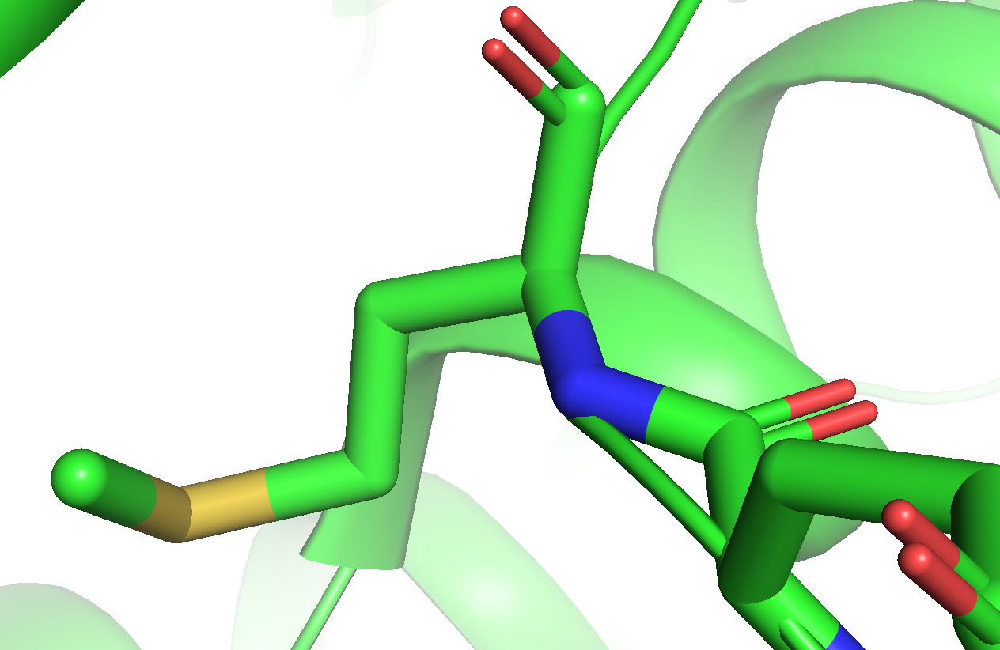
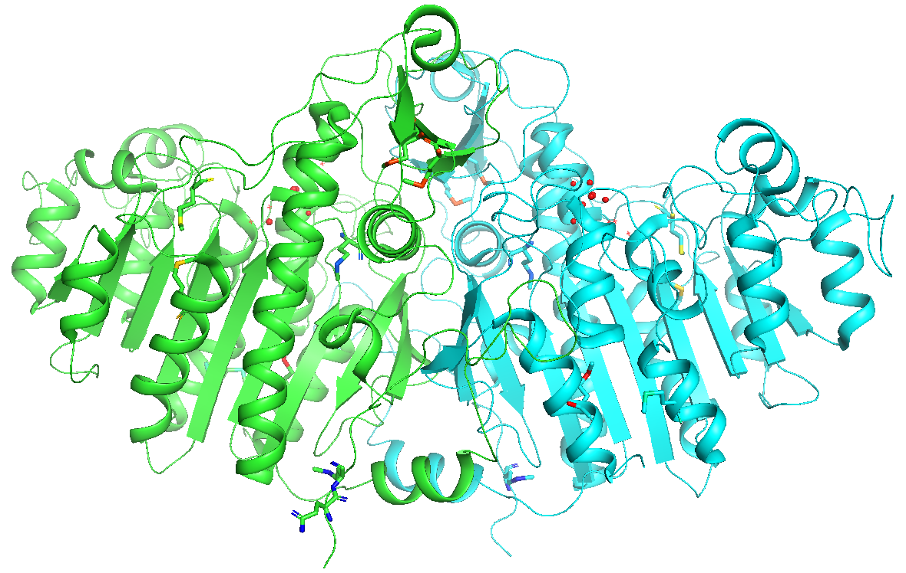
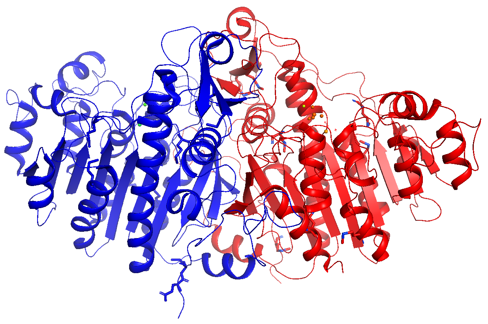
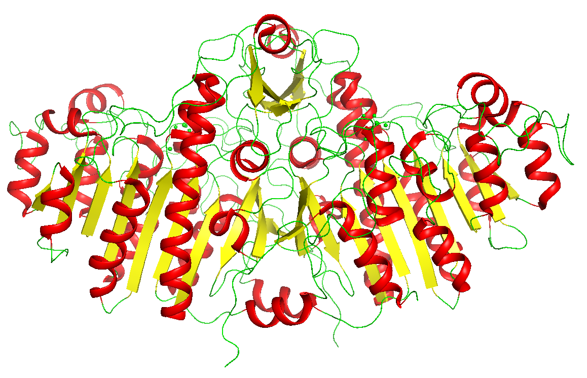
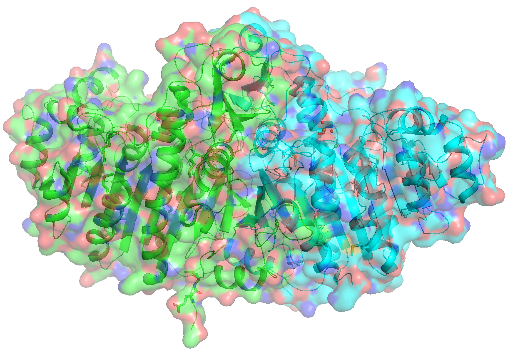
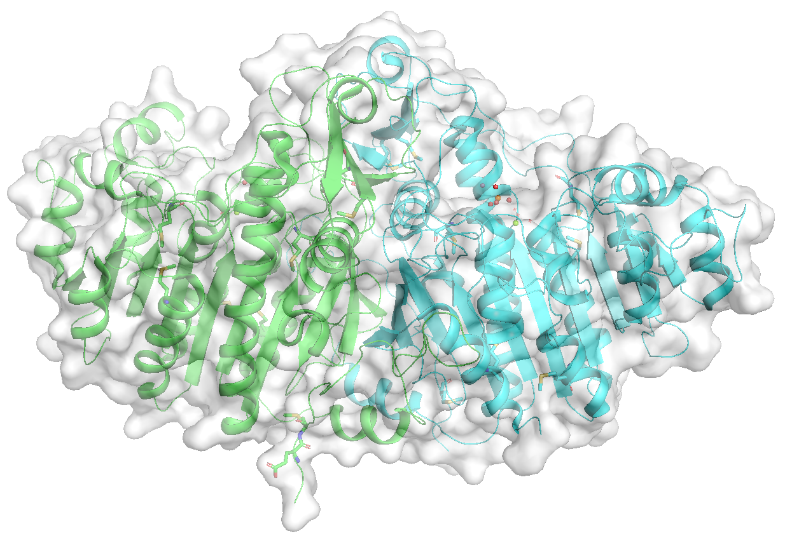
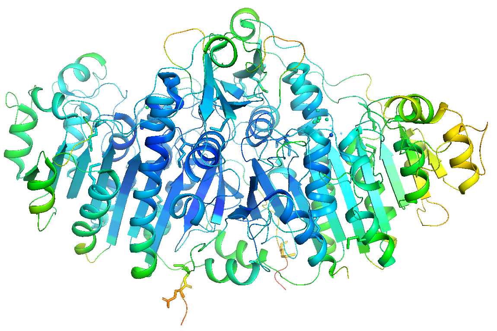

## 色の設定(Color)

色の設定の仕方は自由です、センスの見せ所です……とは言うものの、**実はタンパク質の構造を毎日見るであろう構造生物学専門の研究者にとっては、ある暗黙の了解があります**。それらを踏まえた上で、PyMOLのカラーリング機能を紹介していきましょう。

### 色設定の暗黙の了解

以下のルールだけは遵守しましょう。

* 常に**酸素原子は赤色, 窒素原子は青色, 硫黄原子はオリーブ（olive）色**で表示する。
* 存在する場合、水素原子は白色で表示。
* よって炭素原子は、**上記以外の色**を使う。

メチオニン残基の表示の例（炭素原子はgreen）

PyMOLには、酸素・窒素・窒素・水素原子を上記の色ルールで描画してくれるメニュー（"**by element**"）が存在しますので、これを使うことを強く推奨します。

正確には、PyMOLでは酸素原子はカラーコードで#FF7C7C (255, 76, 76) [1.0, 0.3, 0.3], 窒素原子は#3333FF (51,51,255) [0.2, 0.2, 1.0], 硫黄原子は#E7C640 (231, 198, 64) [0.9, 0.775, 0.25]がデフォルトで割り当てられているため、用意されているカラーパレットを使う限りにはこれらの色と完全にかぶることはないのですが、それでもこれらに近い色を使うと紛らわしいので、使用は控えましょう。また、以下で見るように、用意されているカラーパレットの中にはすべての原子を同一で塗るものもあるので、どうしてもそれらの色を使いたい場合は、そのカラーパレットを選択した後に"**by element**"メニューの一番上のカラーリング（通称"color by hetetoatom"）を選択してあげましょう。

### by element

メニューを開いていただけると一目瞭然、C（炭素）の色だけが変わっており、H, N, O, S, 他にも様々な原子について、「暗黙の了解」の色で固定されています。反対に炭素原子の色を自由に選べることで、多量体タンパク質や大きな複合体に対しても自由に色を塗り分けられることができます。**基本的には、このカラーパレットから選びましょう**。

見落としがちですが、下の方にある**set 2**〜**set 6**にも、様々な色が用意されています。set 6のみ水素原子の色が白色でないものが用意されていますが、あまり使うことはないでしょう。

一番上のメニューではCが表示されておらず、HNOSと書かれていますが、これは**炭素以外の原子の色を既定色に変更する**というとても便利なカラーパレットです（"color by heteroatom"）。

コマンド入力はこちら(オブジェクト`1alk`について行う場合)

    util.cnc 1alk # color by heteroatom

### by chain

#### by chain (elem C | */CA, | 無印)

`1つの生体分子オブジェクト内に複数のchainが存在している場合、各chainごとに異なる色で塗り分けてくれます。

`elem C`の場合、チェイン内の全炭素原子に対して色の変更を行い、他の種類の原子には色の変更を行いません。`*/CA` の場合、主鎖のCα原子のみ色の変更を行い、残りの原子には色の変更を行いません。`無印`は全原子に対して色の変更を行います。

コマンド入力はこちら(オブジェクト`1alk`について行う場合)

    util.color_chains("(1alk and elem C)") # elem C
    util.color_chains("(1alk and name CA)") # */CA
    util.color_chains("(1alk)") # 無印

#### chainbows

**各chainについて**、N末端（5'末端）からC末端（3'末端）にかけて青色から赤色のきれいなグラデーションができるように色を塗り分けてくれます。タンパク質の場合、この配色ならば、**表示された色からアミノ酸配列の位置と構造上での位置の対応関係を把握しやすい**ため、この配色になっている論文を見たことがある方も多いでしょう。

コマンド入力はこちら(オブジェクト`1alk`について行う場合)

    # どちらでもOK
    util.chainbow 1alk
    util.chainbow("(1alk)")

#### by segi (elem C | 無印)

segment identifierによる色分けを行います。

あまり詳しく調べていないのですが、segment identifierは現在仕様が廃止されつつあるのと、カラーリングが赤・青なので、あまり使うことはないでしょう。

### by ss (By Secondary Structure)

タンパク質の二次構造（ヘリックス・シート・ループ）構造を基準に色分けしてくれます。自由に選びましょう。

コマンドで行う場合で、ヘリックスを赤、シートを黄、それ以外を緑に塗りたいときは、以下のように打てばOKです。

    color red, ss h
    color yellow, ss s
    color green, ss l+''

または、

    util.cbss("1alk","red","yellow","green") # オブジェクト1alkについて行いたい場合

### by rep (By Representation)

表示形式(representation)ごとに色分けを表示させることができます。これ以外の他のメニューからの色変更は、全表示形式が一括で色変更されてしまうので、うまく使い分けましょう。例えば、by chainで緑・青に色分けをした後に[show]→[surface]としてsurface表示をした状態ですと、

という表示になりますが（コマンドで`set transparency, 0.5`とし、Surface表示の透明度を変更しています。）、続いて[by rep]→[surface]→[grays]→[white]とすると

このようにSurface表示だけ白くすることができます。

コマンド入力はこちら(オブジェクト`1alk`について行う場合)

    # どちらでもOK
    set surface_color, white, 1alk
    cmd.set("surface_color", "white", '1alk', quiet=0)

`quiet=1` とすると処理終了時にメッセージがログ欄に表示されなくなります（プログラミング用）。`surface_color` の部分を`line`や`cartoon`などに変更すればその表示形式に関わる色のみ変更できます。

### spectrum

#### rainbow (elem C | */CA, | 無印)

オブジェクト全体を虹色表示してくれます。[by chain]の[chainbow]と違い、chainごとに虹色グラデーションをつけてくれるわけではないことに注意してください。`elem C`, `*/CA`, `無印`の意味は上と同様です。

コマンド入力はこちら(オブジェクト`1alk`について行う場合)

    # elemCの場合。どちらでもOK。
    spectrum count, selection=1alk and elem C
    cmd.spectrum("count",selection="(1alk)&elem C")
    # */CAの場合
    spectrum count, selection=1alk&*/CA
    cmd.spectrum("count",selection="(1alk)&*/CA")
    # 無印
    spectrum count, selection=1alk, byres=1
    cmd.spectrum("count",selection="1alk",byres=1)

#### b-factors （無印 | */CA）

結晶構造解析法で構造決定された構造ファイルの場合、**b-factor（温度因子）** という値が各原子に対して割り当てられています。簡単に言えば、この値は **その原子のゆらぎやすさ** を表しており、概して分子内部に存在している原子ほど値が小さく、外側に存在する原子ほど大きくなっています。この色表示ではb-factorの値が小さいほど青色に、大きいほど赤色になるよう表示されます。

コマンド入力はこちら(オブジェクト`1alk`について行う場合)

    # 無印の場合。どちらでもOK。
    spectrum b, selection=1alk, quiet=0
    cmd.spectrum("b", selection=("1alk"), quiet=0)
    # */CAの場合。どちらでもOK。
    spectrum b, selection=1alk&*/CA, quiet=0
    cmd.spectrum("b", selection="((1alk)&*/CA)", quiet=0)

[表示形式のプリセットの中には、b-factorごとに色と太さを変えてくれる](../ch05/preset.md#b-factor-putty)オプションもあります。

#### area (molecular | solvent)

残基あたりのsurface area（表面積）を計算し、それに応じた値でグラデーション色付けをしてくれます。

プログラムの仕様上は`get_area`コマンドを走らせて、その値に応じた色付けを行っているようです。しかし、solventの方も含めて、かなり雑な計算なのでまったく厳密ではないようです（参考：[https://pymolwiki.org/index.php/Get_Area](https://pymolwiki.org/index.php/Get_Area)）。Solvent accessbile surface areaを計算したい場合は、別の厳密なソフトウェアで計算した値を使うことを推奨します。

コマンド入力はこちら(オブジェクト`1alk`について行う場合)

    # molecularの場合（デフォルト）。
    util.color_by_area("1alk","molecular")
    # solventの場合
    util.color_by_area("1alk","solvent")

### auto (elem C | all | by obj (elem C) | by obj)

自動で色付けをしてくれます。**複数の生体分子オブジェクトがPyMOL上で開かれている場合に有効です**。上2つは、押すたびに色が入れ替わっていきます。緑→シアン→黄→紫……の順に入れ替わります。

下2つの`by obj` がついているものはロードされている生体分子オブジェクトの上から順に色を緑→シアン→黄→紫……の順で塗り分けてくれます。特に、**`all` を選択して`by obj` を押せば一発で見慣れた色分けになってくれる**ので便利です。

コマンド入力はこちら(全オブジェクトについて行う場合)

    cmd.color("auto","(all) and elem C")
    cmd.color("auto","all")
    util.color_objs("(all and elem C)",_self=cmd)
    util.color_objs("(all)",_self=cmd)

### auto以下に存在する色分けメニューについて

autoメニューの下には様々なカラーパレットがあります。自由に選択して好きな色を選びましょう。**全表示形式(line, stick, surface...)について同一の色を適用します**。

コマンド入力はこちら(オブジェクト`1alk`について赤色で塗る場合)

    # PyMOL 2.3時代まで
    util.color_deep("red", '1alk', 0)
    # PyMOL 2.4以降（予定）
    color_deep red, 1alk
