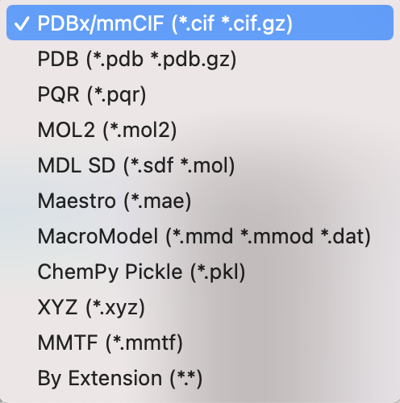
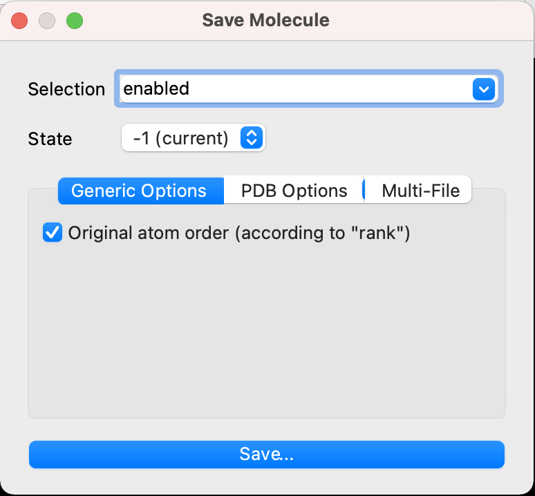
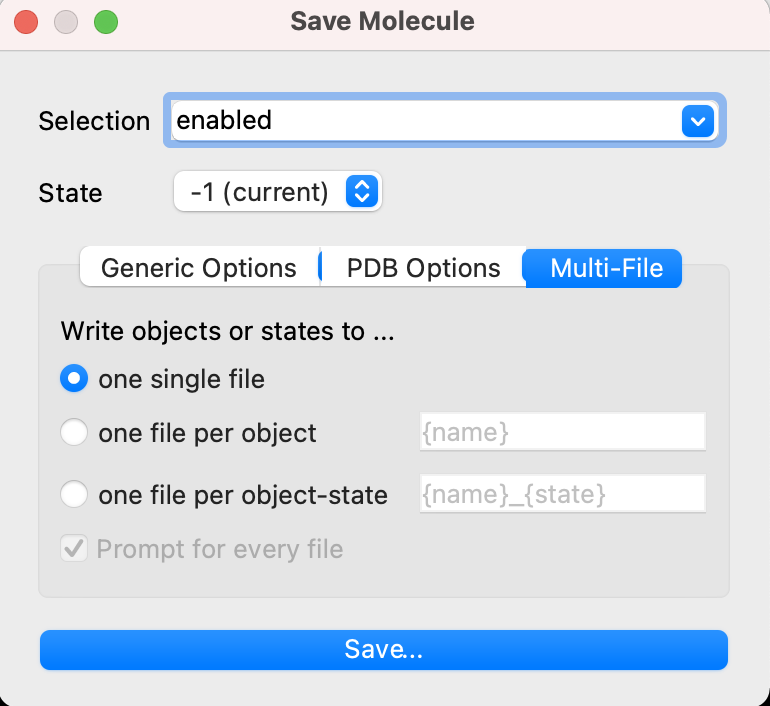

# 構造ファイルのエクスポート
ロードされている構造ファイルの全部または一部を書き出して保存することができます。

上部メニューの[**File**]から[**Export Molecule...**]を選ぶと、保存メニューが現れます。

**Selection**の部分はエクスポートする構造オブジェクトの範囲を示しています。*enabled*は現在オブジェクトパネルで表示をONにしている構造オブジェクトすべてを表します。右のプルダウンメニューには他にも*all*(ロードしている全構造オブジェクト)や個別の構造ファイルのオブジェクト名が含まれています。

**State**は1つのオブジェクトに複数の構造状態を持っている場合に、どの状態を保存するかを表しています。デフォルトは *-1 (current)* で、現在画面に表示されている状態のものを保存します。

## 対応している出力ファイル形式
<br>
デフォルトでは`PDBx/mmCIF (*.cif, *.cif.gz)`となっていますが、他にも画像のような様々なファイル形式に出力することができます。

保存メニューには他にも様々なオプションがあります。

## Generic Options


<input type="checkbox" checked="checked"> Original atom order (according to "rank")

構造オブジェクトの保存時に、ATOM行の並び順を元のファイルの入力通りに並べるかどうかを設定します。例として元のファイルが
```
ATOM      1  CH3 ACE A   1      33.160  24.100  12.400  1.00  0.00
ATOM      2 HH31 ACE A   1      32.860  24.830  11.650  1.00  0.00
ATOM      3 HH32 ACE A   1      33.800  23.390  11.880  1.00  0.00
ATOM      4 HH33 ACE A   1      32.250  23.650  12.770  1.00  0.00
ATOM      5  C   ACE A   1      33.910  24.800  13.510  1.00  0.00
ATOM      6  O   ACE A   1      33.760  24.560  14.700  1.00  0.00
```
だったとしたとき、設定がOFFであればこの並び順は
```
ATOM      1  C   ACE A   1      33.910  24.800  13.510  1.00  0.00           C
ATOM      2  O   ACE A   1      33.760  24.560  14.700  1.00  0.00           O
ATOM      3  CH3 ACE A   1      33.160  24.100  12.400  1.00  0.00           C
ATOM      4 HH31 ACE A   1      32.860  24.830  11.650  1.00  0.00           H
ATOM      5 HH32 ACE A   1      33.800  23.390  11.880  1.00  0.00           H
ATOM      6 HH33 ACE A   1      32.250  23.650  12.770  1.00  0.00           H
```
という順に書き出されます。この並びは`atom identifier`順になっています。一方、設定がONであればこの並び順は
```
ATOM      1  CH3 ACE A   1      33.160  24.100  12.400  1.00  0.00           C
ATOM      2 HH31 ACE A   1      32.860  24.830  11.650  1.00  0.00           H
ATOM      3 HH32 ACE A   1      33.800  23.390  11.880  1.00  0.00           H
ATOM      4 HH33 ACE A   1      32.250  23.650  12.770  1.00  0.00           H
ATOM      5  C   ACE A   1      33.910  24.800  13.510  1.00  0.00           C
ATOM      6  O   ACE A   1      33.760  24.560  14.700  1.00  0.00           O
```
のように、元のファイルの原子順に書き出されて保存されます。


コマンドラインでは `set retain_order, [0,1]`で同様の設定を指定できます（0で無効、1で有効）。

> 参考： https://pymolwiki.org/index.php/Retain_order

## PDB Options
<br>
これらのオプションは従来使われていた`pdb`ファイル形式で出力するときのみ対応します。

<input type="checkbox"> Write multiple bonds as duplicate CONECT records

CONECTレコードを複数作成することで原子間の結合次数の情報をエンコードし、ファイルに書き出します。デフォルトではOFFです。ver. 1.6.1から実装されました。

コマンドラインでは `set pdb_conect_nodup, [0,1]`で無視して保存するかどうかを指定できます（0で書き出す、1で書き出さない）。

<input type="checkbox"> Write CONECT records for all bonds

すべての原子間の結合の組み合わせ情報をCONECTレコードに書き出します。デフォルトではOFFです。

コマンドラインでは `set pdb_conect_all, [0,1]`で同様の設定を指定できます（0で無効、1で有効）。

> 参考： https://pymolwiki.org/index.php/Pdb_conect_all

<input type="checkbox" checked="checked"> Write segment identifier (segi) column

segment identifierを書き出すかどうかを指定します。デフォルトではONです。segment identifierとはPDB formatにおいて73-76番目のカラムを利用した識別子のことです。かつて、同一chain IDにありながらある種の原子のグループごとに分けて記述したい場合に用いられましたが、今はChain IDで分けるのが主流となっています。segment identifierは現在廃止された仕様ですが、PyMOLやChimera, CHARMMなど一部のプログラムは未だにこれを利用することができます。

コマンドラインでは `set ignore_pdb_segi, [0,1]`で無視して保存するかどうかを指定できます（0で書き出す、1で書き出さない）。

<input type="checkbox"> Retain atom ids

構造データのエクスポート時に、原子のIDを1から順になるようリナンバリングするかどうかを指定します。デフォルトではOFFです。

コマンドラインでは `set pdb_retain_ids, [0,1]`で同様の設定を指定できます（0で無効、1で有効）。

> 参考： https://pymolwiki.org/index.php/Pdb_retain_ids

<input type="checkbox"> Write HEADER for every object

このオプションを指定すると、保存時に選択された各オブジェクトがHEADERレコード〜ENDレコードで区切られながら1ファイル中にまとめて書き出されます。こうして書き出されたファイルはマルチエントリPDBファイルとなり、PyMOLでこのファイルをロードしようとすると、各エントリごとに異なるオブジェクトとして表示されるようになります。

対称性情報が含まれている場合、CRYST1レコードも記述されます。

内部処理的にはpdb形式で`multisave`コマンドを使った保存方法に直接対応しています。

> 参考： https://pymolwiki.org/index.php/Multisave

## Multi-File


現在PyMOL上で複数表示されているオブジェクトを、複数ファイルに分けてエクスポートしたいときに使うオプションです。さらに、各オブジェクトが2以上のStateを持っている場合（例として、PDB ID:1G03などのNMR構造ファイル、またはMDトラジェクトリをロードしたオブジェクトなど）は、さらにそれらを分割して保存することができます。

デフォルトではone single fileが選択されています。

<input type="radio" checked="checked"> one single file
<br>
保存したい対象オブジェクト（上部`Selection`のところで設定）を1つのファイルにまとめて保存します。保存される対象のStateはメニュー上部の`State`で変更できます。

<input type="radio"> one file per object<br>
複数のオブジェクトが表示されている場合に、各オブジェクトごとにファイルを分割して出力します。デフォルトの出力ファイル名はオブジェクト名に相当する`{name}`が設定されます。

<input type="radio"> one file per object-state<br>
各オブジェクトに複数のstateが存在する場合、上の設定と同様に、`{name}_{state}`の名前で出力します。

<input type="checkbox" checked="checked"> Prompt for every file にチェックが入っている場合は、保存対象ごとにファイル名の指定画面が現れます。例えば、1つのstateを持つAと、20つのstateを持つBのオブジェクトがある場合に<input type="radio" checked="checked"> one file per object-stateを選択すると、21回画面がポップアップすることになります。
