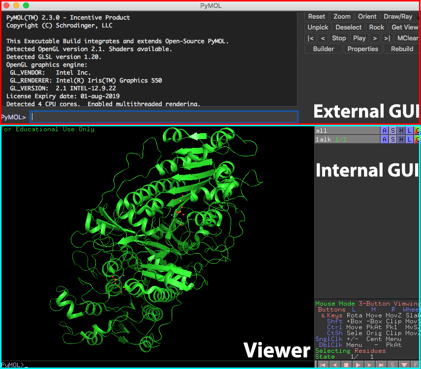

# 第2章 Internal GUIの使い方

# GUIによる基本的な操作方法
GUIとはGraphical User Interfaceのことで、マウスを使ってタンパク質オブジェクトを操作したり、設定を変更したりできるユーザーインターフェースのことです。またPyMOLには**Internal GUI**と**External GUI**と呼ばれるメニューが存在し、マウスのクリックを使った直感的な操作が行えるようになっています。

{{#include ./loadmol.md}}
{{#include ./dispseq.md}}
{{#include ./objpanel.md}}
{{#include ./showandhide.md}}
{{#include ./label.md}}
{{#include ./color.md}}
{{#include ./mouse.md}}
{{#include ./session.md}}
{{#include ./export.md}}
{{#include ./saveimage.md}}
