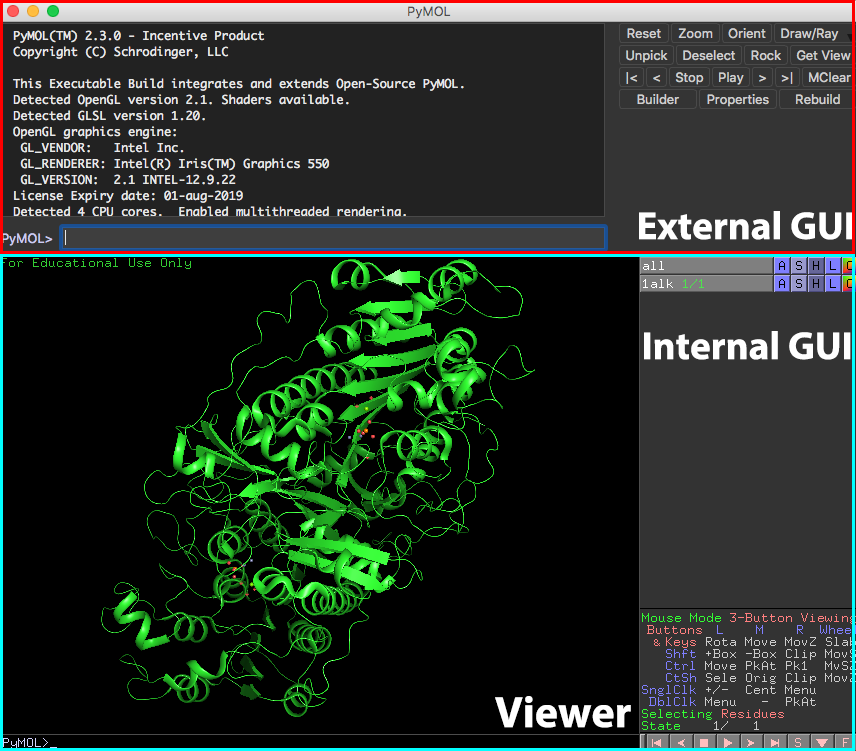

# 第2章 Internal GUIの使い方

GUIとはGraphical User Interfaceのことで、マウスを使ってタンパク質オブジェクトを操作したり、設定を変更したりできるユーザーインターフェースのことです。またPyMOLには**Internal GUI**と**External GUI**と呼ばれるメニューが存在し、マウスのクリックを使った直感的な操作が行えるようになっています。

1. [配列の表示](loadmol.md)
2. [オブジェクトパネル](objpanel.md)
3. [マウス操作](mouse.md)
4. [セッションの保存](session.md)
5. [構造ファイルのエクスポート](export.md)
6. [画像の保存](saveimage.md)
