## ラベルの設定(Label)
**ラベル**を利用することで、分子の周辺に文字を表示させることができます。活性部位周辺に存在する残基の名前と番号を表示させるだけでなく、任意の文字列を表示させることができます。

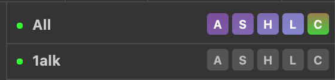 

[分子構造の表示形式のON/OFF (Show and Hide)](./showandhide.md)のときと同様に、オブジェクトパネルから各オブジェクトに対して個別にラベルの設定を行うことができます。特に、選択範囲`(sele)`に対して表示させることが多いでしょう。

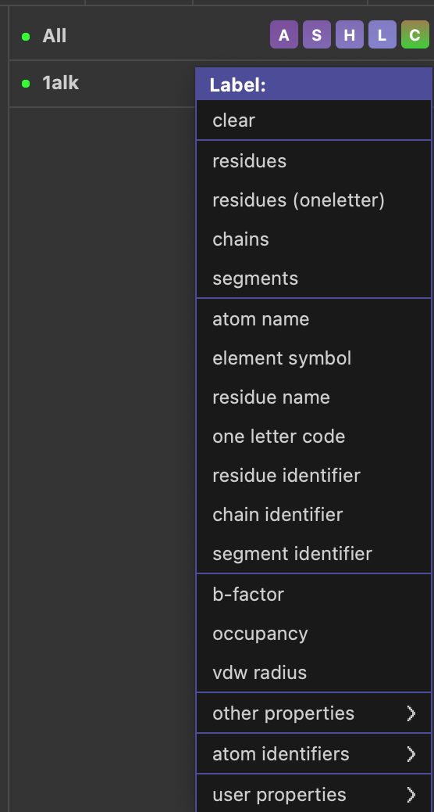

**ラベルの設定変更**はGUIの上部メニューから、Setting -> Labelのところにあり、ラベルの表示サイズやフォント指定、色の指定などが可能です。下記のサンプルではフォントサイズを28にしてあります。

**ラベルの位置変更**は3-Button Editing Modeにしてから、ラベルの上でCtrl(macOSの場合はCommand)を押しながら左クリックでドラッグさせることで任意の位置に移動させることができます。下の例ではASP-101を右に移動させています。

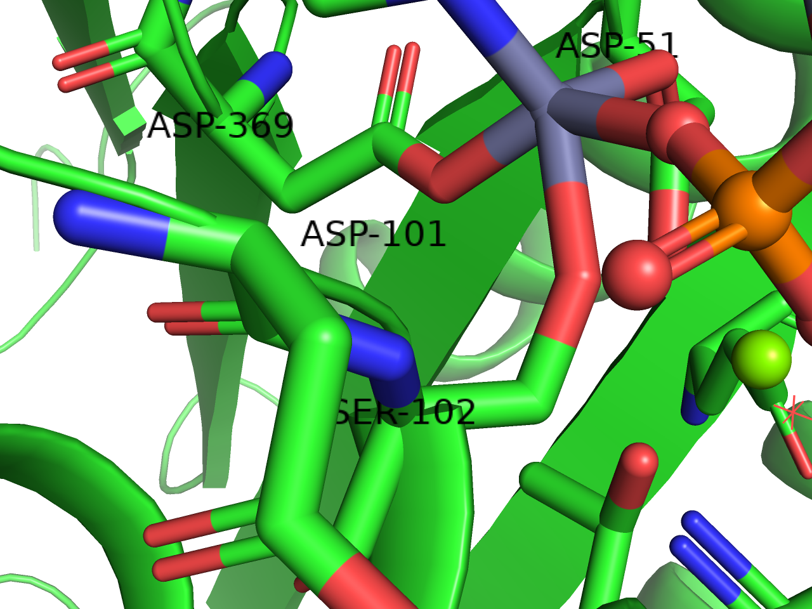

### clear
すでに表示されているそのオブジェクトについてのラベル表示を消去します。消去するのではなく表示を一時的に場合は、Hideメニューからlabelを選択しましょう。

### residues
選択されたオブジェクトについて、アミノ酸と残基番号の情報を`（アミノ酸3文字表記）-（残基番号）`の形で表示します(例：MET-1)。Cα原子の上に表示される設定になっています。

### residues (one letter)
選択されたオブジェクトについて、アミノ酸と残基番号の情報を`（アミノ酸1文字表記）（残基番号）`の形で表示します(例：M1)。Cα原子の上に表示される設定になっています。

### chains
選択されたオブジェクトのN末端とC末端の番号を持つ残基（リガンドが存在する場合、それも含む）のそばに`chain <chain ID>`の形で表示します（例： chain A）。

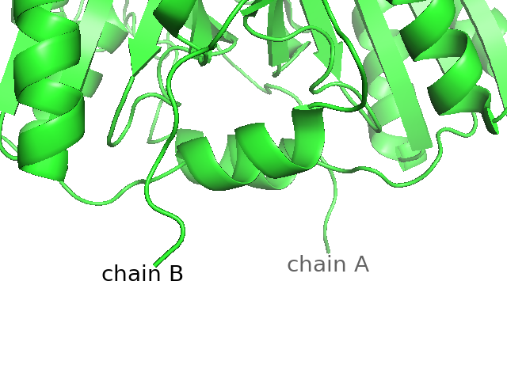

### segments
今となっては使用が廃止されたsegment identifierの情報をchainsと同様に表示します。詳しくは[Appendix: 用語#セグメント](../append01/term.md#セグメントsegment-identifier)を参照してください。今となってはあまり使うことはないと思います。

### atom name
原子名の名前でラベルを作成します。`.pdb`形式ファイルの場合、`ATOM`, `HETATM`レコードの13-16列目に含まれる文字列がatom nameとして定義されており、この文字列を返します。

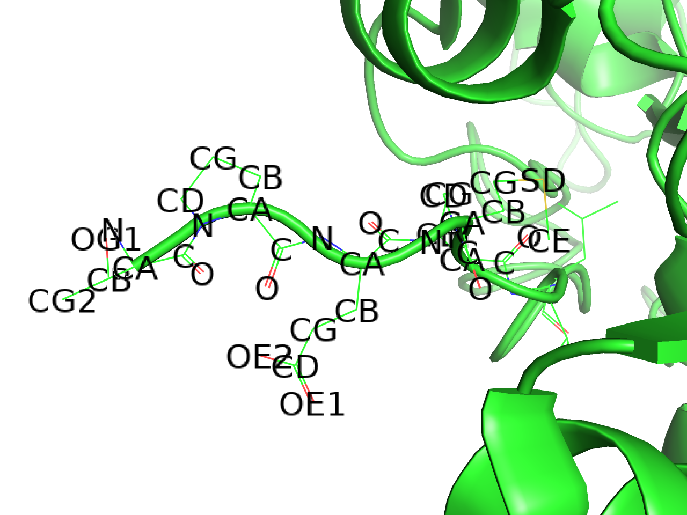

タンパク質アミノ酸やDNA, RNAの場合は命名規則があるため、慣れてしまえばatom nameの意味を理解しやすいと思います。13-14列目には右詰めで原子名を表します。例えば鉄原子は13-14列目を使ってFEの文字が入っていますが、炭素原子は14列目にCの文字を入れ、13列目は空白となっています。しかし、水素原子の場合は13-16列目の4文字分を最大限使って記述する場合があり、この場合は13列目から記入することになっています。

以下ではよく登場するatom nameの一例です。

|atom name|意味|
|--:|--:|
| CA|主鎖のα位の炭素|
|  N|主鎖のN末端側窒素原子|
|  C|主鎖のC末端側炭素原子|
|  O|主鎖のC末端側酸素原子|
| CB|側鎖のβ位の炭素|
| CG|側鎖のγ位の炭素|
| CD|側鎖のδ位の炭素|
| CE|側鎖のε位の炭素|
| CZ|側鎖のζ位の炭素（チロシンなど）|
| Oη|側鎖のη位の炭素（チロシンなど）|

主鎖に近い原子の個数順にβ→γ→δ→ε→ζ→ηと付ける命名規則があります。複数原子が存在するようなアミノ酸（ヒスチジン）などはND1, CD1, CE2, NE2というふうに番号をつけて区別します。

### element symbol
原子名を表記します。

### residue name
3文字表記の残基名を表記します。`.pdb`ファイル形式における`ATOM`, `HETATM`レコードの18-20列目の文字列を返します。存在しない場合は空白になります（以下同様）。

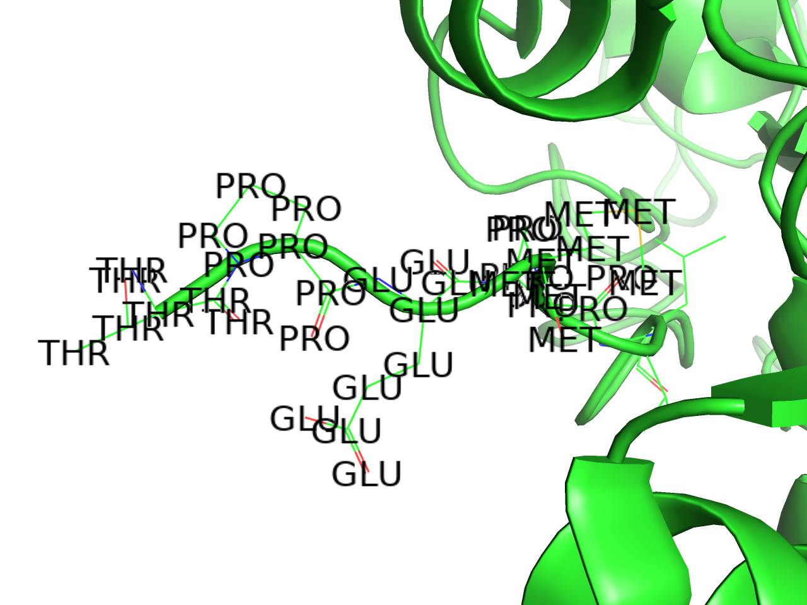

### one letter code
1文字表記の残基名を表記します。

### residue identifier
残基のresidue IDを表記します。`.pdb`ファイル形式における`ATOM`, `HETATM`レコードの23-26列目の文字列を返します。

### chain identifier
残基のChain IDを表記します。`.pdb`ファイル形式における`ATOM`, `HETATM`レコードの22列目の文字列を返します。

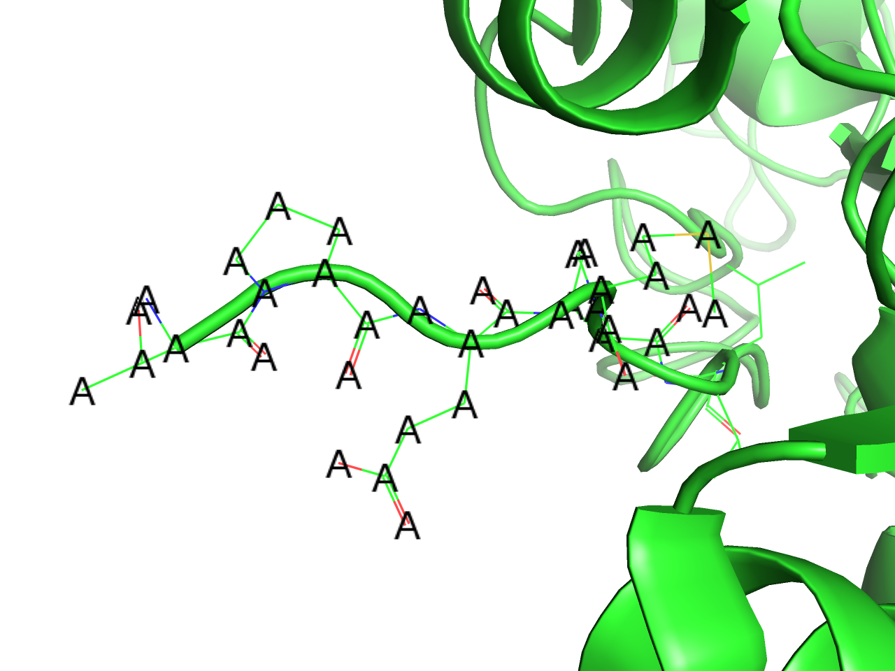

### segment identifier
残基のSegment IDを表記します。詳しくは[Appendix: 用語#セグメント](../append01/term.md#セグメントsegment-identifier)を参照してください。

### b-factor
各原子の温度因子（b-factor; temperature facotr）を表記します。`.pdb`ファイル形式における61-66列目の文字列を返します。

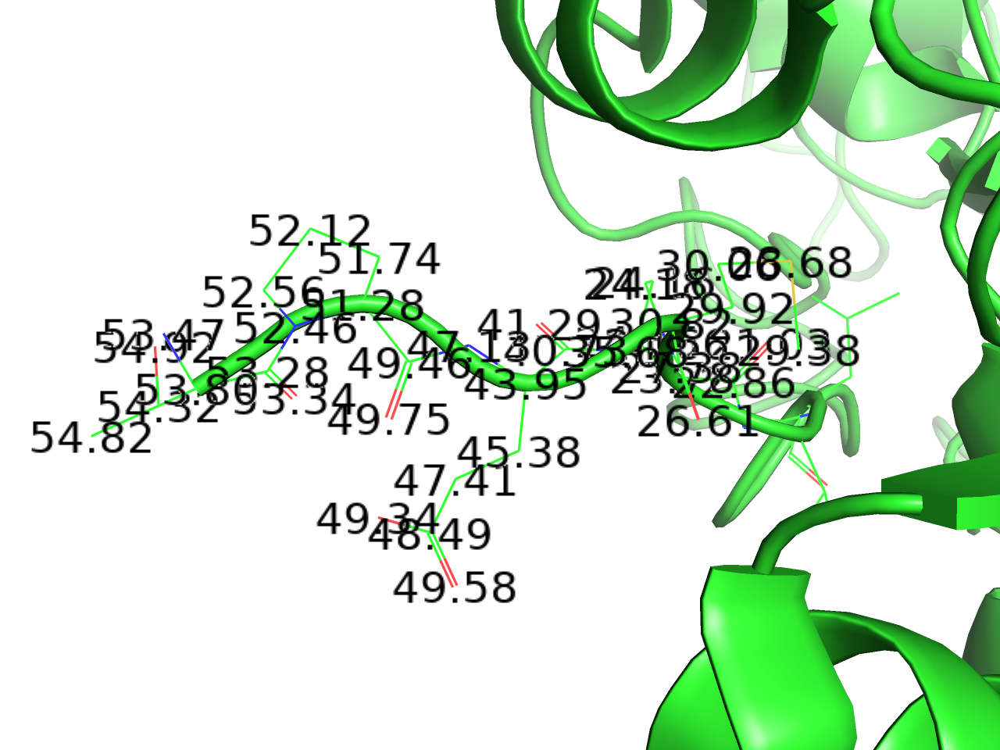

### occupancy
各原子の重み因子を表記します。`.pdb`ファイル形式における55-60列目の文字列を返します。結晶中では基本的に構造は繰り返しになるため、どの場所を見ても同じ座標がループしている事が多く、この値は`1.00`であることが多いのですが、時々その繰り返し構造単位の中に、1より大きなn通りの配座を持っていることがあります。このとき、ここには0~1の小数値が入ります。例としては PDB: 1A6MのGLN-8が`0.57`, `0.43`の値を持つ2通りの配座を持ち、同様にTYR-151も`0.50`, `0.50`で2通りの配座を持っています。この場合、PyMOLの表示上でも2通りの残基配座が見えます。画像はPDB: 1A6MのGLN-8の例を示しています。

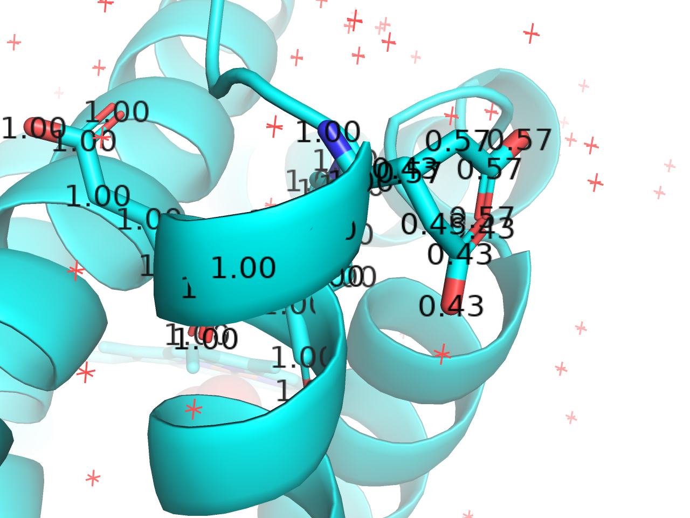

### vdw radius
各原子のファンデルワールス半径の値（Å）を表記します。基本的には原子の種類によって固定の値です。

### Other properties
#### formal charge
各残基についてシステムで定義されている電荷を表記します。例としてLys, Arg残基の場合は`+1`を、Glu, Asp残基の場合には`-1`を表示します。

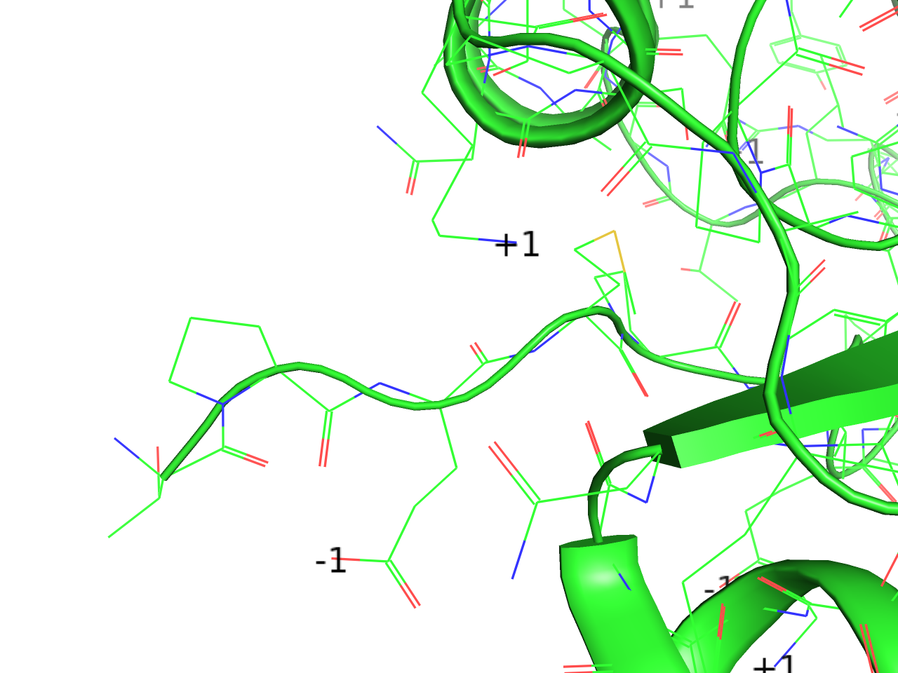

#### partial charge
各原子について計算された部分電荷(partial charge)を表記します。これは通常の`pdb`, `mmCIF`といった構造ファイルには含まれていないため、`0.00`と表示されてしまいますが、`pqr`や`mol2`ファイル形式をロードしたときに真価を発揮します。

タンパク質構造の場合は構造ファイルをいったんロードした後、[APBSプラグインを使った表面電荷表示](../ch04/apbs.md)の手順に従って処理を進めます。このときにオブジェクトパネルに`run01`->`prepared01`というオブジェクトが生成されるので、`prepared01`オブジェクトのラベル設定でpartial chargeを選択すると図のように部分電荷が表示されるようになります。

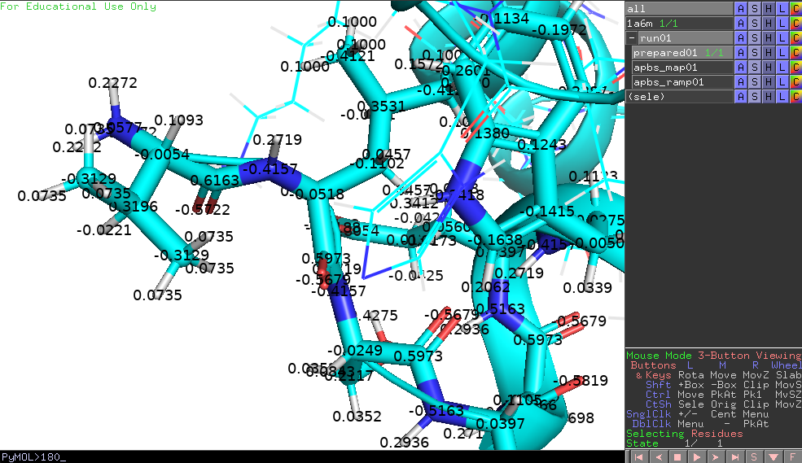

より正確に言えば、これはPDB2PQRというソフトウェアによって分子動力学シミュレーションソフトウェアAMBERが配布している力場AmberFFに基づいて指定されており、各アミノ酸の原子ごとに固有の値を指定してくれます。

実態としてはPQRファイルの記述様式にのっとり、x, y, z座標の次にくるchargeの値を表記しています。

> 参考：[6.15. PQR file format](https://www.mdanalysis.org/docs/documentation_pages/coordinates/PQR.html)

mol2形式の場合でも対応しています。

GaussianやGAMESSなどの量子化学計算ソフトウェアで計算した部分電荷を図にして見てみたいときに特に有効です。

#### elec. radius
partial chargeのときと同様に、PQRファイルのオブジェクトの場合に効果を発揮します。PQRファイル内のx, y, z座標, chargeの次にくるradiusの値を表記しています。vdw radiusとは異なります。

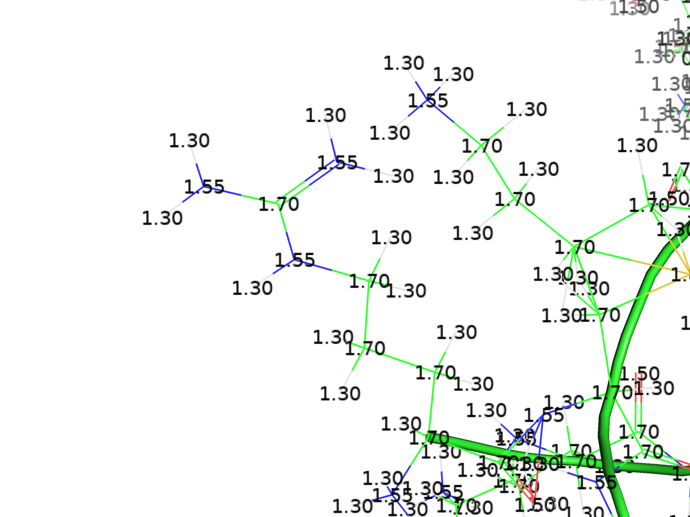

#### text type, numeric type
PyMOL 2.0以降は廃止されているらしく、使われていないようです（詳細不明）

#### stereochemistry
PyMOL 2.2から実装されました。schrodingerのソフトまたはrdkitモジュールのインストールが求められるようです。不斉炭素原子の部分にラベルを置いてくれる機能？

### atom identifiers
#### rank
rankを表記します。rankとは構造ファイルの上から順に`ATOM`, `HETATM`レコードを取得したときの通し番号のことであり、これのみ**0始まり**となっています。

> “rank” selects atoms based on their position in the source file, starting with zero as the first number.

#### ID
IDを表記します。IDとは構造ファイルから忠実に取得したATOM IDのことであり、`pdb`ファイルフォーマットで言えば7-11列目に存在する番号のことを指します。この値は整数値でなければなりません。

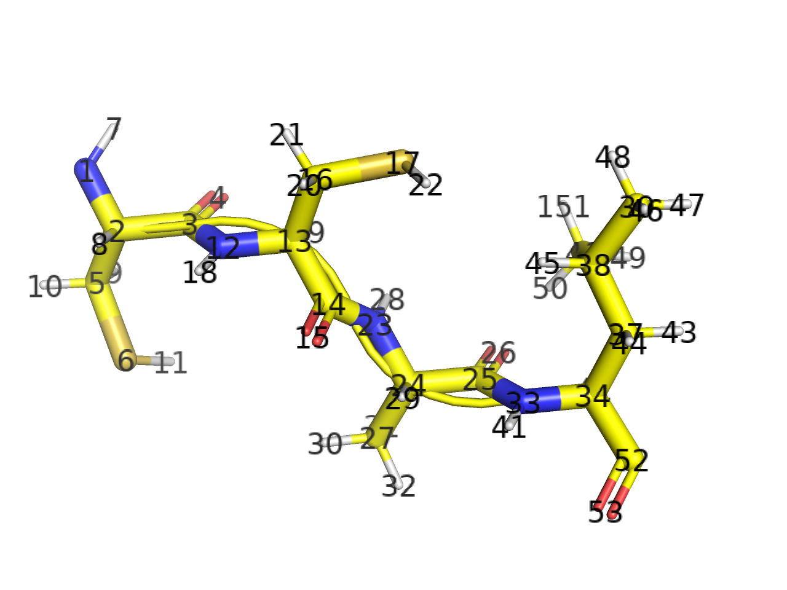

> “id” selects atoms based on the atom identifier number from the source file, which must be a integer.

#### index
Indexを表記します。indexはrankと似ていますが、順に表示するのとは異なり、PyMOL内部で番号を順に振り直したのがindexです。例えばある1つのアミノ酸残基があったとき、その残基の中で登場する原子の順番をどのように入れ替えても、index表記ではN→CA→C→O→CB→……の順に若い数字を付けていきます。

> “index” selects atoms based on their internal PyMOL object atom indices starting with one as the first number.