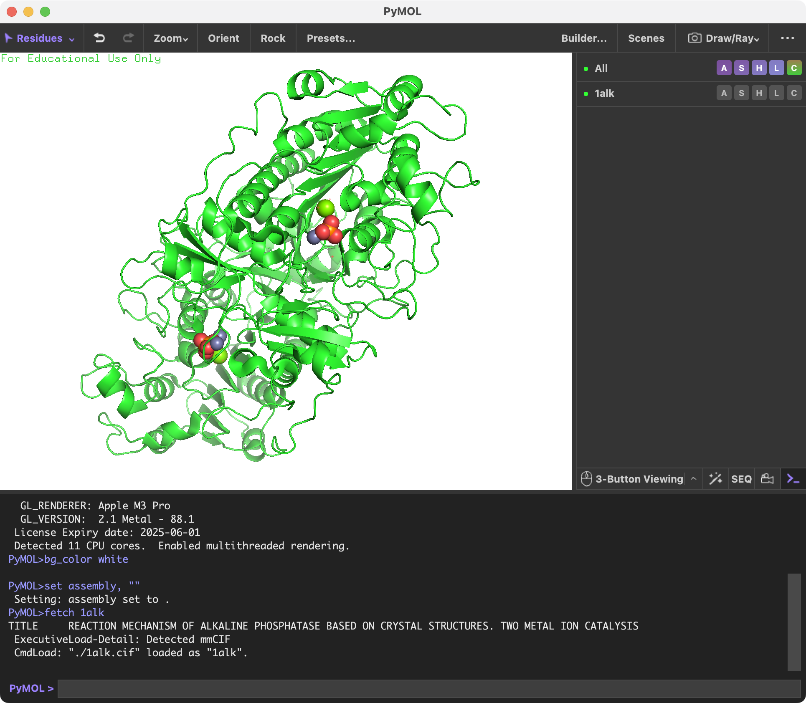

### 構造ファイルのロード
メニュー左上の[File]から、[Open...]を選び、PyMOLに表示させたい構造ファイルを選択します。ここでは、先程ダウンロードした `1alk.cif` ファイルを例として、ダブルクリックして表示させてみます。

すると、画面に1ALKのアルカリフォスファターゼの構造が表示されました。はじめは黒背景に緑のタンパク質がオブジェクトが浮かんでいると思いますが、ここで続けて、メニューの[Display]から[Background]->[White]を選択すると、白背景にすることができます。

 
