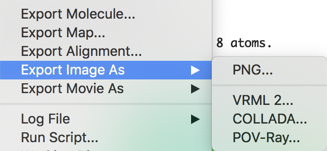
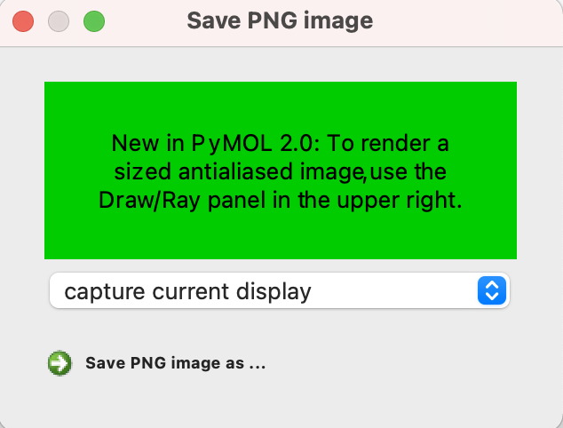
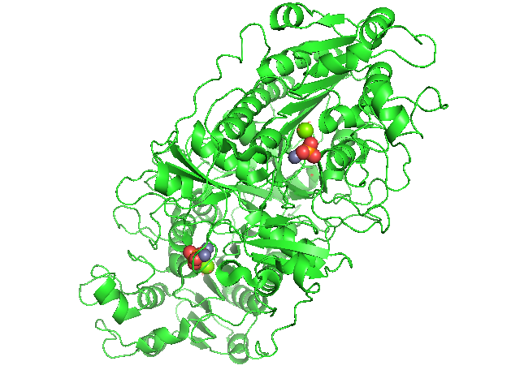
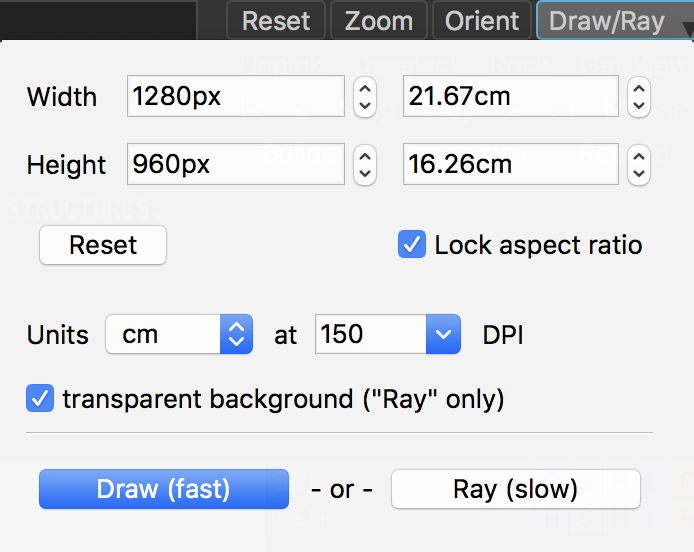

# 画像の保存
PyMOLで表示されている画像を保存することができます。上部メニューの[**File**]から[**Export Image As...**] → [**PNG**]を選ぶと、保存メニューが現れます。

デフォルトでは"capture current display"と表示されています。

この設定で下にある"Save PNG image as..."を押すと、保存先を指定するメニューが表示され、名前を入れて保存することができます（画像はいずれも`bg_color white`で白背景にした場合で表示しています）。

これでとりあえず上のような画像を保存することができましたが、他にも様々なメニューがあるので、状況によって使い分けると良いでしょう。まずは、"capture current display"のプルダウンメニューの部分を押すと、

計4つのメニューがあることがわかります。まず"draw antialiased OpenGL image"とすると、描画にアンチエイリアスがかかります（※なおmacOSの場合、現状OpenGL周りの処理にバグがあるためWARNINGSのメッセージが出ています。）

続いて"ray trace with opaque background"とすると、ray traceをかけてオブジェクト全体に陰影をつけながら表示することができます。

最後に、"ray trace with transparent background"では、ray traceによる陰影と背景の透過処理が行われます（下の画像例では市松模様になっていますが、実際に出力される画像ではきちんと背景が透明になっています）。

特に最後のオプションで背景を透明化したものは、スライドに画像を載せるときなどで利用することが多いため、覚えておくと良いでしょう。

また、保存時のパネルには"To render a sized antialiased image, use the Draw/Ray panel in the upper right."というメッセージが表示されていますが、これはPyMOLのGUI部分の右上にあるメニューのことを指しています。

これをクリックすると設定メニューが表示されます。

先述のメニューでは出力される縦と横の画像サイズは指定できませんでしたが、先にここのメニューで縦(Height)と横(Width)の値を目的の値に変更しておけば指定することができます。

Unitsは`cm`または`inch`を設定できます。また、DPIはdot per inchのことであり、この値が大きいほど画像の解像度が上がる一方、ファイルサイズは大きくなります。論文誌によっては300 DPIを求められる場合がありますので、発表用のものは`300`にしておくと良いでしょう。

<input type="checkbox" checked="checked"> transparent background ("Ray" only) では、先述の背景の透明化処理の有効・無効を設定できます。

出力は"Draw (fast)"と"Ray (slow)"とありますが、これは先述の"draw antialiased OpenGL image"と"ray trace ~"にそれぞれ対応しています。

コマンドラインで行う場合は、各オプションが以下のコマンドに対応しています。

|オプション|コマンド|
|---|---|
|*capture current display*|`png foo.png, 0, 0, -1, ray=0`|
|*draw antialiased OpenGL image*|`draw 0, 0 ; png foo.png, 0, 0, -1, ray=0`|
|*ray trace with opaque background*|`set opaque_background, 1; png foo.png, 0, 0, -1, ray=1`|
|*ray trace with transparent background*|`set opaque_background, 0; png foo.png, 0, 0, -1, ray=1`|

