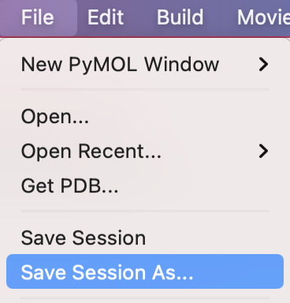

# セッションの保存
**セッション**とは、一連のインタラクティブ操作のことを指します（コンピュータ用語）。PyMOLにおいては、開いてから現在に至るまでの作業記録、と考えることができます。つまり、**セッションの保存**を利用すると作業状態をファイルに保存しておくことができ、あとでその状態を復元することができます。この機能を利用すれば、論文の図を作成している最中に様々な設定を試すことができたり、PyMOLの画面の状態を他の人に表示して確認してもらうということも可能になります。

やり方は簡単で、上部メニューの[**File**]から[**Save Session As...**]を選び、ファイル名を指定してSaveボタンを押して保存するだけです。 

Sessionのファイル形式には**pse**形式と**psw**形式の2つがあります。基本的にはpseファイル形式の方で保存する方がよいでしょう。pswファイルで保存した場合は、そのファイルを開くときに全画面表示が標準になります。例えばデスクトップに`foo.pse`というファイル名で保存したい場合は以下のように入力して[save]ボタンを押します。 

こうして保存されたセッションファイルを再度PyMOLからロードすれば、元の作業状態に戻すことができます。

※ 一度セッションを保存しておけば、以降は[**Save Session**]ボタンを押すことで同名のセッションファイルに上書きしてくれます。
