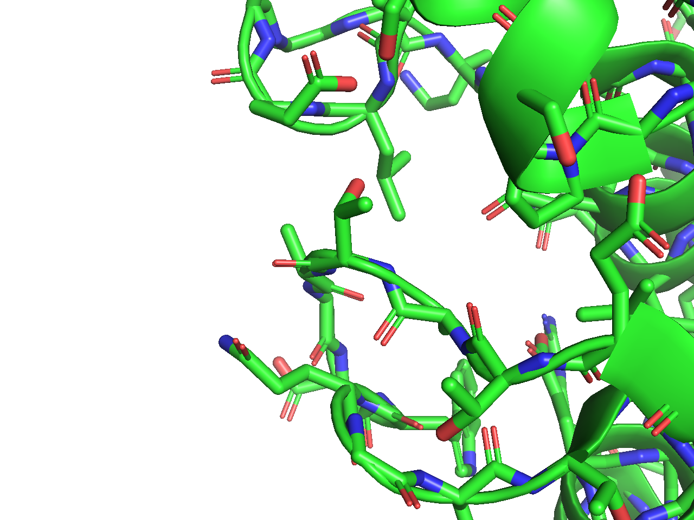

## 分子構造の表示形式のON/OFF (Show and Hide)
タンパク質の構造情報をロードしたとき、デフォルト設定では、20種類のアミノ酸についてはCartoon表示形式と呼ばれる漫画風な表現形式になっています。このCartoon表示形式では、αヘリックスを形成している部分については大きな螺旋で描かれ、βストランド（βシート）を形成している部分については、進行方向に向かって矢印が伸びる表現で描かれています。

タンパク質を構成するアミノ酸を1つ1つ強調して見てみたい場合には、**Cartoon**, **Line**, **Stick**, **Ribbon**, **Sphere**, **Dot**, **Surface**, **Mesh** 表示などの、他の表示形式をONにするという操作を行います。この表示形式の設定は、各オブジェクト構造について個別に行います。例えば、先程ロードした1alkのタンパク質オブジェクトについて他の表示形式をONにしたい場合は、図のように、1alkの**Sマーク部分（図の赤四角部分のボタン）** をクリックします。反対に、OFFにしたい場合は**Hマーク部分（図の青四角部分のボタン）** を押し、各表示形式を選択することでOFFになります。

 

<!--
set_view (\
     0.990649223,   -0.127824500,    0.047657397,\
     0.136341795,    0.915909708,   -0.377514422,\
     0.004605473,    0.380482703,    0.924775600,\
    -0.000116501,   -0.000019159,  -50.788997650,\
    29.517896652,    2.209085464,   19.883510590,\
     0.894756913,  100.680503845,  -20.000000000 )
-->

各表示形式のサンプルを以下に示します。

- **Cartoon表示**
    - 
    - タンパク質やDNA・RNAを表示するときにおすすめです。タンパク質の場合はαヘリックスやβシートが先述のように螺旋や矢印で示されます。DNA/RNAが存在する場合には、各塩基の概形や5'末端→3'末端のつながりが強調して表示されます。
- **Line表示**
    -  
    - 各原子間の結合が細い線で表示されます。上の図では、左にLine表示だけをONにしたものを、右にCartoon表示形式をLine表示とともにONにした場合を右図に示しています（以降、見やすくするためにCartoon表示をONにした上で、他の表示形式を載せます）。
    - 各原子は構造情報ファイルの座標のATOMまたはHETATMレコードに書かれている座標情報（\\( x, y, z \\)の3次元ベクトル）をもとにプロットされ、各原子座標の距離が一定以内にあれば、自動的にその近い2点が直線で結ばれて表示される仕様となっていることに気をつけてください。
- **Stick表示**
    -  
    - 各原子間の結合がLine表示よりも太いStickで表示されます。Stickは円筒状に表現されます。

- **Ribbon表示**
    -  
    - タンパク質または核酸の鎖部分のみを単純な線で表現する形式です。

- **Sphere表示**
    -  
    - 各原子を大きな球体で表現します。Line, Stick表示と異なり、各原子間は直線で結ばれません。

- **Dot表示**
    -  
    - Sphere表示の表面を点で表現したような形式です。

- **Surface表示**
    -  
    - 各原子の表面を滑らかに描画する形式です。分子の大きさによっては、レンダリングに少し時間がかかります。

- **Mesh表示**
    -  
    - Surface表示と似ていますが、表面の描画を網掛けで表現します。
