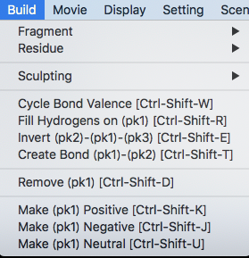

# Build
Buildのメニューからは、PyMOLに内蔵されている化合物のフラグメントやアミノ酸残基のデータを利用して任意の化合物またはポリペプチド鎖の構造モデルを生成することができるようになっています。主な利用方法としては、既存のタンパク質構造をロードしたあとに、その末端に長い人工ペプチドを取り付けたモデル構造を作成することや、0から任意のポリペプチド鎖を作成して計算科学の研究の初期構造に利用するという使い方があります。

Buildメニューは以下の通りです。

## Fragment
ここでは

## Residue
このメニューは20種類の正準アミノ酸の残基のデータの他に、N末端キャッピング用のAcetylとC末端キャッピング用のN-Methylが存在しています。キャッピングとはMDシミュレーション上で使われる人工的な修飾で、末端部分の電荷をニュートラルにするために使われます。それ以外の方はあまり利用することがないでしょう。

AltキーとA~Zの文字を組み合わせて入力することでマウスを使わずに簡単にポリペプチド鎖を作成していくことができます。また、プログラミングしたいときに便利な点として、`cmd._alt(chr(XX))`を入力することでそのキーを入力した扱いにすることができます。XXにはASCII CODEが入ります（A: 65, B: 66, C: 67, ... 88: X, Y: 89, Z: 90）。
|表示|残基名|cmdコマンド|
|:-----------------|:------------------:|:-------------------:|
|Acetyl|アセチル基||
|Alanine|アラニン|`cmd._alt(chr(65))`|
|Amine|アミン|-|
|Aspartate|アスパラギン酸|`cmd._alt(chr(68))`|
|Asparagine|アスパラギン|`cmd._alt(chr())`|
|Arginine|アルギニン|`cmd._alt(chr())`|
|Cysteine|システイン|`cmd._alt(chr())`|
|Glutamate|グルタミン酸|`cmd._alt(chr())`|
|Glutamine|グルタミン|`cmd._alt(chr())`|
|Glycine|グリシン|`cmd._alt(chr())`|
|Histidine|ヒスチジン|`cmd._alt(chr())`|
