## Display
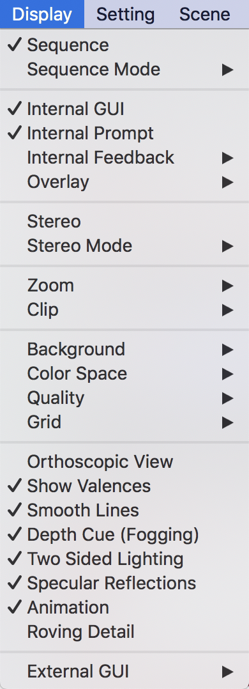

### <input type="checkbox"> Sequence

Viewer上に表示されている生体分子オブジェクトの配列を表示します。デフォルトでは`OFF`になっています。

配列情報はViewer上部に表示されます。複数オブジェクトが存在する場合でも、まとめて表示することが可能です。また、この機能のON/OFFは画面右下の`S`ボタンを押すことでも可能です。コマンドは`set seq_view, 0/1`です（`0`でOFF, `1`でON）。

### Sequence Mode

次に示す5つの選択メニューは配列情報自体の表示の変更に関わる設定です。いずれか1つのみ同時に設定できます。

#### <input type="checkbox" checked="checked"> Residue Codes

タンパク質アミノ酸を**1文字表記**で表示します。核酸の場合は`DG`, `DA`といった表記になります。デフォルトではこの設定がONになっています。コマンドは`set seq_view_format, 0`です。

#### <input type="checkbox"> Residue Names
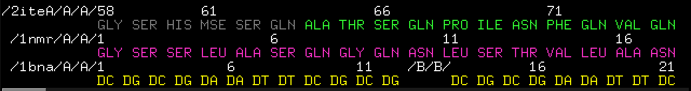

タンパク質アミノ酸を**3文字表記**で表示します。核酸の場合は`DG`, `DA`のままで特に変化しません。コマンドは`set seq_view_format, 1`です。

#### <input type="checkbox"> Chain Identifiers
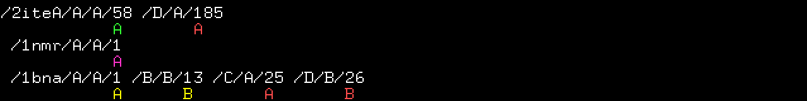

Chain識別子（A鎖、B鎖……）で表示します。コマンドは`set seq_view_format, 3`です。

#### <input type="checkbox"> Atom Names

各アミノ酸残基または核酸塩基をさらに細分化し、原子名単位で表示することができます。特に、ある特定の場所の原子名を持つ原子だけを選択したいというときに、**Selecting**（マウスクリック時の選択単位）を**Atoms**に変更することと組み合わせることで簡単に選択するできるので重宝します。コマンドは`set seq_view_format, 2`です。

#### <input type="checkbox"> States

State番号を表示します。上の例では`1NMR`オブジェクトはNMRで構造解析されたデータであり、20 states存在するオブジェクトです。`2iteA`と`1bnaA`はともに結晶構造解析のデータであり、通常1 Stateのみになっています。コマンドは`set seq_view_format, 4`です。

次に示す4つの選択メニューは、配列表示欄の表示方法に関わる設定です。いずれか1つのみ同時に設定できます。例として、上記の**Residue Codes**表示をONにした場合の設定を掲載しています。

#### <input type="checkbox" checked="checked"> All Residue Numbers

全てのオブジェクトについての配列番号を表示します。コマンドは`set seq_view_label_mode, 2`です。

#### <input type="checkbox"> Top Sequence Only
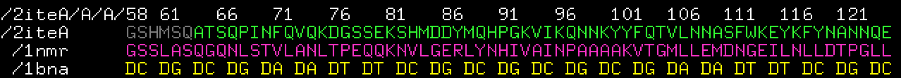

配列番号の表示を一番上のオブジェクトのもののみに限定します。同じオブジェクトを複数ロードしている場合には便利ですが、そうでない場合にしようすると、残基番号の位置を誤ってしまうことになるので、利用しないことが推奨されます。コマンドは`set seq_view_label_mode, 1`です。

#### <input type="checkbox"> Object Names Only
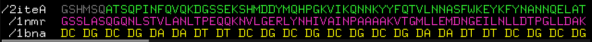

配列番号をすべて隠し、オブジェクト名だけを左端に表示します。コマンドは`set seq_view_label_mode, 0`です。

#### <input type="checkbox"> No Labels

配列番号、オブジェクト名いずれも非表示にし、配列情報のみを表示します。
コマンドは`set seq_view_label_mode, 3`です。

以下の3つのメニューは、配列情報中に存在するミッシング残基についてのギャップマーク`-`の表示・非表示を設定します。いずれか1つのみ同時に設定できます。表示しているオブジェクト中にミッシング残基が存在しない場合はどれを選んでも表示に影響はありません。この機能はver. 2.3.0で実装されました。

ここでは例としてミッシング残基が存在するPDB: 2xwu、pdbフォーマットを表示して紹介します。Chain Bの153-155残基がミッシングになっています。

#### <input type="checkbox"> No Gaps

ギャップマークを非表示にします。
コマンドは`set seq_view_gap_mode, 0`です。

#### <input type="checkbox" checked="checked"> All Gaps

ギャップマークをすべて表示します。コマンドは`set seq_view_gap_mode, 1`です。

#### <input type="checkbox"> Single Gap
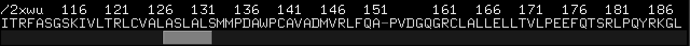

連続したミッシング残基がある場合、その箇所に付きギャップマークを1つだけ表示します。コマンドは`set seq_view_gap_mode, 2`です。

### <input type="checkbox" checked="checked"> Internal GUI

Internal GUIの表示のON/OFFを切り替えます。OFFにすると以下のようにInternal GUIが非表示になります。デフォルトではONになっています。

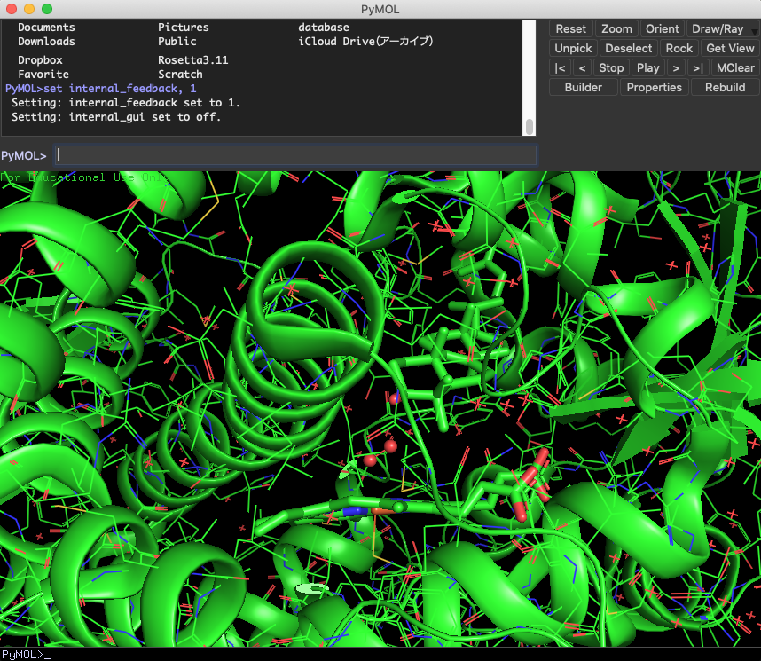

コマンドは`set internal_gui, 0/1`です（`0`でOFF, `1`でON）。

### <input type="checkbox" checked="checked"> Internal Prompt

Internal Promptの表示のON/OFFを切り替えます。Internal PromptとはPyMOL画面の下側に存在する入力欄です。

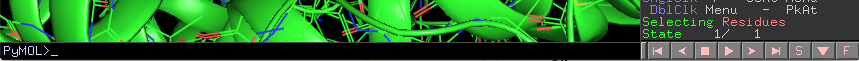

External GUIで入力する入力欄と実質的に機能は同じですが、ヒストリー機能（入力欄でキーボードの上キーを押すと過去に入力したコマンドを参照できる機能）は各入力欄で独立になっています。デフォルトではONになっています。コマンドは`set internal_prompt, 0/1`です（`0`でOFF, `1`でON）。

### Internal Feedback

Internal Feedbackでは、入力欄に入力したコマンドの結果を表示する行の数を設定できます。メニューからは`0`,`1`,`3`,`5`から選べるようになっています。デフォルトでは`1`となっています。例えば、`5`に設定すると以下の画像のようにViewerの下に5行までログが表示されるようになります。

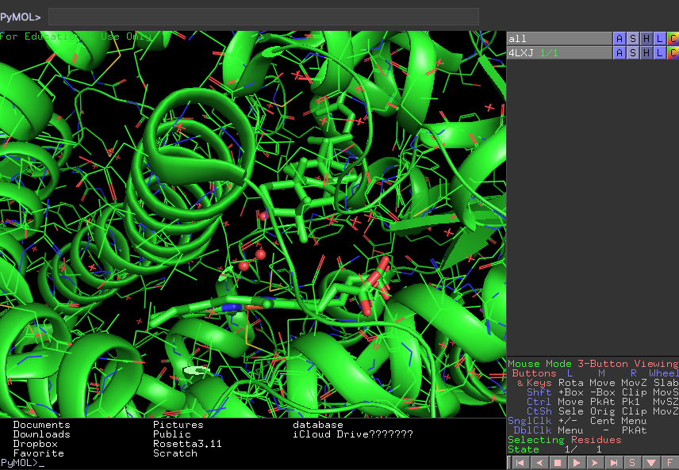

入力欄はInternal Prompt、External GUIのどちらに入力しても同じようにコマンドの結果を表示します。

コマンドは`set internal_feedback, (val)`です。`(val)`には`0`,`1`,`3`,`5`を含む、任意の正の整数値を設定できます。

### Overlay
Overlayは、先程のInternal Feedbackの結果をViewer上に重ねて表示する行数の設定値です。メニューからは`0`,`1`,`3`,`5`から選べるようになっています。デフォルトでは`0`となっています。例えば`5`に設定すると以下の画像のようにViewerの下に5行まで結果を重ねて表示するようになります。

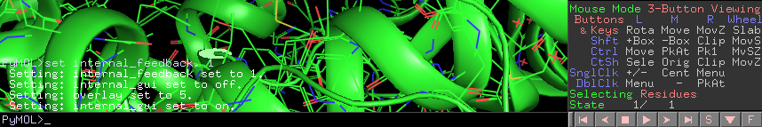

コマンドは`set overlay, (val)`です。`(val)`には`0`,`1`,`3`,`5`を含む、任意の正の整数値を設定できます。

### <input type="checkbox"> Stereo
Stereoを選択すると、現在設定されている**ステレオモード**に移行します。ステレオモードは分子を立体的に見るために便利なモードです。

これを選択すると対応したステレオモードで分子が表示されるようになります。デフォルトではCross-Eye Stereoモードに設定されているので、左右に分かれて表示されるようになります。

- ステレオモード選択前 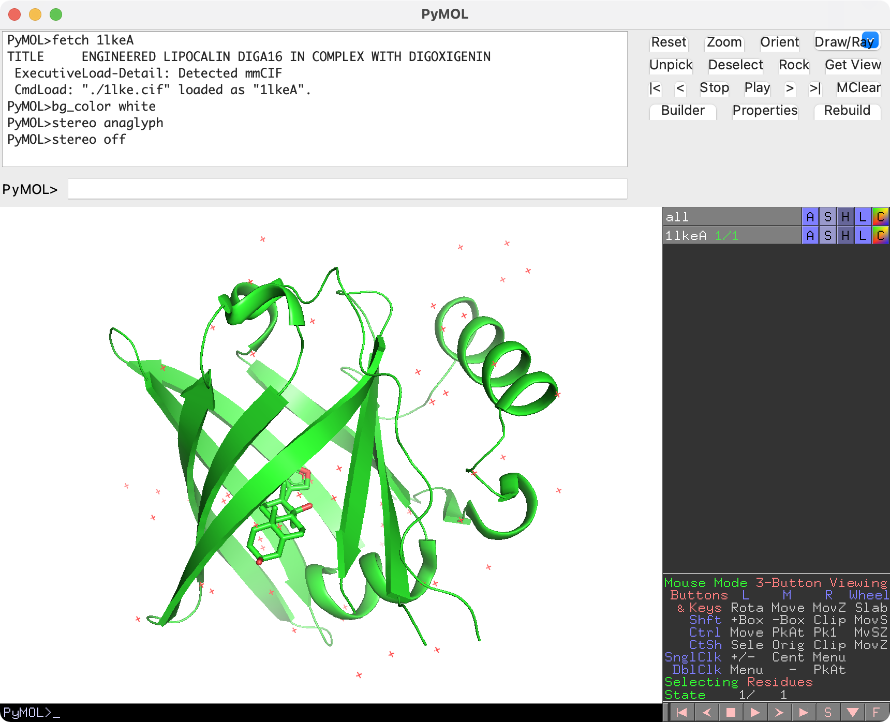

- ステレオモード選択後（Cross-Eye Stereoモード） 

このモードを使うことで、論文などで時々見かける立体視の図を簡単に作ることができます。

コマンドは`stereo, 0/1`です（`0`でOFF, `1`でON）。

### Stereo Mode
#### Anaglyph Stereo
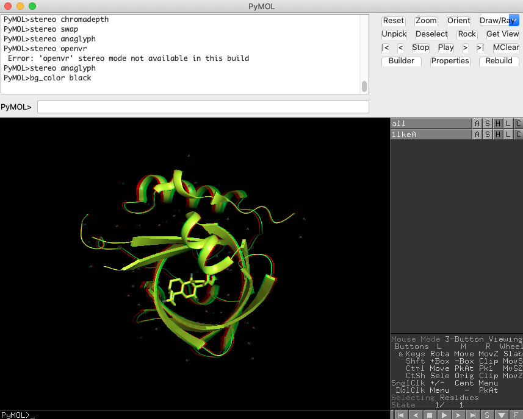

anaglyphモードは、一般的には左目に赤セロファン、右目に青セロファンを通したときに立体的に浮かび上がるような図への出力を行うモードです。いわゆる「赤青メガネ」を着用する状態で見ることを前提とする表示方法です。

コマンドは`stereo, anaglyph`です。
#### Cross-Eye Stereo

交差法による立体視用の図を出力するモードです。コマンドは`stereo, crosseye`です。
#### Wall-Eye Stereo

コマンドは`stereo, walleye`です。
#### Quad-Buffered Stereo

コマンドは`stereo, quadbuffer`です。
#### Zalman Stereo

コマンドは`stereo, byrow`です。
#### OpenVR

コマンドは`stereo, openvr`です。
#### Swap Sides

コマンドは`stereo, swap`です。
#### Chromadepth
chromadepthモードは、画面に対する奥行きに対して自動的に色付けが変わる表示形式です。このモードにした状態で分子を回転させると、常に画面手前側が赤く、画面奥側が青色になるようにカラーリングが変化します。

コマンドは`stereo, chromadepth`です。
#### off
ステレオモードをオフにします。コマンドは`stereo, off`です。

### Zoom

### Clip

### Background

### Color Space

### Quality

### Grid

### <input type="checkbox"> Orthoscopic View

### <input type="checkbox" checked="checked"> Show Valences

### <input type="checkbox" checked="checked"> Smooth Lines

### <input type="checkbox" checked="checked"> Depth Cue (Fogging)

### <input type="checkbox" checked="checked"> Two Sided Lighting

### <input type="checkbox" checked="checked"> Specular Reflections

### <input type="checkbox" checked="checked"> Animation

### <input type="checkbox"> Roving Detail

### External GUI