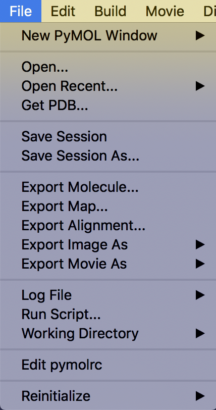
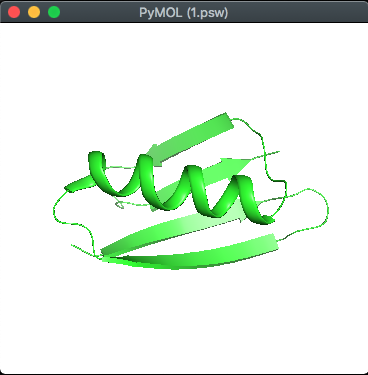
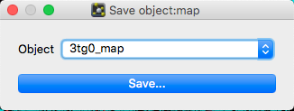
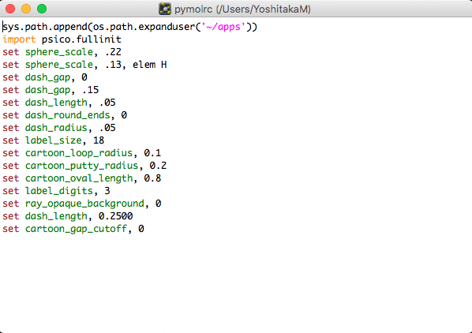

# File



## New PyMOL Window
**新しくPyMOLのウィンドウを別に立ち上げることができます**。ある構造ファイルを開いている時にまったく別の構造ファイルを開く必要があるときには、このNew PyMOL Windowを使って立ち上げると良いでしょう。一方で類似構造のファイルと比較したいという場合には、新しいPyMOL Windowを開かずに1つのPyMOLウィンドウの中で開くと、構造比較する上で便利です。

`Default`では新しいPyMOL Windowを開くと同時に、ユーザー独自の初期設定ファイルである`.pymolrc`（存在する場合）とインストールしたプラグインをともに読み込んでくれます。

`ignore .pymolrc and plugins (-k)`の方では、この機能を無効にし、PyMOLのインストール時の初期設定のまま利用できるようになります。ターミナルから`pymol -k`で起動した場合と同じ効果です。

## Open...
構造ファイルを読み込むことができます。これを選択すると読み込みたいファイルを選択する画面に移行します。ロード可能な構造ファイルを選択することでInternal GUIのViewer部分に構造が表示されます。

## Open Recent...
最近ロードしたことのある構造ファイルの履歴を表示しています。ここから構造ファイルをロードすることも可能です。

## Get PDB...
PDBに登録されている構造ファイルや電子密度ファイルのIDを指定することで、インターネットから直接ダウンロードして開くことができます。これはまずこのメニューを選択すると次のような別メニューが開きます。


PDB IDのところにデータベースのIDを入力します。また、下の方にはPDB Structure Optionsが存在し、chain nameの箇所で表示したいChainを指定できます。A chainのみを表示したい場合はAを入力します（指定しない場合はすべて表示されます）。

その構造ファイルに固有のAssemblyを考慮した表示も可能となっています。Biological assemblyを考慮して表示させたい場合は`1`を、非対称ユニットをロードしたい場合は何も指定しないでおきます。これについては第2章の[分子構造のロード](../ch02/loadmol.html)のページも参考にしてください。

構造ファイルはworking directory上にダウンロードされます。デフォルトの構造ファイル形式は`mmCIF`となっています。working directoryについては[こちら](#Working-Directory)も参照してください。

## Save Session & Save Session as...
**現在開いている表示状態をセッションファイルに保存します**。ショートカットキーは`Ctrl-SまたはCommand + S`です。スライド作成や論文のために生体分子の表示形式を保存しておくととても便利なので、ぜひこの機能は活用していきましょう。

`Save Session`はいわゆる「上書き保存」と同じで、`Save Session as...`は「ファイル名を指定して保存」と同じ機能です。一度もセッションファイルを作成していない状態で`Save Session`を押すと自動的に「ファイル名を指定して保存」に切り替わります。

拡張子はPyMOL Session File（`.pse`）とPyMOL Show File（`.psw`）の2つを選ぶことができます。`pse`ファイル形式で保存すると、再びこのファイルを開いたときにPyMOLの作業状態をそのまま復元するのに対し、`psw`ファイル形式で保存した場合は、このファイルを開くと全画面表示＋Internal GUIとExternal GUIが表示されない状態で開かれます。つまり、pswファイルは編集用というよりは完全に表示用に向いています。



pswファイルを開いたときの例。Internal GUIとExternal GUIが表示されません。

一応、この状態からでも上部メニューの[Display] -> [Internal GUI]と[External GUI] -> [Visible]をクリックすればいつものGUIが表示されるようになるので覚えておくと良いでしょう。

## Export molecule...
現在画面上に開いている生体分子オブジェクトをファイルとして出力します。詳細は[第2章 構造ファイルのエクスポート](../ch02/export.md) を御覧ください。

## Export map...

`.ccp4`などの電子密度マップなどを出力します。電子密度マップについては[第5章 結晶構造の電子密度マップを表示する](../ch05/xtal_elecmap.md)などで参照してください。マップオブジェクトがロードされた状態で選択すると以下のようなダイアログが現れます。



保存したいマップオブジェクトを選びSaveボタンを押してファイル名を入力することで保存されます。デフォルト拡張子は`.ccp4`です。

## Export alignment...

この機能を利用するためには類似のタンパク質間での**アライメントオブジェクト**を生成しておく必要があります。アライメントオブジェクトについては[第4章 オブジェクトの重ね合わせ](../ch04/cmd_super.md)を参照してください。

## Export Image As...
画像を保存するだけでなく、3Dモデリングへの出力にも対応しています。
### PNG...
PNG形式の画像を保存することができます。これについての詳細は第2章の[画像の保存](../ch02/saveimage.md)を参照してください。
### VRML 2...
表示しているモデルをwireframe/VRMLの形式で座標情報をエクスポートすることができます。mesh表示やSurface表示にも対応しています。
タンパク質の3Dプリンタでの出力のときに利用できますが、PyMOLだけでなく他のソフトウェアとの様々な工程を経る必要があるため、詳細はここでは割愛します。

クオリティを上げたい場合は、以下のオプションを利用すると良いそうです。

```
set surface_quality, 1
set cartoon_sampling, 20
```

### COLLADA...
COLLADAというXMLベースのオープン3Dグラフィック形式で出力することができます。PyMOLのcartoon, stick, line, sphere, surfaceなどのスタンダードな表示形式に対応して出力することができます。PyMOL 1.7.3.2から正式実装されました。拡張子は`.dae`です。

上記VRML 2の後発ですが、こちらの形式で出力して3Dプリンタ出力やBlenderなどでの編集も行えるようになるかもしれません。PyMOL 2.4からはglTF (GL Transmission Format)という形式でも出力できるようになるそうです。VRML 2のときのクオリティオプションコマンドも利用できます。

### POV-Ray...
[POV-Ray](http://www.povray.org/)で読み込めるように拡張子`.pov`で出力します。

## Export Movie As...
動画を出力することができます。
### MPEG...
### Quick time...
### PNG Images...

## Log File
PyMOLで操作記録を取ることができます。
### Open...
### Resume...
### Append...
### Close

## Run Script...

## Working Directory
作業ディレクトリのパスを変更します。macOSでアプリケーションからPyMOLを起動させた場合、デフォルトの作業ディレクトリ(以降wd)はホームディレクトリ、ターミナルからコマンドでPyMOLを起動させた場合には、そのターミナル上での作業ディレクトリになっています。

[Get PDB...](#Get-PDB...)を利用する場合など、ファイルの読み込み・書き出しは、この作業ディレクトリのパスを基準に考慮する必要があります。Linuxまたはターミナルの操作に慣れている方にとっては言うまでもない概念でしょう。

PyMOLのコマンドラインからは`cd`コマンドを使うことで変更することができます。

```
# Working Directoryをデスクトップに設定する
# (Linux, macOSの場合)
cd ~/Desktop
```

## Edit pymolrc
PyMOLを起動したときに自動的に実行される設定である`pymolrc`ファイルを編集することができます。bash, zshで言うところの`.bashrc`, `.zshrc`と同様に、`pymolrc`に設定を書き込んでおけば、描画に関する設定やPATH設定などを上書きしておくことができます。macOS, Linuxの場合は`pymolrc`ファイルはホームディレクトリ上に生成されます。


```
set sphere_scale, .22
set sphere_scale, .13, elem H
set dash_gap, 0
set dash_gap, .15
set dash_length, .05
set dash_round_ends, 0
set dash_radius, .05
set label_size, 18
set cartoon_loop_radius, 0.1
set cartoon_putty_radius, 0.2
set cartoon_oval_length, 0.8
set label_digits, 3
set ray_opaque_background, 0
set dash_length, 0.2500
set cartoon_gap_cutoff, 0
```

設定はPyMOLコマンド形式で記述する必要があります。

## Reinitialize
Reinitializeはその名の通りPyMOLを再初期化してくれます。表示されているオブジェクトを含め再起動したかのようにしてくれるEverythingと、設定値だけを再起動するもののsettings系のどちらかを選ぶことができます。

### Everything
Everythingを選ぶと、PyMOLで現在開いているすべての生体分子オブジェクトは消去され、完全にPyMOLを再起動したような状態になります。**それまで保存していなかった作業内容も予告内容なしに消えてしまう**ので、慎重にこのボタンを押してください。
### Original Settings
これらのOriginal Settings, Stored Settingsのメニューでは、現在表示されている生体分子オブジェクトは消去されません。こちらで再初期化してくれるのは**PyMOLの描画の設定値**です。例えばPyMOLのヘリックスの描画の太さ(`set cartoon_oval_length, 0.8`)やループの太さ(`set cartoon_loop_radius, 0.1`)、ミッシング領域の描画の有無(`set cartoon_gap_cutoff, 0`)……などといった、PyMOLの描画全体に影響を及ぼす値を初期値に修正した状態で再び描画し直してくれるのがこの`Original Settings`です。

上の`Edit pymolrc`で描画設定を変更していた場合でも、この`Original Settings`を押すとPyMOL内部の設定値で上書きされてしまうので注意してください。
### Stored Settings
保存しておいた描画の設定値を呼び出してくれます。これは下記の`Store Current Settings`の機能と対応しています。
### Store Current Settings
現在の描画の設定値を保存しておいてくれます。これを一度しておけば、以降PyMOLのプログラムを終了するまで上記の`Stored Settings`からその設定値を呼び出すことができます。


これら`Reinitialize`についてPyMOLのコマンドラインから行う場合は以下の通りです。

```
reinitialize [ what [, object ]]
```
whatには`everything`または`settings`が入ります。settings部分には`settings`, `original_settings`, `stored_settings`が選べるようです。defaultはeverything。
objectにはオブジェクト名を入れることができます。

