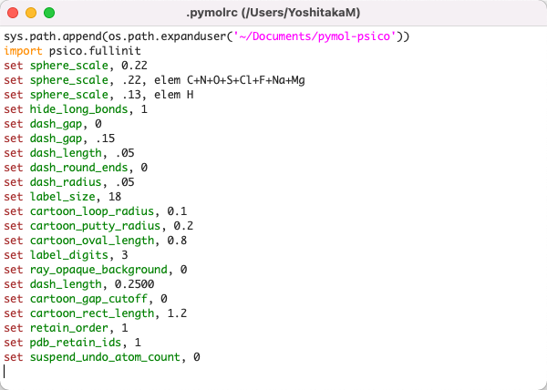

# File


## New PyMOL Window
**新しくPyMOLのウィンドウを別に立ち上げることができます**。ある構造ファイルを開いている時にまったく別の構造ファイルを開く必要があるときには、このNew PyMOL Windowを使って立ち上げると良いでしょう。一方で類似構造のファイルと比較したいという場合には、新しいPyMOL Windowを開かずに1つのPyMOLウィンドウの中で開くと、構造比較する上で便利です。

`Default`では新しいPyMOL Windowを開くと同時に、ユーザー独自の初期設定ファイルである`.pymolrc`（存在する場合）とインストールしたプラグインをともに読み込んでくれます。

`ignore .pymolrc and plugins (-k)`の方では、この機能を無効にし、PyMOLのインストール時の初期設定のまま利用できるようになります。ターミナルから`pymol -k`で起動した場合と同じ効果です。

## Open...
構造ファイルを読み込むことができます。これを選択すると読み込みたいファイルを選択する画面に移行します。ロード可能な構造ファイルを選択することでInternal GUIのViewer部分に構造が表示されます。

## Open Recent...
最近ロードしたことのある構造ファイルの履歴を表示しています。ここから構造ファイルをロードすることも可能です。

## Get PDB...
PDBに登録されている構造ファイルや電子密度ファイルのIDを指定することで、インターネットから直接ダウンロードして開くことができます。これはまずこのメニューを選択すると次のような別メニューが開きます。


PDB IDのところにデータベースのIDを入力します。また、下の方にはPDB Structure Optionsが存在し、chain nameの箇所で表示したいChainを指定できます。A chainのみを表示したい場合はAを入力します（指定しない場合はすべて表示されます）。

その構造ファイルに固有のAssemblyを考慮した表示も可能となっています。Biological assemblyを考慮して表示させたい場合は`1`を、非対称ユニットをロードしたい場合は何も指定しないでおきます。これについては第2章の[分子構造のロード](../ch02/loadmol.html)のページも参考にしてください。

構造ファイルはworking directory上にダウンロードされます。デフォルトの構造ファイル形式は`mmCIF`となっています。working directoryについては[こちら](#Working-Directory)も参照してください。

## Save Session & Save Session as...
**現在開いている表示状態をセッションファイルに保存します**。ショートカットキーは`Ctrl-SまたはCommand + S`です。スライド作成や論文のために生体分子の表示形式を保存しておくととても便利なので、ぜひこの機能は活用していきましょう。

`Save Session`はいわゆる「上書き保存」と同じで、`Save Session as...`は「ファイル名を指定して保存」と同じ機能です。一度もセッションファイルを作成していない状態で`Save Session`を押すと自動的に「ファイル名を指定して保存」に切り替わります。

拡張子はPyMOL Session File（`.pse`）とPyMOL Show File（`.psw`）の2つを選ぶことができます。`pse`ファイル形式で保存すると、再びこのファイルを開いたときにPyMOLの作業状態をそのまま復元するのに対し、`psw`ファイル形式で保存した場合は、このファイルを開くと全画面表示＋Internal GUIとExternal GUIが表示されない状態で開かれます。つまり、pswファイルは編集用というよりは完全に表示用に向いています。


pswファイルを開いたときの例。Internal GUIとExternal GUIが表示されません。

一応、この状態からでも上部メニューの[Display] -> [Internal GUI]と[External GUI] -> [Visible]をクリックすればいつものGUIが表示されるようになるので覚えておくと良いでしょう。

## Export molecule...
現在画面上に開いている生体分子オブジェクトをファイルとして出力します。詳細は[第2章 構造ファイルのエクスポート](../ch02/export.md) を御覧ください。

## Export map...

`.ccp4`などの電子密度マップなどを出力します。電子密度マップについては[第5章 結晶構造の電子密度マップを表示する](../ch05/xtal_elecmap.html)などで参照してください。マップオブジェクトがロードされた状態で選択すると以下のようなダイアログが現れます。


保存したいマップオブジェクトを選びSaveボタンを押してファイル名を入力することで保存されます。デフォルト拡張子は`.ccp4`です。

## Export alignment...

この機能を利用するためには類似のタンパク質間での**アライメントオブジェクト**を生成しておく必要があります。アライメントオブジェクトについては[第4章 オブジェクトの重ね合わせ](../ch04/cmd_super.html)を参照してください。

## Export Image As...

## Export Movie As...

## Log File

## Run Script...

## Working Directory
作業ディレクトリのパスを変更します。macOSでアプリケーションからPyMOLを起動させた場合、デフォルトの作業ディレクトリ(以降wd)はホームディレクトリ、ターミナルからコマンドでPyMOLを起動させた場合には、そのターミナル上での作業ディレクトリになっています。

[Get PDB...](#Get-PDB...)を利用する場合など、ファイルの読み込み・書き出しは、この作業ディレクトリのパスを基準に考慮する必要があります。Linuxまたはターミナルの操作に慣れている方にとっては言うまでもない概念でしょう。

PyMOLのコマンドラインからは`cd`コマンドを使うことで変更することができます。

```
# Working Directoryをデスクトップに設定する
# (Linux, macOSの場合)
cd ~/Desktop
```

## Edit pymolrc
PyMOLを起動したときに自動的に実行される設定である`pymolrc`ファイルを編集することができます。bash, zshで言うところの`.bashrc`, `.zshrc`と同様に、`pymolrc`に設定を書き込んでおけば、描画に関する設定やPATH設定などを上書きしておくことができます。macOS, Linuxの場合は`pymolrc`ファイルはホームディレクトリ上に生成されます。



設定はPyMOLコマンド形式で記述する必要があります。

## Reinitialize

### Everything
### Original Settings
### Stored Settings
### Store Current Settings