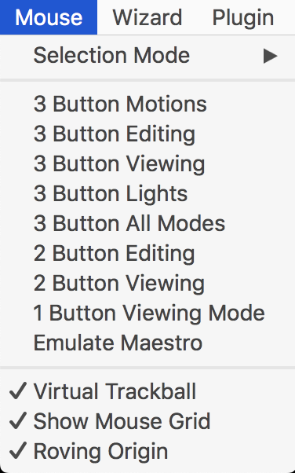
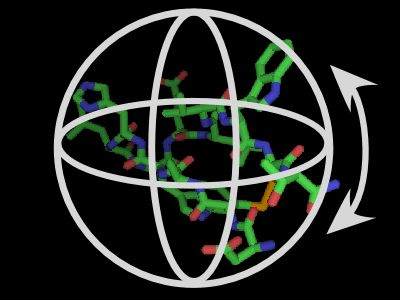

# Mouse

ここではマウス操作についてのメニューを表示しています。マウス操作については[2.4 マウス操作](../ch02/mouse.md)を適宜参照することをおすすめします。

## Selection Mode

[+/-機能](../ch02/buttonaction.md#選択--)（デフォルト設定では3-Button Viewingモードで左のシングルクリック）で選択範囲を増減させるときの、選択範囲の単位を変更します。デフォルトは`Residues`で、他にも`Atoms`, `Chains`, `Segments`, `Objects`, `Molecules`, `C-alphas`から選択することができます。

GUI上では、右下のメニューからSelectingの部分をクリックすることで、選択範囲を変更することができます。

コマンドからは`set mouse_selection_mode, (value)`で変更できます。設定値0, 1, 2, 3 ,4, 5, 6がそれぞれ`atoms`, `residues`, `chains`, `segments`, `objects`, `molecules`, `C-alphas`に対応します。

## Mouse Mode

[2.4.1 操作モード](../ch02/buttonmode.md)も参照して下さい。マウスのボタン配置と操作方法を、3 Button Motions, 3 Button Editing, 3 Button Viewing, 3 Button Lights, 3 Button All Modes, 2 Button Editing, 2 Button Viewing, 1 Button Viewing Mode, Emulate Maestroの中から選択することができます。

デスクトップ型パソコンを使っていて、左クリック、ホイールクリック（ミドルクリック）、右クリックが揃ったマウスを使える環境であれば、3 Button式を選ぶと機能を最大限活用することができます。一方、最近はホイールクリックのないタイプのタッチパッド（Macbookなど）もありますので、そういった方は2 Button式のメニューを選ぶことをおすすめします。

Emulate Maestroは[Schrödinger Maestro](https://www.schrodinger.com/maestro)のマウス操作感覚とほぼ同じような設定になっています。

コマンドからも設定できるように思えるのですが、見かけだけ変わるようで実際の操作が変わっていないように見えます……。素直にGUIメニューから設定変更した方がよいと思われます。

## Virtual Trackball

この機能をONにすると（デフォルトはON）、分子が写っている画面の中央に見えないトラックボールが置かれてあるような状態になります。

このトラックボールの外にマウスカーソルをあわせて視点を変更しようとしたときの挙動が、Virtual Trackballの設定値によって変動します（トラックボール内部はON/OFFともに同じです）。ONのときにトラックボールの外で視点を変更しようとすると、Z軸だけが回転するような動きになります。OFFのときは全体がトラックボールの上にあるような動きになります。

コマンドからは`set virtual_trackball, (value)`で変更できます。`0`がOFF, `1`がONです。

> The virtual trackball works as if there is an invisible ball in the center of the scene. When you click and drag on the screen, it is as if you put your finger on the sphere and rotated it in approximately the same manner. If you click outside the sphere, then you get rotation about the Z-axis only.

## Show Mouse Grid

GUIメニュー右下のマウスの操作方法メニューの表示をON/OFFにします。

 

## Roving Origin

Originの位置を、視点の移動とともに追従するかそうでないかを設定します。デフォルトはONです。Originとは回転操作を行いたいときの回転中心のことです。Originの位置は任意の選択範囲に対してActionパネルから`Origin`を選ぶことで設定できます。これがONのとき、視点を平行移動（[マウス操作のMove](../ch02/mouse.md#並進-move)参照）させてもOriginの位置が画面に対して同じ位置に留まるよう更新されますが、OFFにすると視点を平行移動させてもOrigin位置を自動で更新しなくなります。
この効果は、PyMOL上で分子を画面の端っこに置いた状態で設定値を変えて視点の変更しようとすると分かりやすいと思います。

<video width="100%" height="100%" controls autoplay loop>
<source src="./image/mouse/roving.mp4" type="video/mp4">
</video>

コマンドからは`set roving_origin, (value)`で変更できます。`0`がOFF, `1`がONです。
