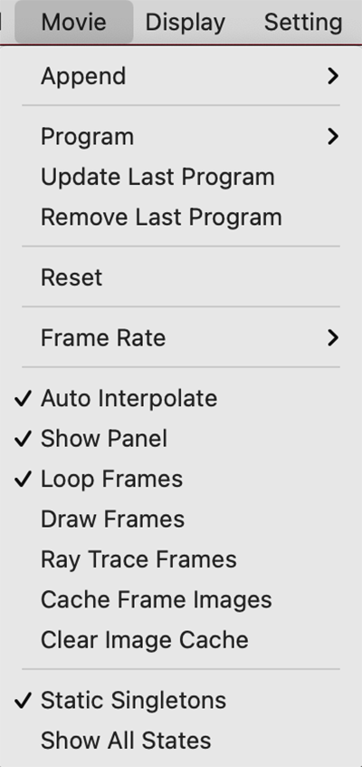

## Movie



PyMOLのMovie機能を使うことでカメラまたは分子自体の動き・表示に時限式のプログラムを施し、分子を様々な角度から映すことができるようになります。

### Append
この機能は指定した秒数分の**フレーム**を確保するのに使います。メニュー上では`0.25`〜`60` secondの延長が可能です。このとき、設定されている[FPS](#FPS)の値（後述）に応じて延長されるフレーム数が増加します。つまり、30FPSに設定されているときに2 second延長しようとすると、60フレーム分追加されることになります。

コマンドでは、60フレーム分の枠を確保する場合には`mset 1x60`のような形で入力します。この60フレームは30FPSに設定しているときですと2秒に相当します。

<hr>

### Program

ムービーに登録する動きのプログラミングを行います。視点を変更する（つまり分子自体の座標は変化しない）**Camera Loop**, 登録しておいたScene（[Scene](scene.md)のページを参照）の入れ替えを制御する**Scene Loop**, 表示された分子オブジェクトにstateがある状態（NMR構造やMDシミュレーションの動きのデータが入ったオブジェクトなど）での動きの再生を行う**State Loop**, Stateをすべて再生した後に逆再生を行う**State Sweep**が用意されています。

Program機能を使うと、PyMOLの画面下にFrameのインジケータが出現します。これを**ムービーパネル**と呼びます。ここには現在どのフレームにいるか、そのフレームにカメラが設定されているかどうかを示す小さなアイコンが表示されます。

以下に示す動きのプログラムは複数連結させることも可能で、Camera Loop Nutate の後に State Loopを行い、Camera Loop X-Rockを行う……という設定にすることも可能です。

#### Camera Loop
カメラ視点を制御するメニューです。中には**Nutate**, **X-Rock**, **X-Roll**, **Y-Rock**, **Y-Roll**のメニューがあります。それぞれどういった動きをするものなのかを以下で紹介していきます。

##### Nutate

Nutateは[章動](https://ja.wikipedia.org/wiki/%E7%AB%A0%E5%8B%95)のことで、物体の回転運動において、歳差運動をする回転軸の動きの短周期で微小な成分を指します。以下の動画のようなカメラの動きを行います。

<video width="100%" height="100%" controls autoplay loop>
<source src="./image/movie/cameranutate1.mp4" type="video/mp4">
</video>

GUIメニューからは動きの秒数と歳差運動の角度をいくつか選ぶことができます。
コマンドでは`movie.add_nutate(4,15,start=1)`となっています（4秒間、角度15度設定の場合）。`start=`の値にはこのプログラムを付け加えるFrameの開始番号を入力します。


##### X-Rock, Y-Rock

X-Rock, Y-Rockは画面\\(x\\)軸または\\(y\\)軸に対してカメラ角度を指定した値の範囲分だけ傾ける運動を繰り返します。以下の動画のようなカメラの動きを行います。

<video width="100%" height="100%" controls autoplay loop>
<source src="./image/movie/xrock1.mp4" type="video/mp4">
</video>

コマンドでは`movie.add_rock(2,30,axis='x',start=1)`となっています（2秒間、角度30度、\\(x\\)軸rock設定の場合）。`start=`の値にはこのプログラムを付け加えるFrameの開始番号を入力します。


##### X-Roll, Y-Roll

X-Roll, Y-Rollは画面\\(x\\)軸または\\(y\\)軸に、指定された時間で1周して戻ってくるように回転させます。以下の動画のようなカメラの動きを行います。

<video width="100%" height="100%" controls autoplay loop>
<source src="./image/movie/xroll1.mp4" type="video/mp4">
</video>

コマンドでは`movie.add_roll(4.0,axis='x',start=1)`となっています（4秒間、\\(x\\)軸回転設定の場合）。`start=`の値にはこのプログラムを付け加えるFrameの開始番号を入力します。


#### Scene Loop
この機能を使うためには、[Scene機能](./scene.md)によっていくつかのSceneを事前に用意しておく必要があります。このScene間でカメラの動きをシームレスにつなげてムービーパネルに登録してくれます。

下の動画の例では先にF1, F2, F3の3つのSceneが登録された状態で示しています。

##### nutate

登録されているSceneを順番に移動しながら、各Sceneについて指定した秒数分のnutateを行っていきます。

<video width="100%" height="100%" controls autoplay loop>
<source src="./image/movie/scenenutate1.mp4" type="video/mp4">
</video>

コマンドでは`set sweep_angle 30; cmd.movie.add_scenes(None, 2, rock=4, start=1)`となっています（角度30度、2秒間動作、nutate設定の場合）。`start=`の値にはこのプログラムを付け加えるFrameの開始番号を入力します。

##### X-Rock, Y-Rock

登録されているSceneを順番に移動しながら、各Sceneについて指定した秒数分のX-Rock/Y-Rockを行っていきます。

<video width="100%" height="100%" controls autoplay loop>
<source src="./image/movie/scenexrock1.mp4" type="video/mp4">
</video>

コマンドでは`set sweep_angle 30; cmd.movie.add_scenes(None, 2, rock=2, start=1)`となっています（角度30度、2秒間動作、\\(x\\)軸Rockの場合）。\\(y\\)軸Rockの場合は`rock=1`に設定します。`start=`の値にはこのプログラムを付け加えるFrameの開始番号を入力します。

##### Steady

登録されているSceneを順番に移動しながら、各Sceneについて指定した秒数分だけ静止します。

<video width="100%" height="100%" controls autoplay loop>
<source src="./image/movie/scenesteady1.mp4" type="video/mp4">
</video>

コマンドでは`cmd.movie.add_scenes(None, 1.0, rock=0, start=1)`となっています（角度30度、1秒間静止の場合）。

#### State Loop
この機能を使うためには、すでに1つ以上のロード済みの生体分子オブジェクトに複数のStateが入っている状態である必要があります。PDBに登録されている構造のうち、NMRで構造が決定されたものはたいてい複数のStateが入っていますが、結晶構造には通常複数のStateは入っていません。または、MDシミュレーションのトラジェクトリデータをロードすることで、複数のStateをもたせることもできます。

以下の例ではNMRで構造決定された[PDB: 1G03](https://www.rcsb.org/structure/1G03)の構造オブジェクトを利用しています。State loop機能は、このState間での動きをムービーパネルに登録してくれます。

State Loopは全Stateを順に再生します。`n second pause`で停止時間を指定した場合、Stateの再生前、再生後に指定した時間分の停止フレームが設定されます。

<video width="100%" height="100%" controls autoplay loop>
<source src="./image/movie/stateloop1.mp4" type="video/mp4">
</video>

コマンドでは`movie.add_state_loop(n, m, start=1)`です（1/*n*倍速、*m*秒pauseを挟む場合）。動画では1倍速、1秒pause設定にしています。`start=`の値にはこのプログラムを付け加えるFrameの開始番号を入力します。

#### State Sweep
この機能もStateが複数ある構造オブジェクトがロードされていることを前提としています。全Stateを順に再生させて最後のStateまで到達した後、Stateを逆再生します。`n second pause`で停止時間を指定した場合、最後のstateに到達した後に逆再生を始めるまでと、最初と最後にもそれぞれ停止フレームが設定されます。

<video width="100%" height="100%" controls autoplay loop>
<source src="./image/movie/statesweep1.mp4" type="video/mp4">
</video>

コマンドでは`movie.add_state_sweep(n, m, start=1)`です（1/*n*倍速、*m*秒pauseを挟む場合）。動画では1/2倍速、1秒pause設定にしています。`start=`の値にはこのプログラムを付け加えるFrameの開始番号を入力します。

### Update last program

**最後にGUIメニューから行った**動作プログラムを再実行させます。コマンドでプログラムしたものはこの`Update last program`を押しても再実行されないので注意してください。

### Remove last program

**最後にGUIメニューから行った**動作プログラムを削除することができます。コマンドからプログラムしたものについては無効のようです。

### Reset

作成しているすべてのMovieのフレーム情報をすべて消去します。コマンドは`mset; rewind`です。

<hr>

### Frame Rate
1秒あたりの動き（フレーム）の数に関する設定です。
#### FPS

Frame per second(FPS, 1秒あたりのフレーム)を設定します。デフォルトは`30`FPSに設定されており、1秒あたり最大で30枚の静止画像数（いわゆる「コマ」）を処理するようになっています。GUIからは`30`, `15`, `5`, `1`, `0.3`を選べるようになっていますが、コマンドからは任意の値を設定できます。

動画として後々出力し他の方に見せる場合、FPSの値は配信するマシン環境やネットワークなどによっても上限を制限されるので、現実的には`30`が主流の値、よくて`60`FPSです。

コマンドでは`set movie_fps, (value)`です。`(value)`にはFPSのfloat値を入力します（デフォルトでは`30`）。

#### <input type="checkbox"> Show Frame Rate

Internal GUIの右下部分の再生ボタンの上に、Frame Rateが表示されるようになります。デフォルトでは`OFF`です。

コマンドでは`set show_frame_rate, (value)`です。`(value)`の部分は`1`, `0`を指定でき, `1`でON, `0`でOFFとなります。(value)の部分に`on`, `off`と入れても有効です。

#### Reset meter
コマンドは`meter_reset`で、PyMOLのドキュメントによれば

> **meter_reset** resets the frames per second counter.

とのこと。Show Frame RateをONにした状態でこのボタンを押すとHzの数字が現在の値にアップデートされる。実際には表示形式の変更などの内部処理時に自動的に呼び出されているくらいで、人間が明示的に使う機会はあまりなさそう。
<hr>

### <input type="checkbox" checked> Auto Interpolate

プログラム動作を指定するタイミングのフレーム（**キーフレーム**と呼びます）が新たに設定されたときに、その前後のカメラの動きを自動的に補間してくれます。デフォルトでは`ON`です。

この機能は上記のようなGUIによるキーフレームの設定を使っているときにはすでに補間が働いていることもあって、あまり効果をなしません。コマンドベースでムービーのプログラミングを行っているときには効果がよくわかります。

例として以下のムービー作成コマンドを、Auto InterpolateがONのときとOFFのときで比較してみます。

```
fetch 1rx1, async=0
as cartoon
as sticks, organic
mset 1x70
orient
mview store, 1
mview store, 70
orient organic
mview store, 30
mview store, 40
mplay
```

これはタンパク質1rx1をロードし、`mset 1x70`で70フレーム分の枠を用意した後、1フレームめと70フレームめにはタンパク質全体の様子を見せる`orient`の状態でキーフレームを設定し、30フレームめと40フレームめでは`orient organic`によってリガンド部分にズームした状態のキーフレームを設定しています。

Auto Interpolateが`on`の場合は以下のような動画が作られます。

<video width="100%" height="100%" controls autoplay loop>
<source src="./image/movie/autoinp1.mp4" type="video/mp4">
</video>

Auto Interpolateが`off`の場合は以下のようになります。

<video width="100%" height="100%" controls autoplay loop>
<source src="./image/movie/autoinp2.mp4" type="video/mp4">
</video>

このように動きを設定したフレーム間でのカメラの補間が働いていないことがわかります。

コマンドは`set movie_auto_interpolate, on`または`off`です。

### <input type="checkbox" checked> Show Panel
ムービーパネルの表示・非表示を設定します。コマンドでは`set movie_panel, 1`で表示となります（`0`で非表示）。デフォルトでは`1`になっています。

### <input type="checkbox" checked> Loop Frames

ムービーを構成するフレームが再生し終わったときに自動的にループして再生するか、それとも停止するかを設定できます。コマンドでは`set movie_loop, 1`でループ再生となります（`0`で停止）。デフォルトでは`1`になっています。

### <input type="checkbox">Draw Frames
このオプションにチェックを入れておくと、各フレームを再生する時に`draw`によるややきれいな画像レンダリングが行われるようになります。`ray`よりはとても動作が軽い一方、`set ray_opaque_background, 0`を使った背景の透明化などはできないようです。

コマンドでは`set draw_frames, 1`でdraw描画がONになります（`0`で解除）。デフォルトでは`0`になっています。

### <input type="checkbox">Ray Trace Frames

このオプションにチェックを入れておくと、各フレームを再生する時に`ray`によるレイトレーシングが行われるようになります。1フレームごとにきれいな画像が出力されるので、後に動画ファイルとして出力する場合に利用できますが、反面1フレームごとの再生速度が極端に低下するので普段チェックを入れておくことはおすすめしません。

コマンドでは`set ray_trace_frames, 1`でレイトレーシングがONになります（`0`で解除）。デフォルトでは`0`になっています。

### <input type="checkbox">Cache Frame Images

このオプションにチェックを入れておくと、各フレームの画像がメモリに保存されるようになります。メモリに保存されると2回め以降のループ再生時の再計算が必要なくなり、表示が早くなります。ただし、画像をキャッシュすると表示サイズやフレーム数に応じて膨大な量のメモリを消費するので、少なくともこのオプションを使う前に表示画像サイズをコントロールする`viewport`コマンドでウィンドウを縮小しておくことを勧めます。

コマンドでは`set cache_frames, 1`でキャッシュが`ON`になります（`0`で解除）。デフォルトでは`0`になっています。

### Clear Image Cache

キャッシュされた画像情報をクリアしてメモリを開放します。`Cache Frame Images`にチェックを入れていなければ自動的にキャッシュが溜まることはないので使う必要はありません。コマンドでは`mclear`です。

<hr>

### <input type="checkbox" checked> Static Singletons

このオプションにチェックを入れておくと、PyMOLでロードされたオブジェクトが複数あり、かつ複数stateを持つオブジェクト（PDB: 1G03など）と1 stateしか存在しないオブジェクトがあったときに、再生ボタンを押してstate 2以降になった場合でも、その1 stateしか持っていないオブジェクトも画面上に表示され続けます。チェックがOFFだと、その1 stateのオブジェクトは表示されなくなります。

コマンドでは`set static_singletons, 1`で1 stateのオブジェクトの表示を許可します（`0`で表示しなくなります）。デフォルトでは`1`になっています。

### <input type="checkbox"> Show All States

このオプションにチェックを入れておくと、ロードしたオブジェクトに複数のStateが存在する場合に全Stateが表示されるようになります。


コマンドでは`set all_states, 1`で全state表示が`ON`になります（`0`で解除）。デフォルトでは`0`になっています。