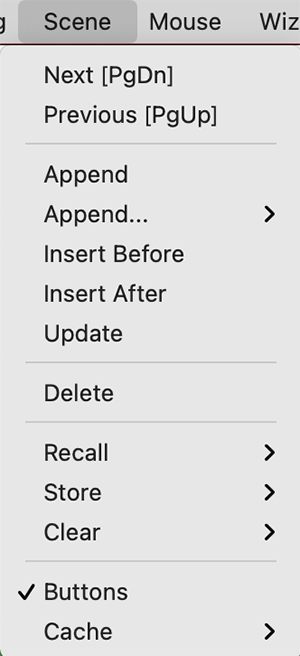

# Scene


**Externalメニューに存在するScene機能は論文・ポスター発表や動画作成の時にとても重宝します**。PyMOLに表示したタンパク質の構造を色んな角度から撮影したり、色んなカラーリングや設定値を試したり、それらをつなげて動画にまとめて出力したいという試行錯誤は、読み手に分かりやすい論文・ポスター用の図を作成する上で必要な作業だと思われます。そんなとき、1つの作業セッションファイル中に複数の表示状態を保存することができるこの**Scene**機能をぜひ活用しましょう。

<video controls autoplay loop>
<source src="./image/scene/scene1.mp4" type="video/mp4">
</video>

この動画で示しているように、左下に`001`, `002`, `003`という小さなボタンが現れています。ここをクリックすることで、**前もって保存しておいたカメラ角度(view/camera)、色使い(color)、表示形式（rep/representations）に戻って表示させる**ことができます。

このボタンはSceneの`append`または`Store`機能によって生成することができます。内容を上書きするには`Update`を、削除するには`Delete`を用います。`Recall`, `Store`, `Clear`の3つは、`Append`, `Delete`の使い方に似ていますが、キーボードのF1〜F12を使ったショートカットキーと自動的に結びつけてくれるため使い勝手が良くなります。

**Sceneボタンをマウスでクリックして白くなっているときを`active`状態と呼びます。**

## Next [PgDn] / Previous [PgUp]

すでに複数のSceneボタンが存在しているときに動作します。Nextで次の、Previousで前のSceneを表示させることができます。Next, Previousはそれぞれキーボードの[PgDn], [PgUp]ボタンにショートカットキーが割り当てられているので、マウスを使わずにSceneを切り替えることができます。

<hr>

## Append

**現在の表示状態をSceneに追加します**。デフォルトではSceneオブジェクト名は自動的に`001`からの連番になります。

内部処理としては、コマンドで`scene new, store`が作動します。`new`は自動的に連番のIDを割り振ります。`new`以外の文字を入力すると、そのオブジェクト名でSceneが生成されます。

### Append (Camera, Color, Reps, Reps+Color)
Camera (view), Color, Repsはそれぞれ撮影角度、表示されている分子のカラーリング、表示された分子の表示形式を表しています。上述の`Append`ではこれらをすべて保存してSceneに登録するのに対して、こちらのサブメニューではその一部のみをSceneに登録します。

内部処理としては、コマンドで`scene new, store, view=0/1, color=0/1, rep=0/1`としており、`0`
のとき各情報を保存しない、`1`のときに情報を保存する、としています。

## Insert Before / After

現在表示している画面の状態のScene登録を、現在ActiveになっているSceneの上(before)または下(after)に登録させます。これによって、上述の Next [PgDn] / Previous [PgUp] との円滑な連携を図ることができます。

内部処理としては、コマンドで`scene <scene_name>, insert_before/insert_after`としています。

## Update

現在表示している画面の状態を、ActiveになっているSceneボタンの上に上書きします。内部処理としては、コマンドで`scene <scene_name>, update`としています。

<hr>

## Delete

現在ActiveになっているSceneボタンを削除します。内部処理としては、コマンドで`scene <scene_name>, clear`としています。

<hr>

## Recall
下記の`Store`で保存されたSceneを呼び出すことができます。
上で見たような連番のSceneボタンと異なり、F1〜F12ボタンと自動的に結びつけて操作することが可能です。例えば、`F1`でStoreされたSceneをF1キーを押すだけで呼び出すことができます。

## Store
F1〜F12ボタンと自動的に結びつけられたSceneボタンを生成することができます。使い方は`Append`と似ています。

**Windows/Linuxの場合はCtrlキーと, macOSの場合はCommandキーとF1〜F12とすることで現在表示されている画面をSceneに登録することができます**。

## Clear

F1〜F12ボタンと自動的に結びつけられたSceneボタンを削除します。

<hr>

## Buttons
画面左下にSceneのボタンを表示するかしないかを設定できます。

コマンドでは`set scene_buttons, 0/1`でそれぞれ表示しない（`0`）、表示する（`1`）を設定できます。

## Cache

現在ActiveになっているSceneに対し、`enable`または`optimize`を選択することでそのSceneのキャッシュを生成します。通常、Scene間の表示形式の切り替え時には再度新たに描画のON/OFFを内部で行っているため、わずかに切り替えに時間がかかりますが、キャッシュを生成しておくとあらかじめ最適化された描画を記憶しておくためにSceneの切り替え時間が短くなります。これは特に分子表面の表示のON/OFFが関係している時に有効です。しかしその反面多量のメモリを確保する必要があるので、初回の操作は重くなります。
`disable`とするとキャッシュ機能を無効化します。（`read_only`はちょっとわかりませんでした……。）

cacheを`optimize`にすると、今ActiveになっているSceneに対して現在登録されている他のSceneからの切り替えをすべて計算するため、かなり重い処理になります。

コマンドでは`cache action [, scenes [, state ]]`となります。`scenes`はスペース区切りで複数指定できます。使用例は以下の通りです。

```
cache enable
cache optimize
cache optimize, F1 F2 F5
```