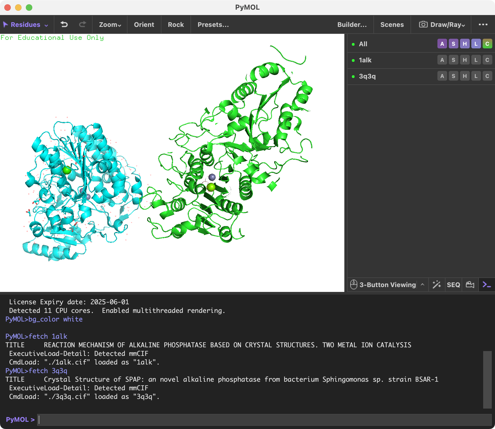
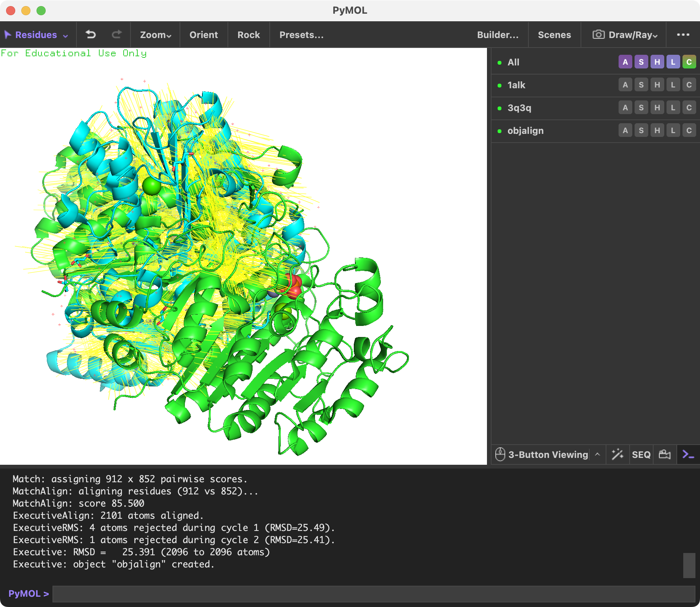
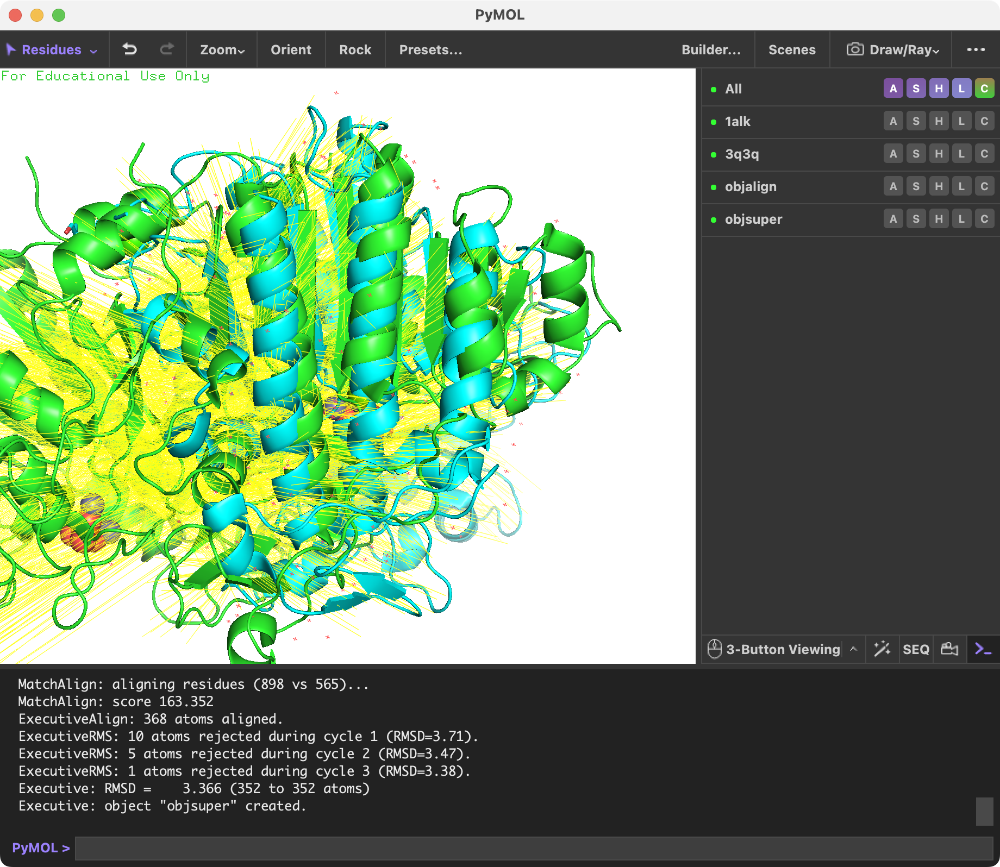

# オブジェクトの重ね合わせ

生体分子、特にタンパク質には、構成されるアミノ酸配列が異なるものの概してよく似た構造を取っているものがよくあります。新種のタンパク質について構造解析を行い、既存のタンパク質と構造・機能上よく似たタンパク質が存在した場合には、その構造を比べてみて類似点・相違点を述べるというのが構造解析論文のディスカッションでよく見られる光景です。

重ね合わせのためのコマンドは`align`または`super`が用意されています。この2つのコマンドはともに構造の重ね合わせをすることができますが、**配列相同性が高い場合は`align`コマンドを、低い場合は`super`を利用することがそれぞれ推奨されています**。アルゴリズム的に見ると、`align`は構成アミノ酸配列を考慮するのに対し、`super`は配列を考慮せずに構造ベースで重ね合わせようとします。

> <https://pymolwiki.org/index.php/Align>

> <https://pymolwiki.org/index.php/Super>

## alignコマンド

### 使い方

```python
align mobile, target [, cutoff [, cycles
    [, gap [, extend [, max_gap [, object
    [, matrix [, mobile_state [, target_state
    [, quiet [, max_skip [, transform [, reset ]]]]]]]]]]]]]
```

* `mobile` = string: 移動するべきオブジェクトのatom selection
* `target` = string: 重ね合わせる先のオブジェクトのatom selection
* `cutoff` = float: RMS（root mean square :構造のズレの数値指標）を基準に、この値を超えると外れ値とみなして重ね合わせに考慮に入れなくする。 デフォルトは`2.0`。
* `cycles` = int: 重ね合わせ試行の繰り返し数。この回数分だけ、重ね合わせる→大きくずれている箇所を検出し、そこを考慮しないで再度重ね合わせ→……を行う。デフォルトは`5`回。
* `gap`, `extend`, `max_gap`: 配列アライメント上でのペナルティパラメータ。
* `object` = string: 重ね合わせ結果をアライメントオブジェクトとして出力するときのオブジェクト名を指定する。デフォルトでは重ね合わせオブジェクトを生成しない。
* `matrix` = string: 配列アライメントでの置換行列を指定する。デフォルトは`BLOSUM62`置換行列。
* `mobile_state` = int: `mobile`で指定したオブジェクトに複数のstateが存在する場合、どのstateを使ってアライメントするかを指定できる。デフォルトは`0`（全state）。
* `target_state` = int: `target`で指定したオブジェクトに複数のstateが存在する場合、どのstateを使ってアライメントするかを指定できる。デフォルトは`0`
* `quiet` = `0`の場合、詳細なアウトプットを表示する。`1`の場合は表示しない。デフォルトはコマンドラインから利用した場合`0`で、APIから呼び出した場合は`1`。
* `max_skip` = ?
* `transform` = `1`ならば`mobile`オブジェクトを移動させる。`0`ならば移動させない。
* `reset` = ?

## superコマンド

### 使い方

ほぼ`align`コマンドと同じですが、さらにオプションが追加されています。

```
super mobile, target [, cutoff [, cycles [, gap [, extend [, max_gap [, object [, matrix [, mobile_state [, target_state [, quiet [, max_skip [, transform [, reset [, seq [, radius [, scale [, base [, coord [, expect [, window [, ante ]]]]]]]]]]]]]]]]]]]]]
```

* `reset` = ?
* `seq` = ?
* `radius` = ?
* `scale` = ?
* `base` = ?
* `coord` = ?
* `expect` = ?
* `window` = ?
* `ante` = ?

## 実例

ここではPDB IDの1alkと3q3qの2つのアルカリホスファターゼを例にとって構造の重ね合わせをしてみましょう。この2つはアルカリホスファターゼでありながら、全体の構造は大きく異なっています。また1alkの方は2量体であるのに対して3q3qの方は単量体で表示されていることに注意してください。

```python
fetch 1alk
fetch 3q3q
```



`align`を使って構造を重ね合わせてみるとこのような形になります。

```python
align 1alk, 3q3q, object=objalign
```



External GUIの出力結果を見ると、

```python
Executive: RMSD =   25.391 (2096 to 2096 atoms)
```

となっており、構造のずれを表すRMSD値は25.3とかなり大きな値になっています。

一方で、`super`コマンドを使ってみると

```python
super 1alk, 3q3q, object=objsuper
```



```
Executive: RMSD =    3.366 (352 to 352 atoms)
```

となっており、重ね合わせに利用した原子が352 atomsであり、その範囲でのRMSD値が3.366となりました。

また、`objalign`と`objsuper`という**アライメントオブジェクト**が生成されています。このオブジェクトは2つの構造の重ね合わせのときに使った対応部分を黄色い線で表してくれています。`super`を行った場合は、1alk, 3q3qに共通しているαβα-sandwich構造の部分だけを自動的にサーチして、その部分だけを利用した重ね合わせを実行してくれています。
