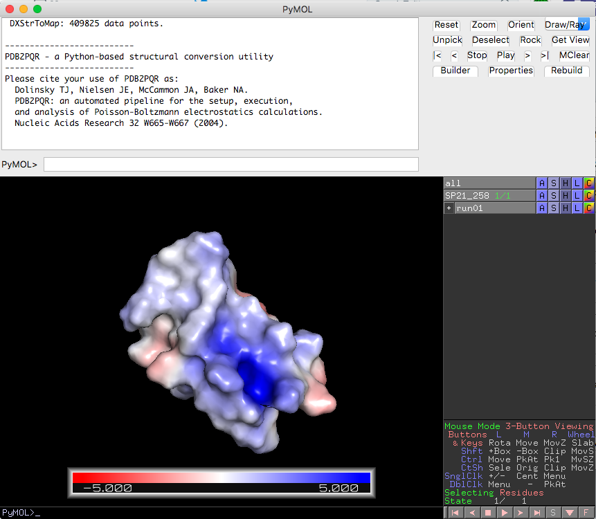
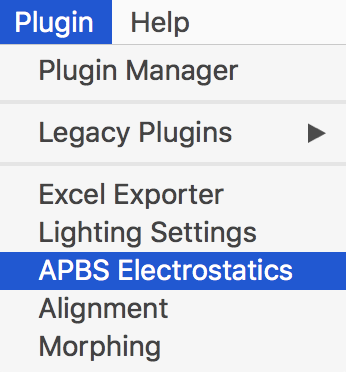
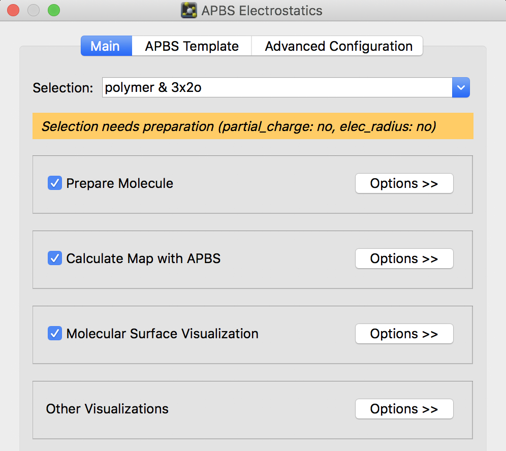
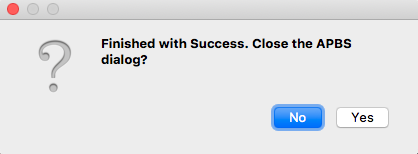
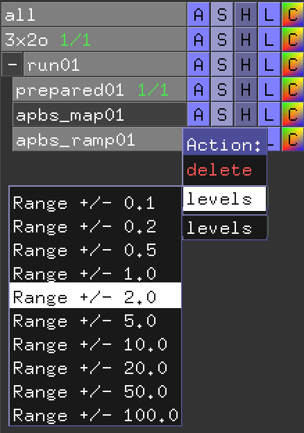
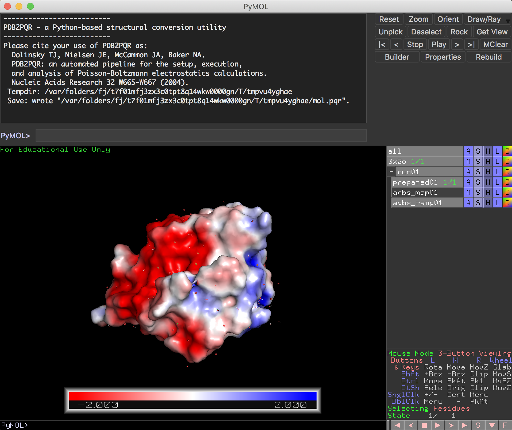
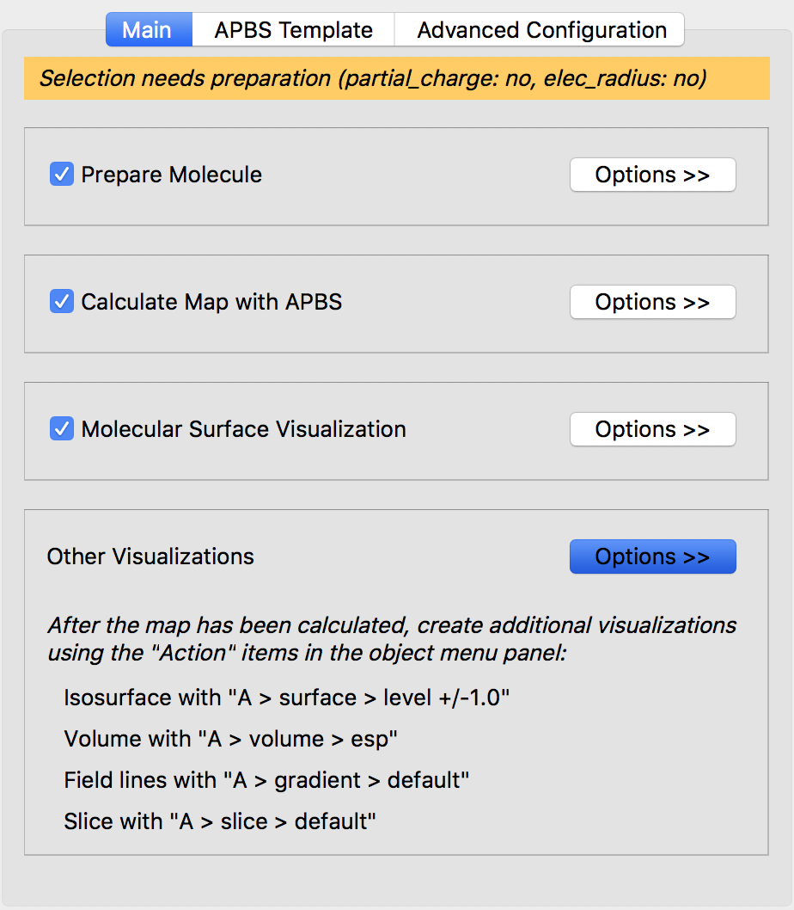
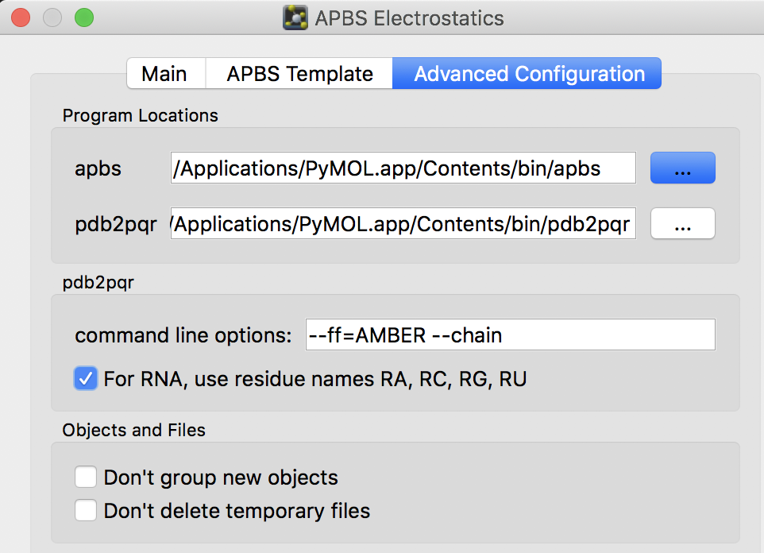
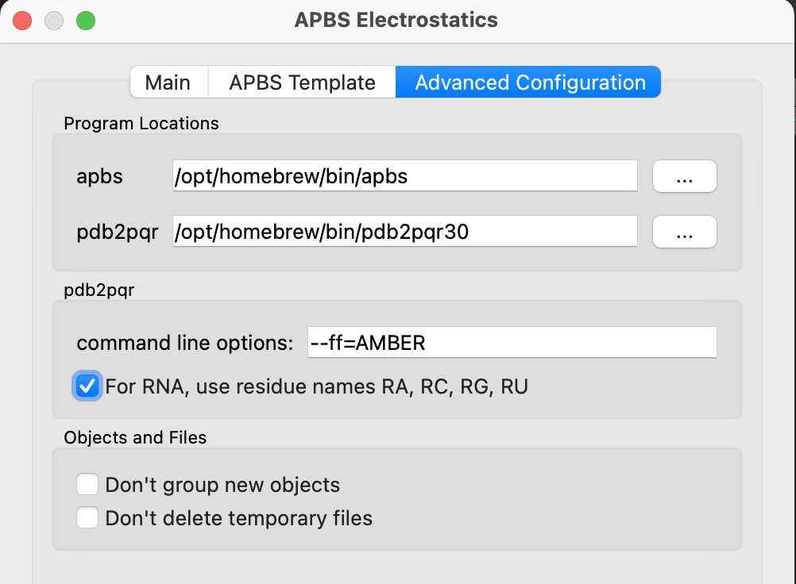
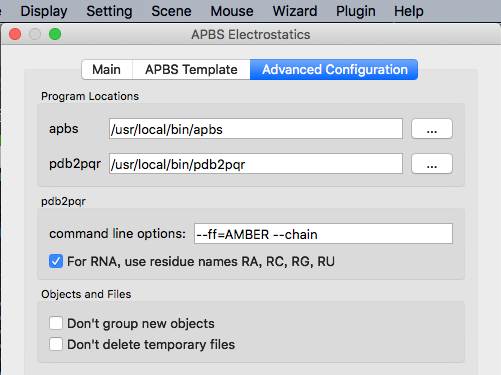

## APBSプラグインを使った表面電荷表示
PyMOLのプラグインでデフォルトでインストールされている**APBS**を使って表面電荷を表示してくれる方法を説明します。



このプラグインは、インストーラー版を使ってPyMOL 2をインストールした場合にはその中に同梱されているので別段の準備は必要ありませんが、オープンソース版をインストールした場合には様々な準備が必要となりますので、下にある[HomebrewでAPBS, PDB2PQRをインストールしておきます](#apbsのインストール)。まずはAPBSプラグインの使い方を説明します。

### APBSを使ってみる
今回は例としてPDB: 3x2oの構造のみを開いた状態にしておきます。その後、まず上部メニューの[Plugin]を選択し、次に[APBS Electrostatics]を選択します。



中のメニューはこうなっています。



Mainのタブでまず`selection`部分を確認します。この例では`polymer & 3x2o`という表示になっていますが、これはアミノ酸20種類かつオブジェクト3x2oが選択されていることを意味し、この選択範囲についてAPBSの電荷計算をこれから行うことを意味します。

この選択範囲に問題がなければ、このメニューの下の方にあるRunボタンを押すだけでAPBSの計算が動き出します。途中Warnings: "do you want to continue?"が表示された場合はYesと答えておきましょう。


正常にAPBSの計算が終わると、Close the APBS dialog?と問われます。閉じてもOKです。



計算が終わると、このように3x2oの表面が赤・白・青に分けて表示されるようになりました。


**赤は負電荷の多い箇所、青は正電荷の多い箇所**を表しています。白は中性です。

右側のInternal GUIのメニューには`run01`というオブジェクトグループが新しく増えています。ここの＋マークを押すと子オブジェクトが現れます。このうち`apbs_ramp01`というオブジェクトの`A`メニューを開いてみましょう。



上の方の`levels`を選ぶと`Range`を変えることができそうです。このRangeは先述の負電荷・正電荷の色付けの表示領域を表しており、値が小さいほど、描画上で最大となる赤・青のしきい値が小さくなります。つまり、デフォルトの5.0から2.0にしてみると



こんな感じで赤と青の箇所が濃く表示されるようになります。

この表面電荷表示はSurface表示として扱われているので、`set transparency, 0.5`として透明度を変更してあげることができます(`0.5`は透明度)。


透明度を下げてCartoon表示とともに観察すれば、分子のどの部分構造の付近が負電荷、正電荷になっているかがわかりやすいと思います。

さて、ここで先程のAPBS Electrostaticsメニューのプラグイン画面に戻ってみましょう。そこのMainタブの下の方には`Other Visualizations`というOptionsボタンがあります。ここを開いてみると、「mapオブジェクトが計算されたあと、オブジェクトメニューパネルの"Action"アイテムを使うことで追加の描画を生成することができる」（日本語訳）と書かれてあります。



これに従って追加操作をしてみましょう（書きかけ）。

### Advanced Configuration

APBS Electrostaticsの計算のパラメータはデフォルトでも十分問題なく動作すると思いますが、上級者のために、パラメータを変更することもできるようになっています。[APBS Templrate]のタブを開くと、表面電荷を計算するための設定ファイルが表示されます。

<br>

ここのBrowse...のところからは完成された設定ファイルを読み込ませることができます。公式ドキュメントは[https://apbs-pdb2pqr.readthedocs.io/en/latest/apbs/input/](https://apbs-pdb2pqr.readthedocs.io/en/latest/apbs/input/) にあるので、そちらを参考にするのも良いでしょう。

最後の[Advanced Configuration]タブからは、APBSとPDB2PQRのプログラムのインストール場所を指定したり、コマンドオプションを追加して計算させることもできます。追加コマンドオプションの一覧は[https://apbs-pdb2pqr.readthedocs.io/en/latest/pdb2pqr/invoking.html](https://apbs-pdb2pqr.readthedocs.io/en/latest/pdb2pqr/invoking.html)などが参考になります。



以下の項で説明するように、オープンソース版PyMOLではAPBS, PDB2PQRがプリインストールされていないため、自前で用意してからこのAdvanced Configurationで正しくプログラムの位置を指定してあげる必要があります。

### APBSのインストール

(2022年5月3日更新)

オープンソース版PyMOLを使っている人向けの説明です。やり方は3通りあって、Homebrewを使う方法と、バイナリインストールとソースコードからのインストールがあります。macOSの方やLinuxbrewが使える方はHomebrewの方法が簡単です。ソースコードからのインストールの方法は上級者向けです。

macOS（Linux OSの場合はLinuxbrewが必要）を使っている方は、私が作成したHomebrewのFormulaを使うことで簡単にインストールすることができます。執筆時点ではバージョン3.4.0です。

```bash
brew install brewsci/bio/apbs
```

これにより、`apbs`コマンドが利用できるようになります。

```bash
$ apbs --version

----------------------------------------------------------------------
    APBS -- Adaptive Poisson-Boltzmann Solver
    Version APBS 3.4.0
...
（以下省略）
```

インストール先は`which apbs`で調べることができます。

```bash
$ which apbs
/opt/homebrew/bin/apbs # M1 Macの場合
/usr/local/bin/apbs    # Intel Macの場合
```

ここで表示されたインストール先のパス名をAdvanced ConfigurationのProgram Locationsのapbsの欄に入力すれば動作準備完了です。



### PDB2PQRのインストール

(2022年5月3日更新)

オープンソース版PyMOLを使っている人向けの説明です。pythonのpipを使ったインストールの方法が最も簡単でおすすめです。執筆時点ではバージョン3.5.2です。先に、

```bash
$ python3 -m pip install pdb2pqr
...
(中略)
...
Successfully installed pdb2pqr-3.5.2
```

インストール先は`which pdb2pqr30`で調べることができます。バージョン3以前と異なり、バイナリ名が`pdb2pqr`から`pdb2pqr30`に変わっていることに気をつけてください。

```bash
$ which pdb2pqr30
/opt/homebrew/bin/pdb2pqr30 # M1 Macの場合
/usr/local/bin/pdb2pqr30    # Intel Macの場合
```

ここで表示されたインストール先のパス名をAdvanced ConfigurationのProgram Locationsのpdb2pqrの欄に入力すれば動作準備完了です。

### APBS GUIプラグインのインストール

オープンソース版PyMOLはバイナリ版と違い、GUIプラグインがあらかじめインストールされていません。しかしバイナリ版のプラグインのディレクトリをそのままオープンソース版の方のディレクトリにコピーしてくれば使用することができます。

このGUIプラグイン部分は[私のGithub](https://github.com/YoshitakaMo/pymolplugin)にコピーして置いてありますので、それをオープンソース版PyMOLのプラグインディレクトリに追加してやります。ターミナルを開いて

```bash
# pymolpluginディレクトリをダウンロード
cd ~
git clone https://github.com/YoshitakaMo/pymolplugin.git
# ファイルをオープンソース版PyMOLのプラグインディレクトリに追加
cp -rp ~/pymolplugin/* ${HOMEBREW_PREFIX}/opt/pymol/libexec/lib/python3.10/site-packages/pmg_tk/startup
# ここでPyMOLを立ち上げてみて、プラグインがインストールされていればOK
# インストールできたら~/pymolpluginディレクトリは削除してOK
rm -rf ~/pymolplugin
```

と入力します。このコピーを行った後にopen-source版PyMOLを立ち上げると、上部メニューのPluginのところにAPBS Electrostaticsの文字が現れているはずです。


この文字をクリックし、Advanced Configurationのタブをクリックします。このProgram Locationsを自身の環境にあわせて設定する必要があります。



HomebrewでAPBSとPDB2PQRをインストールした場合は、上図のようにapbsの欄を`/usr/local/bin/apbs`にし、pdb2pqrの欄を`/usr/local/bin/pdb2pqr30`に設定します（※M1以降のMacの方はそれぞれ`/opt/homebrew/bin/apbs`と`/opt/homebrew/bin/pdb2pqr30`）。もしソースコードからインストールした場合にはこの限りではありませんので、適切なapbs, pdb2pqrバイナリ本体へのpathを指定しましょう。

他の部分は特に変更する必要はありません。これで右下のrunを押せばめでたくAPBSが動くはずです。

