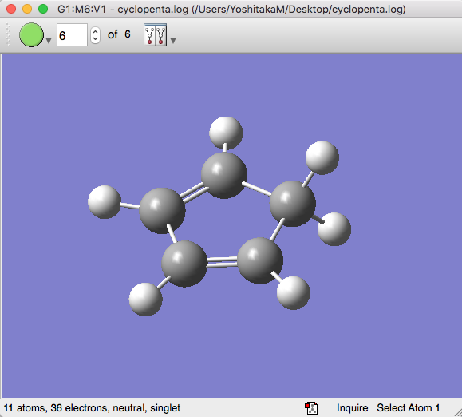
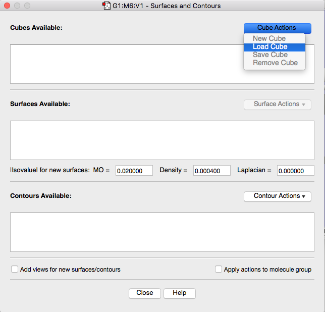
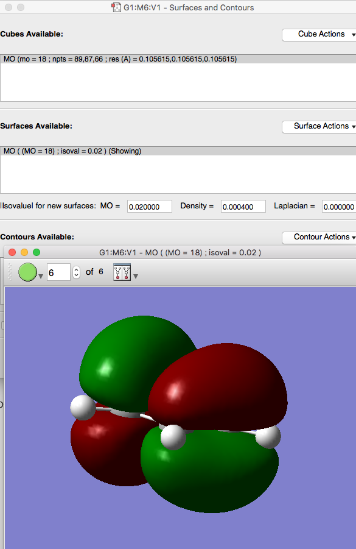
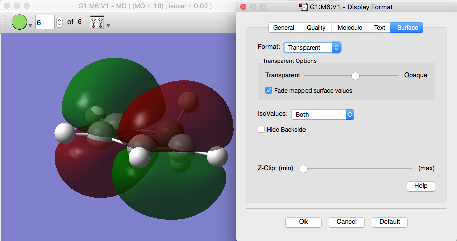
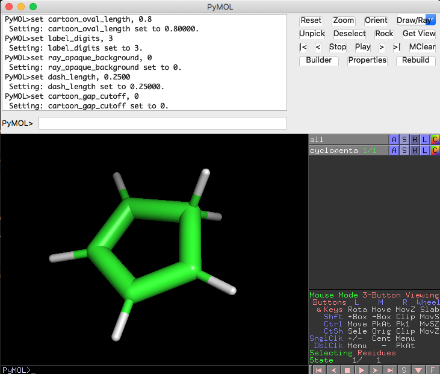
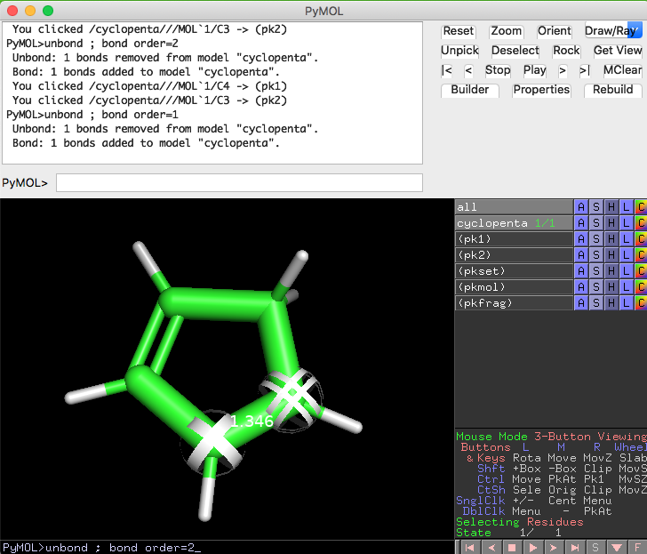
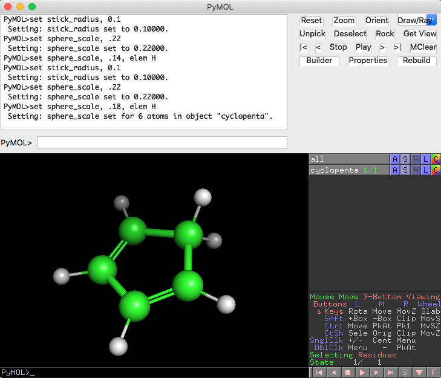

# Gaussian 16のcubeファイルを開いて分子軌道を表示する


PyMOLは、[VMD](https://www.ks.uiuc.edu/Research/vmd/)とまでは行きませんが、様々なファイルの可視化にも対応しています。今回紹介するのは、Gaussian 16などで計算された分子の分子軌道（molecular orbital）をPyMOL上で表示させるテクニックです。

GaussView 6やVMD 1.9.4などの他のソフトを用いて可視化してもよいのですが、タンパク質の構造生物学をやっている人ならだいたい使ったことがあり、扱いに慣れているPyMOLで見られれば、共同研究のときとかに喜ばれると考えられます。

ここでは、簡単な計算の例を示しながら、それをGaussViewまたはPyMOLで分子軌道を表示する時の方法を紹介します。

## 分子軌道を表示するのに必要な環境
 - GaussView 6, VMD, PyMOL 2.3.0以降のうち、いずれか1つをインストールしてあるパソコン

この記事ではGaussView 6またはPyMOL 2.3.0での方法を示します

## Example 1-1. シクロペンタジエンの場合
例として、シクロペンタジエン分子の構造をGaussian 16（`g16`）で構造最適化させ、分子軌道を計算させてみます。インプットファイル`cyclopenta.gjf` を以下のように書いて`g16`で計算させます。

```
%chk=cyclopenta.chk
%mem=20GB
%nprocshared=12
#p opt b3lyp/6-311g(d,p) pop=full

Title

0 1
 C                 -1.78668958   -0.09572728    0.64728372
 C                 -1.36269158    1.27506872    0.64728372
 H                 -1.14231658   -0.96843328    0.64730872
 H                 -0.33812858    1.63156072    0.64725872
 C                 -3.62816658    1.22478072    0.64727472
 H                 -4.64865477    1.54029066    0.71018208
 C                 -3.18843958   -0.09572728    0.64728372
 H                 -3.80595672   -0.96740593    0.58605536
 C                 -2.51974858    2.06652172    0.64717972
 H                 -2.52502738    2.68450968    1.52065726
 H                 -2.55124904    2.68351582   -0.22644835

```
`%mem=20GB`部分は計算にメモリを20GB使用するということ、`%nprocshared=12`は計算で使うCPU数を指定します。この値は各計算環境に応じて適宜変更する必要があります。ここで、重要なのは計算条件を指定する`#p opt pop=full`の部分です。`opt pop=full`で構造最適化計算と、電子密度解析計算を行うよう指示します。計算レベルや基底関数については`b3lyp/6-311g(d,p)`でなくても好みのものを使ってください。
（ちなみにGaussian 16だと`%nprocshared`の指定は非推奨になっています。最近実装された、環境変数での指定方法のほうが使い勝手が良いと思います。さらに、GPUを使った計算をしたい場合にはもっと別の指定方法になります。 参考： http://www.hpc.co.jp/gaussian_Link-0-Equivs.html ）

実行コマンド例は

```bash
#!/bin/bash
job="cyclopenta"
export GAUSS_CDEF="0-11" # cyclopenta.gjfファイルの%nprocshared=12に対応

g16 < ${job}.gjf > ${job}.log
```

計算が終わりますと、計算結果の`cyclopenta.log`ファイルだけでなく、.chk（チェックポイント）ファイル`cyclopenta.chk`も生成されているはずです。分子軌道の可視化や以降の処理にはこのファイルを用います。

## Example 1-2. chkファイルの処理
このchkファイルを用いて、まずターミナル上での以下のコマンドで、formatted checkpoint file形式に変換します。

    formchk cyclopenta.chk cyclopenta.fchk

として、formatted checkpoint fileに変換します。この`formchk`コマンドはGaussian 16と同時にインストールされているはずのコマンドです。Gaussian 16がインストールされてあるマシンやスパコンでは、Gaussian 16の本体である`g16`コマンドが使えるならば、ほぼ間違いなく使えるはずです。
（ちなみにGaussian 16で計算したchkファイルをGaussian 09時代の`formchk`コマンドで変換することはできない……かもしれません）

続いて、上のコマンドで作成された`cyclopenta.fchk`ファイルから、必要な分子軌道のデータを`.cube`形式のファイルに抽出します。

    cubegen 0 MO=homo cyclopenta.fchk cyclopenta_homo.cube

この`cubegen`についての操作方法はGaussian公式の[cubegenの解説ページ](http://gaussian.com/cubegen/)のページを参照してください。MO=のあとにhomoやlumo、または数字を指定すると、それに対応した分子軌道が出力されます。
今回はシクロペンタジエンのHOMO（最高被占軌道）のデータを取り出したいので、MO=homoとし、.fchkファイルと出力ファイル名`cyclopenta_homo.cube`を指定します。

## Example 1-3. cubeファイルの表示
### Case 1. GaussView 6で表示する
GaussView 6で表示する時、必要になるファイルは`cyclopenta.log`と`cyclopenta_homo.cube`です。まずはふつうに`cyclopenta.log`を開きます。



続いて、Results > Surfaces/Contoursを選択し、Cube ActionsからLoad Cubeを選び、`cyclopenta_homo.cube`を選択します。



続いて、Surface Actions > New Surfaceをクリックすると、分子軌道の図が表示されるようになります。



このSurfaceの描画モードを変えたい場合は、この紫の画面内で右クリックし、View -> Display Formatを選択します（macOSはCommand+DでもOK）。


このDisplay Formatウィンドウの中で、右端のSurfaceタブを選び、Format: transparentとすれば、半透明な表面を描画することができます。透明度はそこのスライダで調節できます。またmesh表示も可能です。



以下では、この部分をPyMOLでやってみる方法を紹介します。

### Case 2. PyMOL 2.3.0で表示する
PyMOLで開く場合には、

 1. `cyclopenta.log`の最終構造に対応する構造ファイルをPDB形式などで用意し、PyMOLに表示させる
 2. この上に`cyclopenta_homo.cube`をロードし、適切な処理を施す。

という流れになります。このうち、1.で述べた構造ファイルを用意する部分はやや面倒かもしれません。お使いのマシンに[AmberTools 18がインストールされている](https://qiita.com/Ag_smith/items/d2e86dda17f190a3dd0f)状態であれば、

    antechamber -i cyclopenta.log -fi gout -o cyclopenta.pdb -fo pdb

とすることで最終構造のPDBファイルを一発変換できます。AmberToolsがない場合は、オープンソースのファイルコンバータである[Open Babelを使った変換法](https://future-chem.com/open-babel-usage/)で代用できます。Homebrewのインストール方法は適当にググってください。

```
# Open BabelをHomebrewでインストール
brew install open-babel
# Usage:
# obabel [-i<input-type>] <infilename> [-o<output-type>] -O<outfilename> [Options]
# input-typeにはまだg16フォーマットがサポートされていないのですが、g09で代用可能だと思います。
# see also 'http://openbabel.org/docs/current/FileFormats/Overview.html#file-formats'
obabel -i g09 cyclopenta.log -o pdb -O cyclopenta.pdb
```

こうしてファイル形式を変換して作成した`cyclopenta.pdb`をPyMOLで開いてみます。



んー、本来は二重結合になっている炭素の結合情報が、全部同じような線で繋がれてしまっていますね。これが嫌だな〜って方は、以下のようにして二重結合っぽい表示に変えてみます。

二重結合にしたい原子の上でそれぞれ右のダブルクリック（マウスにホイールがある場合はホイールクリックでも可能）をすると、Pk1, Pk2という選択印が付きます。この状態で、PyMOLのコマンド `unbond ; bond order=2` を実行します（コマンド入力できるフォームは2箇所ありますが、どちらに入れても同じです）。この`order=2`で結合次数を指定しています。



これで二重結合っぽい表示に変わりました。ついでに、好みで以下の設定を入れてGaussViewっぽい描画設定にしてみます。

```
show sticks
show spheres
set stick_radius, 0.1
set sphere_scale, .22
set sphere_scale, .18, elem H
```



では、PyMOLに`cyclopenta_homo.cube`ファイルをロードします。コマンドは以下の通り

```
load /path/to/cyclopenta_homo.cube
isosurface Asurf1, cyclopenta_homo, 0.02
isosurface Bsurf1, cyclopenta_homo, -0.02
color red, Asurf1
color blue, Bsurf1
set transparency, 0.5
```

`load`部分は、`cyclopenta_homo.cube`のファイルのあるファイルパスを指定します。デスクトップ上に置いてあるならば`load ~/Desktop/cyclopenta_homo.cube`みたいに。以下の`isosurface`コマンドで分子軌道をしきい値0.02, -0.02で作成します。正と負の波動関数に対応する各電子雲をAsurf1, Bsurf1というオブジェクト名で作成し、色付けを red, blueにしています。


Asurf1, Bsurf1の色変更は、PyMOLのオブジェクト色変更と同じ感覚でマウスを使って簡単に変更できます。
