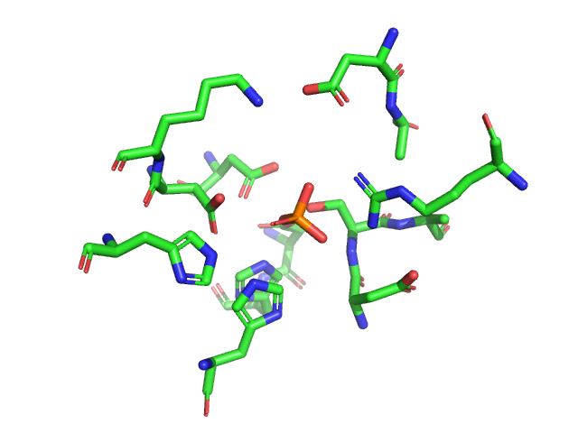

## Pythonからpymolモジュールをimportして使う

よくプログラミングしているユーザーからすると、PyMOLに使われている様々なコマンドをPython側から呼び出して利用したいということもあるかもしれません。しかし、その設定が環境によってはちょっと難しいので、ここではまずpymolをimportできるようにする設定の方法を確認します。

まずターミナルを開いてPython3を対話型で開き、`import pymol`を入力してみましょう。`python3`の部分は`python3.9`, `python3.8`の場合もあります。

```shell
$ python3
Python 3.9.4 (default, Apr  5 2021, 01:50:46)
[Clang 12.0.0 (clang-1200.0.32.29)] on darwin
Type "help", "copyright", "credits" or "license" for more information.
>>> import pymol
Traceback (most recent call last):
  File "<stdin>", line 1, in <module>
ModuleNotFoundError: No module named 'pymol'
>>>
```

もしここで`ModuleNotFoundError`というエラーが表示されずそのまま次の入力`>>>`が表示された場合はめでたくpymolのモジュールのimportに成功しているのですが、そうでない場合は環境設定を行う必要がありますので、次項以降を確認してみてください。

Homebrewをお使いの場合、2021年5月1日以降のpymol 2.4.0_5からは`import pymol`が使えるようになっているはずです。

### 事前準備: PythonのPATHとpython内のsys.pathの値を確認する（macOS/Linuxの人向け）

ターミナルから以下のコマンドを入力することで`python3`のバージョン情報およびインストールされているディレクトリの場所を確認することができます。

``` shell
$ python3 --version
Python 3.9.4
$ ls -l `which python3`
lrwxr-xr-x  1 YoshitakaM  admin  38  4  9 12:16 /usr/local/bin/python3 -> ../Cellar/python@3.9/3.9.4/bin/python3
```

今の環境ではPython 3.9.4のバージョンを使用しており、python3は`/usr/local/Cellar/python@3.9/3.9.4/bin/python3`にあることがわかりました（これもシンボリックリンクで、真の実体はまた別の位置に存在しています）。macOSの場合Cellar以下にpython3がある場合は、それはHomebrewでインストールされたpython3、もっと言うと`brew install python@3.9`コマンドでインストールされたものとなっています。

次にターミナルからpython3を起動して、以下のコマンド`import sys`, `sys.path`を入れてみます。

```shell
$ python3
Python 3.9.4 (default, Apr  5 2021, 01:50:46)
[Clang 12.0.0 (clang-1200.0.32.29)] on darwin
Type "help", "copyright", "credits" or "license" for more information.
>>> import sys
>>> sys.path
['', '/Users/YoshitakaM/apps/amber20/lib/python3.8/site-packages', '/Users/YoshitakaM/apps/amber20/lib/python3.8/site-packages/pytraj-2.0.5-py3.8-macosx-10.9-x86_64.egg', '/Users/YoshitakaM/apps/amber20/lib/python3.8/site-packages/pdb4amber-1.7.dev0-py3.8.egg', '/usr/local/Cellar/python@3.9/3.9.4/Frameworks/Python.framework/Versions/3.9/lib/python39.zip', '/usr/local/Cellar/python@3.9/3.9.4/Frameworks/Python.framework/Versions/3.9/lib/python3.9', '/usr/local/Cellar/python@3.9/3.9.4/Frameworks/Python.framework/Versions/3.9/lib/python3.9/lib-dynload', '/Users/YoshitakaM/Library/Python/3.9/lib/python/site-packages', '/usr/local/lib/python3.9/site-packages', '/usr/local/Cellar/pybind11/2.6.2/libexec/lib/python3.9/site-packages', '/usr/local/Cellar/sip/6.0.3_1/libexec/lib/python3.9/site-packages', '/usr/local/Cellar/modeller/10.1/modlib']
```

`sys.path`は起動したpython3に対して、Pythonの追加モジュールを読み込むPATHを表示してくれています。ここにpymolのモジュールへのパス、例えば`/usr/local/Cellar/pymol/2.4.0_5/libexec/lib/python3.9/site-packages/pymol`が含まれていない場合はimportに失敗し、`ModuleNotFoundError`というエラーが発生します。

これを解決する方法は3つあります。

1. 環境変数`PYTHONPATH`を設定し、pymolモジュールがインストールされている場所を追加する
2. `import sys`, `sys.path.append()`を使ってpython3の中からモジュール検索パスを追加する
3. パス設定ファイル(`.pth`)をpython3のデフォルト`site-packages`の中に追加する

詳しくは https://note.nkmk.me/python-import-module-search-path/ を参照してください。簡単なのは1.の環境変数`PYTHONPATH`を設定する方法です。Homebrewでは実は3.の方法で実現しています。

### pymolモジュールの使い方

普段使いの`python3`から無事`import pymol`が成功したら、次にpymolモジュールの使い方を見ていきましょう。

#### 例1. PyMOLの画像を出力する

PyMOLのGUIを開き、以下のコマンドを入力していきます。

```
fetch 1alk, type=mmtf
hide everything
select sel1, byres resn * within 5 of (resn PO4 and chain A)
zoom sel1
as sticks, sel1
ray 640,480
png ~/Desktop/foosel1.png
```

すると、以下のような画像が出力されます。


これと同様のことを、Pythonの`import pymol`から実行することができます。そのためのコマンドがこちら

```python
import pymol
pymol.cmd.fetch("1alk", type="mmtf")
pymol.cmd.hide("everything")
pymol.cmd.select("sel1",  "byres resn * within 5 of (resn PO4 and chain A)")
pymol.cmd.zoom("sel1")
pymol.cmd.show_as("sticks", "sel1")
pymol.cmd.ray("640", "480")
pymol.cmd.png("~/Desktop/foosel2.png")
```



このように、同様の結果が得られました。

上記のコマンドでは`pymol.cmd`と書いていましたが`from pymol import cmd`とすれば`pymol.cmd`を`cmd`と短くすることもできます（Pythonの仕様です）。

```python
from pymol import cmd
cmd.fetch("1alk", type="mmtf")
cmd.hide("everything")
cmd.select("sel1",  "byres resn * within 5 of (resn PO4 and chain A)")
cmd.zoom("sel1")
cmd.show_as("sticks", "sel1")
cmd.ray("640", "480")
cmd.png("~/Desktop/foosel2.png")
```

module`cmd`以下に存在する様々な関数（`fetch`, `hide`, `select`など）はPyMOLのコマンドとほぼ同様ですが、一部は`as`→`show_as`のように名前が変更されているものもありますので注意してください。各コマンドの使い方は[PyMOLWiki](https://pymolwiki.org/)、またはpymol.orgのサイト上で検索することでも情報が取得できますが、VSCodeなどのエディタ上でのプログラミングに慣れている方であれば、メソッドのヘルプ表示機能などで仕様を直接確認する方が確実かもしれません。

