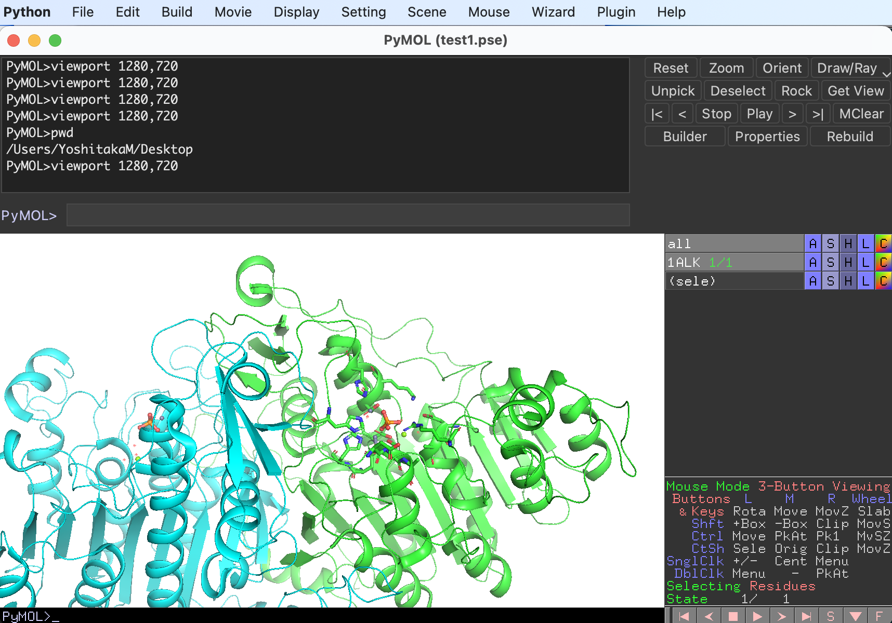
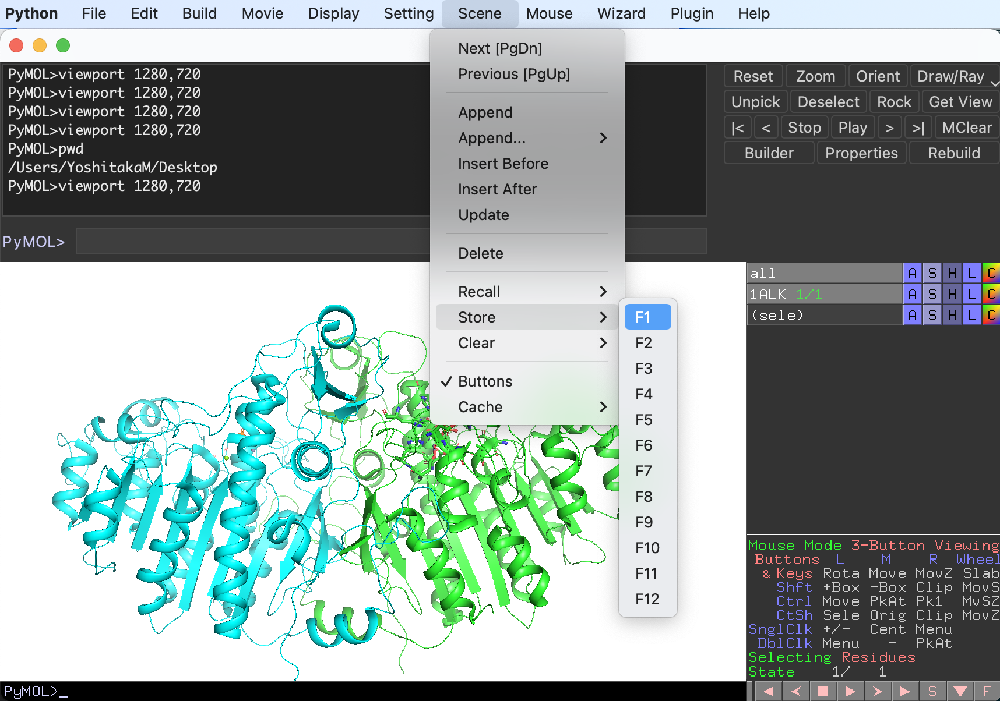
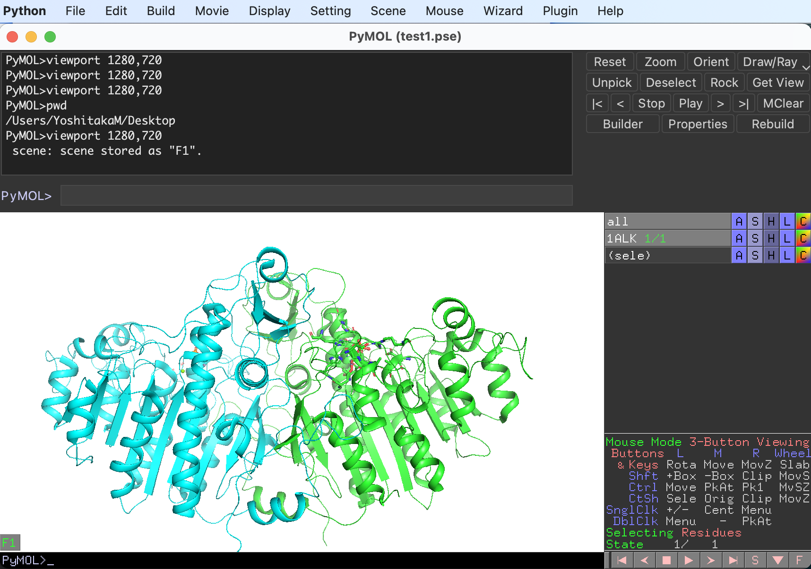
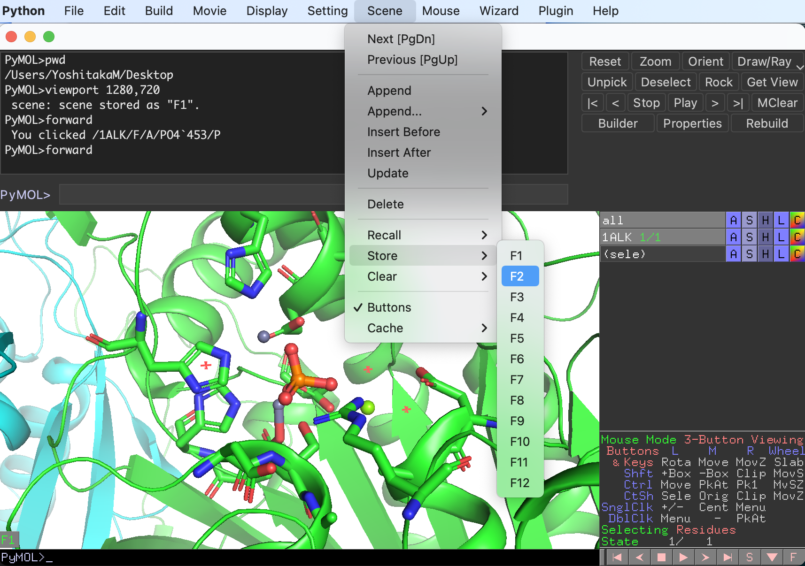
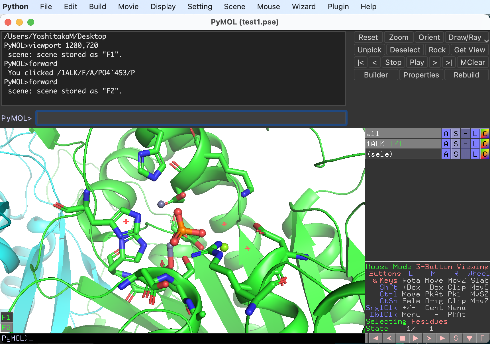
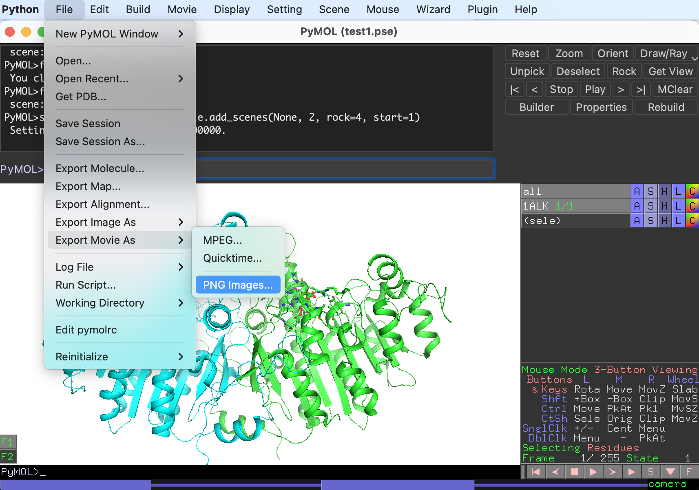
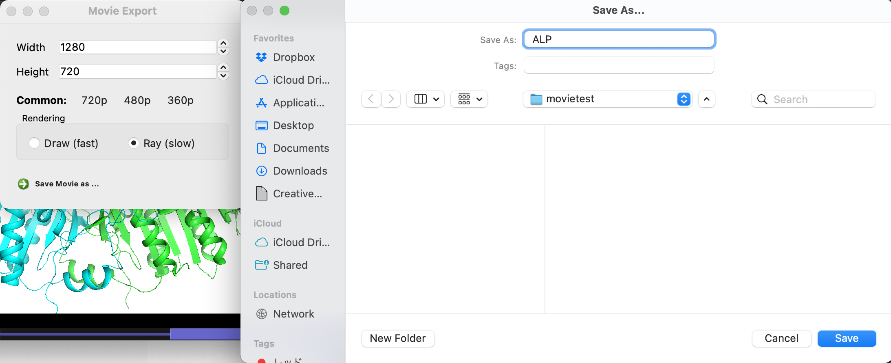

## 動画の作成方法

自身の研究しているタンパク質の構造を他の人にもしっかりと見てもらうための方法は、1つにはPyMOLセッションファイルに保存して、それをPyMOLで開いてもらうということが考えられます。しかし、PyMOLセッションファイルは相手のパソコンやmacにPyMOLがインストールされてなければ閲覧することはできません。そこで、より広い範囲で色んな人に見てもらうための方法として、**分子が動いている様子を一般的な動画形式に変換する**という方法があります。これならPowerpointなどのスライドに埋め込むこともできますし、ウェブ上でも公開できます。

ここではその方法をいくつか紹介します。

### 目指す動画の例

先に完成例としての動画を表示します。

<video width="100%" height="100%" controls autoplay loop>
<source src="./image/movie/alpmovie.mp4" type="video/mp4">
</video>

ポイントは

- 全体像を見せつつ、基質結合部位を見せる
- 背景画像を使う
- 無料のコマンドラインツールのみを使用し、有料アプリを使わない

です。

背景画像を使っているのは、使用しないと黒背景になることが多くなってしまうためです。

### 使うツール

動画への出力は**ffmpeg**を使います。macOSならば

```bash
$ brew install ffmpeg
```

でインストールできますので、これをインストールしておきます。もしOpen-source版のPyMOLを`brew install brewsci/bio/pymol`でインストールしていた場合はffmpegも自動的にインストールされているはずです。

### 手順1：画面サイズを決める

動画として出力する予定の画面サイズを先に決めておくと後が楽です。ここでは横1280ピクセル縦720ピクセルの動画を出力することにします。これはコマンドでかんたんに設定することができます。コマンド入力欄に

```
viewport 1280, 720
```

と入力すると、画面が指定したサイズに変化します。



### 手順2：Sceneを保存する

[3.7 Scene](../ch03/scene.md)で述べているように、**Scene機能**を使うとPyMOLでのカメラアングルと表示状態を保存することができ、左下に現れたメニューからいつでもその状態を呼び出すことができます。動画を作成する上でもこの**Scene機能**を活用することが可能です。

例としてまずアルカリホスファターゼの二量体構造全体が見える位置でSceneを1つ保存しておきます。いい感じの表示設定とカメラアングルが得られたら、上部メニューの**Scene**から**Store**を選びF1〜F12のいずれかに保存します（ここでは**F1**にしておきます）。



左下に**F1ボタン**が現れました。以降はこのボタンを押すと表示設定とカメラアングルが呼び出されます。



続いて基質結合部位に注目したカメラアングルをSceneの**F2**として保存しておきます。同様の操作でこんな感じで保存しておきます。





Sceneをすべて設定し終えたら、上部**Movie**メニューから**Program**, **Scene Loop**, **Nutate, 30 de. over 2sec.** を選びます。これはSceneを順番に表示しつつ、各Sceneで2秒間30°ずつ揺らしながら次の状態に移行する設定です。設定には色々あるので、[3.4 Movie](../ch03/movie.md)から好きなものを選んでください。

右下のスタートボタンを押すとこんな感じで再生されます。

<video width="100%" height="100%" controls autoplay loop>
<source src="./image/movie/movie_1.mp4" type="video/mp4">
</video>

ここに表示されている画面が動画として出力されるので、よくチェックしておきます。

もし手順1を飛ばしていた場合はここで`viewport`コマンドを入れて画像サイズを調節し、再度手順2のScene保存をやり直します。

よければセッションファイル（pseファイル）として保存しておきます。

### 手順3：PNG形式で各フレームを保存する

動画に表示されている動きの全フレームをPNG画像形式で出力させます。これは**File**, **Export Movie As**, **PNG Images**から選択することができます。



Moview Exportのダイアログボックスでは出力画像サイズを設定することができます。もしここで当初予定していた画像サイズから変わっていれば（少し変わっていることがよくあります）、その数字を修正しておきます。また、RenderingオプションはRay(Slow)の方がきれいに出力されますが、その分時間がかかります。今回はRayでやります。

最後に一番下のSave Movie as...から出力先のディレクトリを選択します。このとき、出力先ディレクトリは新規ディレクトリを作成してからその中に保存することを強く勧めます。こうしないと画像が散らばって面倒です。

今回の例では保存先をmovietestというディレクトリ上に保存することにします。そしてSave Asの名前欄に`ALP`と入力します（この文字は画像のprefixなので任意の文字列でOKです）。



すると、出力先のmovietestディレクトリにALP0001.png, ALP0002.png, ... といった具合にすべてのフレームの画像が出力されます。しばらくかかるのでこのまますべて終わるまでじっくり待ちます。

### 手順4：背景画像を使ってffmpegで動画を生成する

好きな背景画像を適当に用意します。今回は以下のものを使いました。


画像サイズはあらかじめ出力したタンパク質の画像サイズ（1280 x 720）と合わせておくと良いでしょう。画像の切り抜きにはコマンドラインツールのImagemagickを使うこともできます。詳しくは[ImageMagick の画像 Crop](https://qiita.com/yoya/items/62879e6e03d5a70eed09)の記事などを参考にしてください。

この背景画像を`bg.jpg`として、先程のmovietestディレクトリに置きます。その後、以下のコマンドでffmpegを実行するだけで、動画ファイル`out.mp4`が生成されます。

```bash
$ ffmpeg -r 30 -i bg.jpg -vf 'movie=ALP%4d.png [over], [in][over] overlay' -vcodec libx264 -pix_fmt yuv420p out.mp4
```

- `-r`：フレームレート
- `-i`：インプット画像
- `-vcodec libx264`：スマートフォン向けの動画(H.264+aac)に変換
- `-pix_fmt yuv420p`：エンコーダに渡すピクセルフォーマットを指定。yuv420pはH.264動画変換のときのデフォルトらしい
- `-vf 'movie=ALP%4d.png [over], [in][over] overlay'`：ALPではじまる連番画像をインプット画像の上に重ねる

これで動画が出力されました。

<video width="100%" height="100%" controls autoplay loop>
<source src="./image/movie/alpmovie.mp4" type="video/mp4">
</video>

### その他

MDシミュレーションでトラジェクトリを表示させたときのタンパク質が動いている様子もこれと同様の手順で出力することができます。