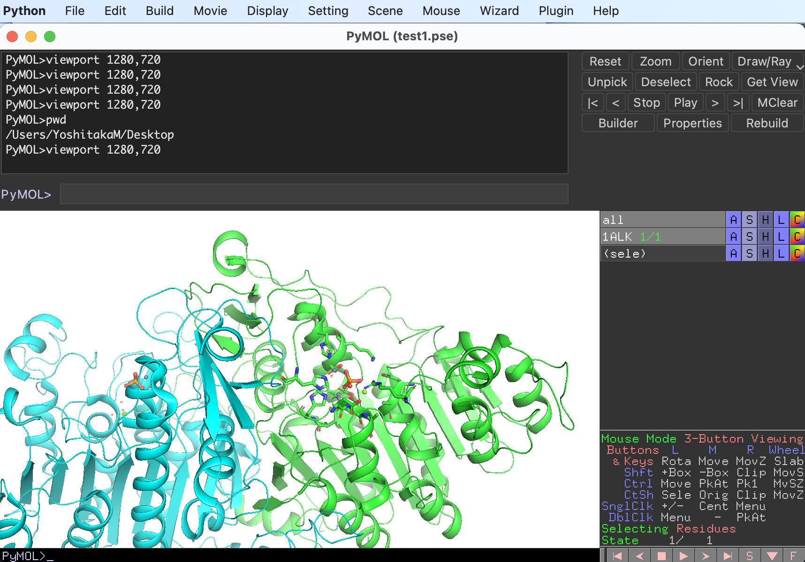
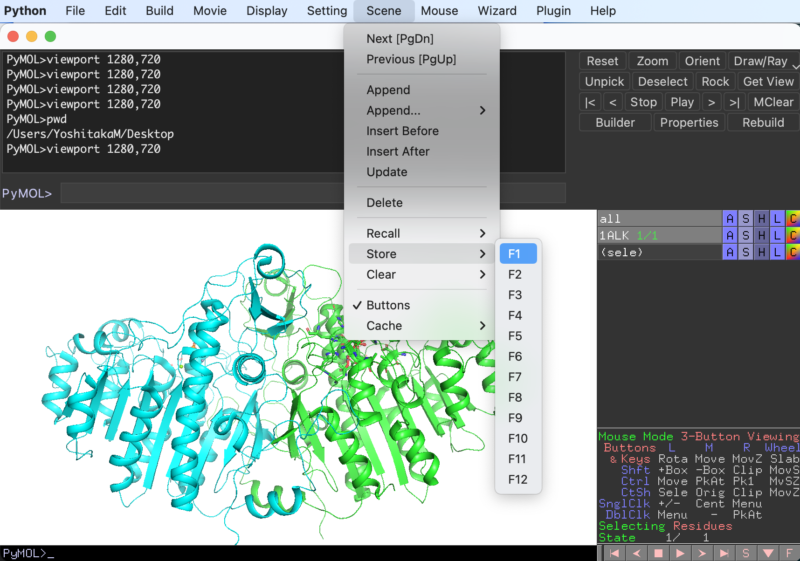
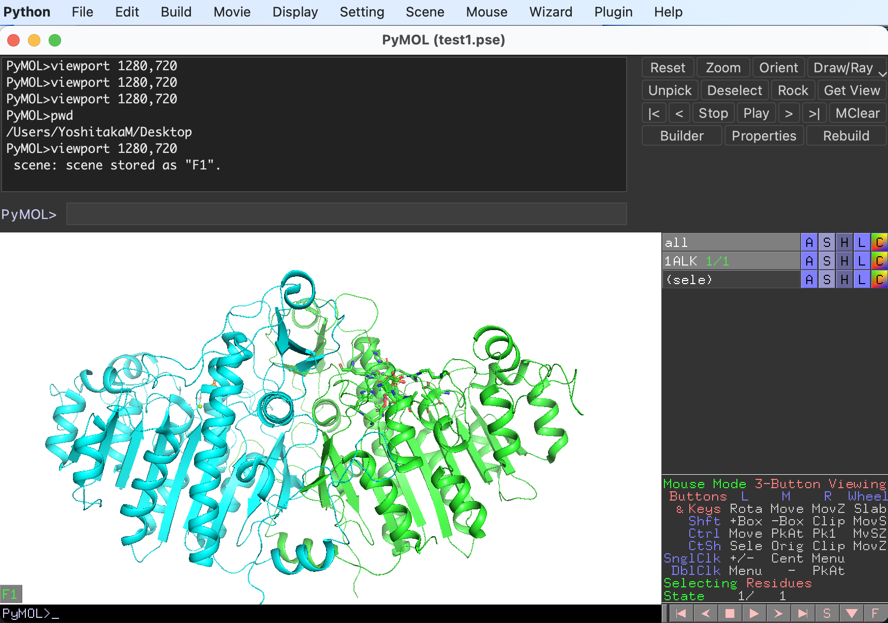
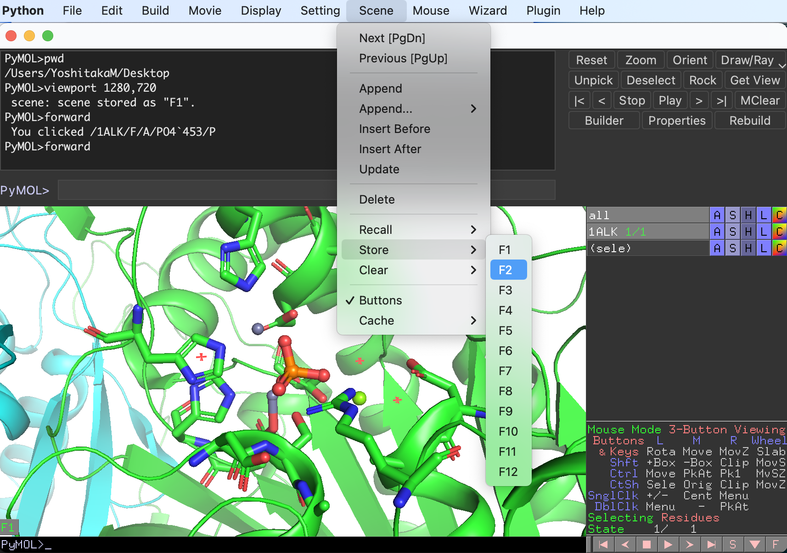
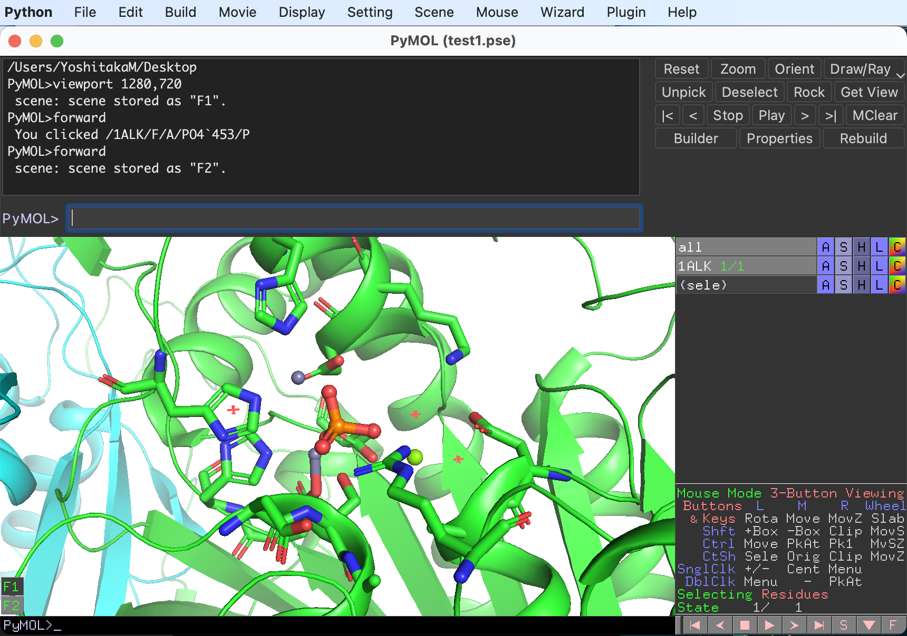
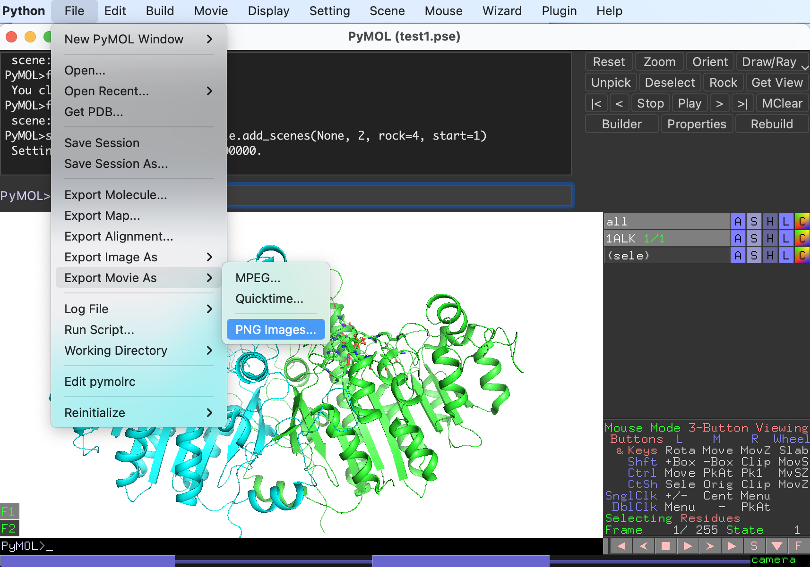
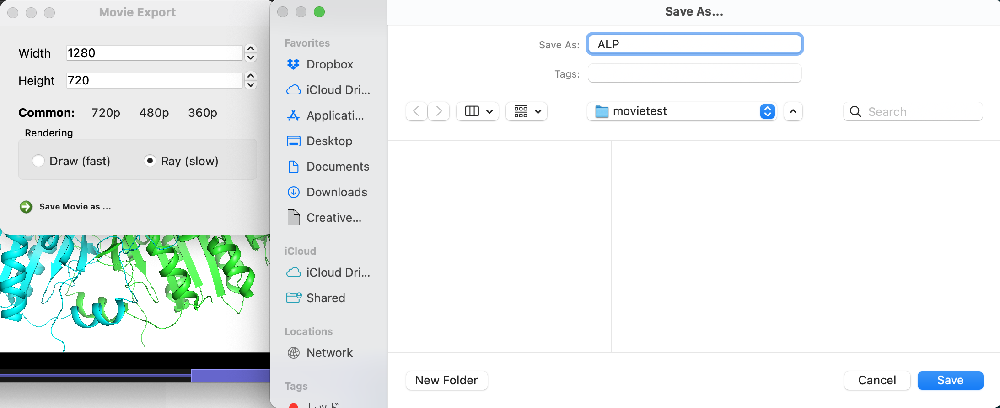

# 動画の作成方法

自身の研究しているタンパク質の構造を他の人にもしっかりと見てもらうための方法は、1つにはPyMOLセッションファイルに保存して、それをPyMOLで開いてもらうということが考えられます。しかし、PyMOLセッションファイルは相手のパソコンやmacにPyMOLがインストールされてなければ閲覧することはできません。そこで、より広い範囲で色んな人に見てもらうための方法として、**分子が動いている様子を一般的な動画形式に変換する**という方法があります。これならPowerpointなどのスライドに埋め込むこともできますし、ウェブ上でも公開できます。

ここではその方法をいくつか紹介します。

## 目指す動画の例

先に完成例としての動画を表示します。

<video width="100%" height="100%" controls autoplay loop>
<source src="./image/movie/alpmovie.mp4" type="video/mp4">
</video>

ポイントは

- 全体像を見せつつ、基質結合部位を見せる
- 背景画像を使う
- 無料のコマンドラインツールのみを使用し、有料アプリを使わない

です。

背景画像を使っているのは、使用しないと黒背景になることが多くなってしまうためです。

## 使うツール

動画への出力は**ffmpeg**を使います。macOSならば

```bash
brew install ffmpeg
```

でインストールできますので、これをインストールしておきます。もしOpen-source版のPyMOLを`brew install pymol`でインストールしていた場合はffmpegも自動的にインストールされているはずです。

## 手順1：画面サイズを決める

動画として出力する予定の画面サイズを先に決めておくと後が楽です。ここでは横1280ピクセル縦720ピクセルの動画を出力することにします。これはコマンドでかんたんに設定することができます。コマンド入力欄に

```python
viewport 1280, 720
```

と入力すると、画面が指定したサイズに変化します。



## 手順2：Sceneを保存する

[3.7 Scene](../ch03/scene.md)で述べているように、**Scene機能**を使うとPyMOLでのカメラアングルと表示状態を保存することができ、左下に現れたメニューからいつでもその状態を呼び出すことができます。動画を作成する上でもこの**Scene機能**を活用することが可能です。

例としてまずアルカリホスファターゼの二量体構造全体が見える位置でSceneを1つ保存しておきます。いい感じの表示設定とカメラアングルが得られたら、上部メニューの**Scene**から**Store**を選びF1〜F12のいずれかに保存します（ここでは**F1**にしておきます）。



左下に**F1ボタン**が現れました。以降はこのボタンを押すと表示設定とカメラアングルが呼び出されます。



続いて基質結合部位に注目したカメラアングルをSceneの**F2**として保存しておきます。同様の操作でこんな感じで保存しておきます。





Sceneをすべて設定し終えたら、上部**Movie**メニューから**Program**, **Scene Loop**, **Nutate, 30 de. over 2sec.** を選びます。これはSceneを順番に表示しつつ、各Sceneで2秒間30°ずつ揺らしながら次の状態に移行する設定です。設定には色々あるので、[3.4 Movie](../ch03/movie.md)から好きなものを選んでください。

右下のスタートボタンを押すとこんな感じで再生されます。

<video width="100%" height="100%" controls autoplay loop>
<source src="./image/movie/movie_1.mp4" type="video/mp4">
</video>

ここに表示されている画面が動画として出力されるので、よくチェックしておきます。

もし手順1を飛ばしていた場合はここで`viewport`コマンドを入れて画像サイズを調節し、再度手順2のScene保存をやり直します。

よければセッションファイル（pseファイル）として保存しておきます。

## 手順3：PNG形式で各フレームを保存する

## GUIを使う場合

動画に表示されている動きの全フレームをPNG画像形式で出力させます。これは**File**, **Export Movie As**, **PNG Images**から選択することができます。



Moview Exportのダイアログボックスでは出力画像サイズを設定することができます。もしここで当初予定していた画像サイズから変わっていれば（少し変わっていることがよくあります）、その数字を修正しておきます。また、RenderingオプションはRay(Slow)の方がきれいに出力されますが、その分時間がかかります。今回はRayでやります。

最後に一番下のSave Movie as...から出力先のディレクトリを選択します。このとき、出力先ディレクトリは新規ディレクトリを作成してからその中に保存することを強く勧めます。こうしないと画像が散らばって面倒です。

今回の例では保存先をmovietestというディレクトリ上に保存することにします。そしてSave Asの名前欄に`ALP`と入力します（この文字は画像のprefixなので任意の文字列でOKです）。



すると、出力先のmovietestディレクトリに`ALP0001.png`, `ALP0002.png`, ... といった具合にすべてのフレームの画像が出力されます。しばらくかかるのでこのまますべて終わるまでじっくり待ちます。

## PyMOLのコマンド`mpng`を使う場合

PyMOLのコマンドラインから`mpng`コマンドを使うことでも同様にPNG形式で各フレームを保存することができます。例えば以下のようにします。

```python
# syntax
mpng prefix [, first [, last [, preserve [, modal [, mode [, quiet [, width [, height ]]]]]]]]
# example
mpng ALP, first=1, last=120, mode=1, width=1280, height=720
```

詳しくは[PyMolWikiのmpng](https://pymolwiki.org/index.php/Mpng)も参考にしてください。

引数`first`と`last`を使うことで書き出すフレームを指定できます。これにより、ワークステーションクラスタにレンダリングを自動的に分散させるスマートなPythonプログラムを作成できます。これらのオプションを0に設定した場合、全フレームがレンダリングされます。

`prefix`にALPを指定すると、出力されるファイル名は`ALP0001.png`, `ALP0002.png`, ... となります。

`width`と`height`で出力画像のサイズを指定できます。ここで指定することも可能ですが、これを使うと出力される画像を事前に確認することが難しいため、実用上は`viewport`コマンド(例：`viewport 1280, 720`)で画面サイズを変更して画面を確認してから`mpng`を実行する方が良いでしょう。

- 引数
  - `prefix` = str: 保存された画像のファイル名のプレフィックス -- 出力ファイルには番号が付けられ、`.png`で終わります。
  - `first` = int: 開始フレーム {デフォルト: 0 (最初のフレーム)}
  - `last` = int: 最後のフレーム {デフォルト: 0 (最後のフレーム)}
  - `preserve` = 0/1: 存在しないファイルのみを書き込む {デフォルト: 0}
  - `modal` = int: フレームはモーダル描画ループでレンダリングされます
  - `mode` = int: 2=ray、1=draw、0=normal {default: -1、ray_trace_framesまたはdraw_framesが設定されている場合はそれに従う}
  - `width` = int: ピクセル単位の幅 {default: 現在のviewport値}
  - `height` = int: ピクセル単位の高さ {default: 現在のviewport値}

## 手順4：ffmpegで動画を生成する

## 背景画像を使う場合

好きな背景画像を適当に用意します。今回は以下のものを使いました。


画像サイズはあらかじめ出力したタンパク質の画像サイズ（1280 x 720）と合わせておくと良いでしょう。画像の切り抜きにはコマンドラインツールのImagemagickを使うこともできます。詳しくは[ImageMagick の画像 Crop](https://qiita.com/yoya/items/62879e6e03d5a70eed09)の記事などを参考にしてください。

この背景画像を`bg.jpg`として、先程のmovietestディレクトリに置きます。その後、以下のコマンドでffmpegを実行するだけで、動画ファイル`out.mp4`が生成されます。

```bash
ffmpeg -r 30 -i bg.jpg -vf 'movie=ALP%4d.png [over], [in][over] overlay' -vcodec libx264 -pix_fmt yuv420p out.mp4
```

- `-r`：フレームレート
- `-i`：インプット画像
- `-vcodec libx264`：スマートフォン向けの動画(H.264+aac)に変換
- `-pix_fmt yuv420p`：エンコーダに渡すピクセルフォーマットを指定。yuv420pはH.264動画変換のときのデフォルトらしい
- `-vf 'movie=ALP%4d.png [over], [in][over] overlay'`：ALPではじまる連番画像をインプット画像の上に重ねる

これで動画が出力されました。

<video width="100%" height="100%" controls autoplay loop>
<source src="./image/movie/alpmovie.mp4" type="video/mp4">
</video>

## 背景画像を使わない場合

背景画像を使わない場合は以下のコマンドで動画を生成します。

```bash
ffmpeg -r 30 -i ALP%4d.png -c:v libx264 -pix_fmt yuv420p out.mp4
```

## 連番画像を途中から使いたい場合

連番画像を途中から使いたい場合は`-start_number`オプションを使います。例えば11番目の画像から使いたい場合は以下のようにします。

```bash
ffmpeg -r 30 -start_number 11 -i ALP%4d.png -c:v libx264 -pix_fmt yuv420p out.mp4
```

## シミュレーションの動画に時間を表示させる

ffmpegの`drawtext`フィルタを使うと、動画にテキストを重ねることができます。例えばシミュレーションの動画に時間を表示させたい場合は以下のようにします。ただし、macOSの場合、Homebrewには軽量の`ffmpeg`と`ffmpeg-full`の2種類があるのですが、`drawtext`フィルタを使うためには`ffmpeg-full`をインストールしておく必要があります。

```bash
brew install ffmpeg-full
```

インストール後に`ffmpeg -filters | grep drawtext`を実行して、`drawtext`フィルタが利用可能か確認しておきます。

```bash
$ ffmpeg -filters | grep drawtext
ffmpeg version 8.1 Copyright (c) 2000-2026 the FFmpeg developers
  built with Apple clang version 21.0.0 (clang-2100.0.123.102)
  configuration: --prefix=/opt/homebrew/Cellar/ffmpeg-full/8.1_1 --enable-shared --enable-pthreads --enable-version3 --cc=clang ...
  libavutil      60. 26.100 / 60. 26.100
  libavcodec     62. 28.100 / 62. 28.100
  ...
  T. drawtext          V->V       Draw text on top of video frames using libfreetype library.
```

左上にシミュレーションの時間を表示させる場合は以下のようにします。

```bash
ffmpeg -framerate 30 -i mvg%04d.png \
-vf "drawtext=fontfile=/System/Library/Fonts/Supplemental/Arial.ttf:text='Time\: %{eif\:(n+1)*20/100\:d}.%{eif\:mod((n+1)*20\,100)/10\:d}%{eif\:mod((n+1)*20\,10)\:d} ns':x=20:y=20:fontsize=48:fontcolor=white:borderw=2:bordercolor=black" \
-c:v libx264 -pix_fmt yuv420p -crf 18 -preset medium output.mp4
```

ここで

- `-framerate 30`: フレームレートを30に設定
- `-i mvg%04d.png`: 連番画像の入力. mvg0001.png, mvg0002.png, ... という形式のファイルを読み込む
- `-vf "drawtext=...`: 動画フィルタでdrawtextを使用してテキストを描画
  - `fontfile`: フォントファイルのパスを指定
  - `text`: 描画するテキスト. ここではシミュレーションの時間を計算して表示するために、`%{eif\:(n+1)*20/100\:d}`などの式を使用しています。`n`は現在のフレーム番号を表し、20はフレームごとの時間間隔（例: 20ps）を表しています。
  - `x`と`y`: テキストの位置を指定
  - `fontsize`: フォントサイズを指定
  - `fontcolor`: フォントの色を指定
  - `borderw`: テキストの境界線の幅を指定
  - `bordercolor`: テキストの境界線の色を指定
- `-c:v libx264`: H.264コーデックを使用して動画をエンコード
- `-pix_fmt yuv420p`: ピクセルフォーマットを指定
- `-crf 18`: 品質を指定（数値が小さいほど高品質）
- `-preset medium`: エンコードの速度と品質のバランスを指定
- `output.mp4`: 出力ファイル名を指定

という設定になっています。これで動画の左上にシミュレーションの時間が表示されるようになります。

## その他

MDシミュレーションでトラジェクトリを表示させたときのタンパク質が動いている様子もこれと同様の手順で出力することができます。
