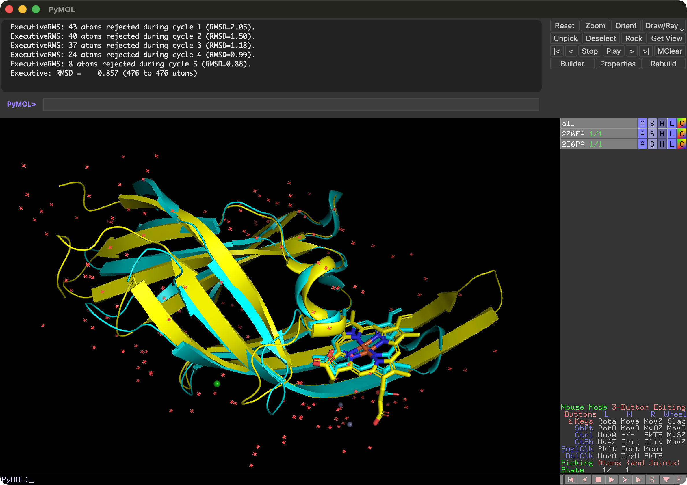
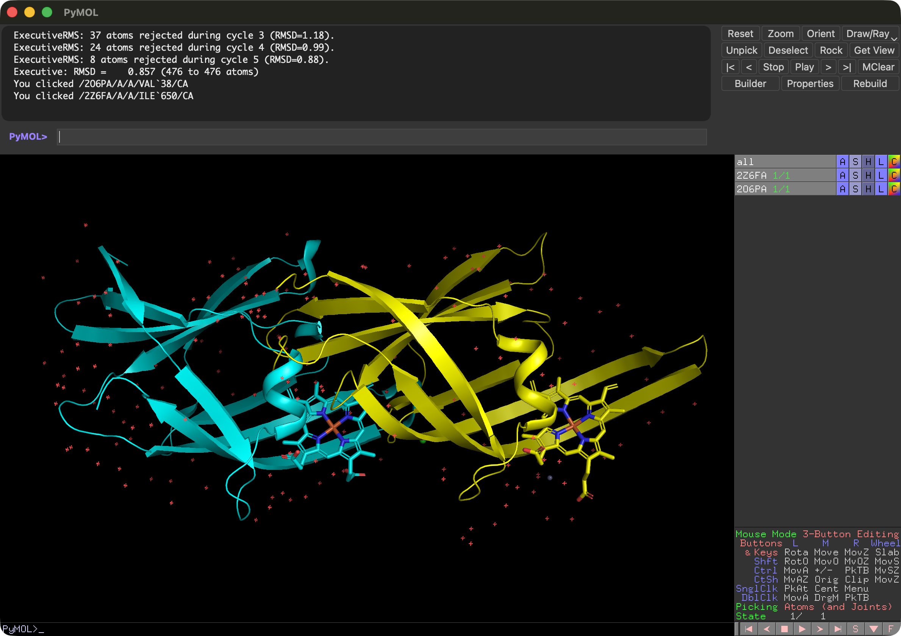
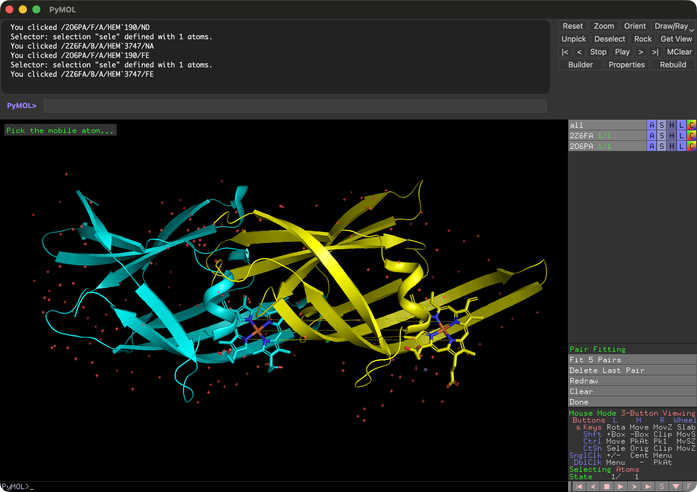
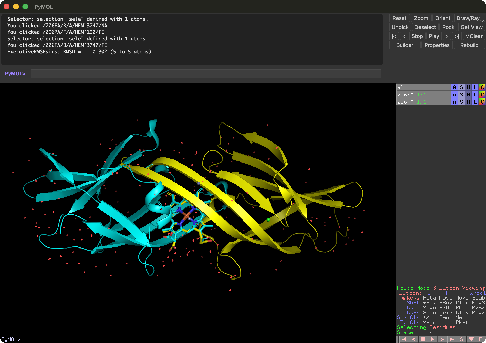

## pair fittingでリガンドの位置を重ねる

<video width="100%" height="100%" controls autoplay loop><source src="./image/movie/pairfitting.mp4" type="video/mp4"></video>

ある2つの分子構造があって、一方の分子構造にもう一方の分子構造を重ねたい場合があります。例えば、タンパク質に結合したリガンドの位置を、別の構造に重ねたい場合などです。このような場合に便利なのが**pair fitting**という機能です。この機能は、PyMOLのWizardメニューの"Pair Fitting"から利用することができます。

### 1. 2つの構造を用意する

例として、PDB IDが2Z6Fと2O6Pの構造を用意します。2Z6Fと2O6PはそれぞれIsdH-NEAT3 domainとヘムタンパク質の複合体、およびIsdC-NEAT domainとヘムタンパク質の複合体です。2つの構造は似ていますが、IsdH-NEAT3 domainとIsdC-NEAT domainの部分が若干異なります。2つの構造をPyMOL上でダウンロードて読み込みます。ここではそれぞれChain Aだけあればよいので、それだけを`fetch`コマンドで読み込ませます。

```shell
fetch 2Z6FA
fetch 2O6PA
```

この2つのタンパク質は構造が似ているため、`super`コマンドを使うことで単純に構造を重ねることができます。

```shell
super 2Z6FA, 2O6PA
```



次に、Editing Modeに切り替えて、2つのタンパク質構造を少し離して配置します。



### 2. pair fittingでリガンドを重ねる

本題として、それぞれの構造に結合しているヘム分子を、タンパク質構造が反転するような形で重ねる操作を行います。

Wizardメニューの **Pair Fitting** を選択します。このモードでは、2つの分子構造の対応する原子を選択することで、それらの原子を重ねることができます。
モードが始まると、Internal GUIにPair Fittingのメニューが現れ、画面左上には"Pick the mobile atom..."と表示されます。ここで、最初に動かしたい分子にある原子（mobile atom）を選択します。今回は2O6PAのヘム分子を選択します。ヘム分子の原子を1つクリックすると、その原子が選択され、次に"Pick the target atom..."と表示されます。次に、重ね先の分子構造の対応する原子(target atom)を選択します。今回は2Z6FAのヘム分子の対応する原子をクリックします。

今回はヘム分子のポルフィリン環を形成する4つの窒素原子と鉄原子を用いて重ねることにします。4つの窒素原子と鉄原子をそれぞれクリックして選択していきますが、ここで注意が必要なのは、mobile atomとtarget atomの選択を順番に行うことです。つまり、最初にmobile atomの1つ目を選択し、次にtarget atomの1つ目を選択し、次にmobile atomの2つ目を選択し、次にtarget atomの2つ目を選択する、というように交互に選択していきます。これを繰り返して、4つの窒素原子と鉄原子をすべて選択します。選択を間違えた場合は、Internal GUIの **Delete Last Pair** ボタンを押すことで、最後の選択ペアを削除することができます。

窒素原子を選択する場合は、タンパク質構造を反転させるように位置を選択してください。下の図と動画が参考になると思います。



5つの原子ペアを選択し終わったら、Internal GUIの **Fit n pairs** ボタンを押します（*n*は選択したペア数）。これで、選択した原子ペアに基づいて、2O6PAのヘム分子が2Z6FAのヘム分子に重ねられます。



Pair fitting Wizardは、メニューの**Done**ボタンを押すことで終了できます。

### 考察

この操作自体はタンパク質構造の重ね合わせと似ていますが、pair fittingでは特定の原子ペアを指定して重ねることができるため、より柔軟に分子構造を配置することができます。特に、Pubchemなどからダウンロードしてきた小分子の分子構造ファイルが、既知のタンパク質-リガンド複合体ポケットに入ることができるかどうかを検討したいときに、そのリガンドの位置に原子をフィッティングさせることで収まりを確認する用途があったり、他にはMDシミュレーションの初期構造としてリガンドの位置を調整したい場合などに有用です。

上記の2Z6F, 2O6Pの例は私が実際に研究で使った例で、IsdH-NEAT3 domainとIsdC-NEAT domainがヘム分子をこのような形で互いに受け渡すことができるのではないか、という仮説を着想するために用いました。実際には、これらを重ねてみるとタンパク質構造どうしがぶつかっているため、そのままではヘム分子の受け渡しができないように思えますが、MDシミュレーションを行ってみると、ヘムとチロシン配位子の軸が少し回転可能なため、ヘム分子の受け渡しが可能であることが示唆されました。

参考：Yoshitaka Moriwaki et al.,  [Rapid Heme Transfer Reactions between NEAr Transporter Domains of Staphylococcus aureus: A Theoretical Study Using QM/MM and MD Simulations](https://doi.org/10.1371/journal.pone.0145125), DOI: 10.1371/journal.pone.0145125
