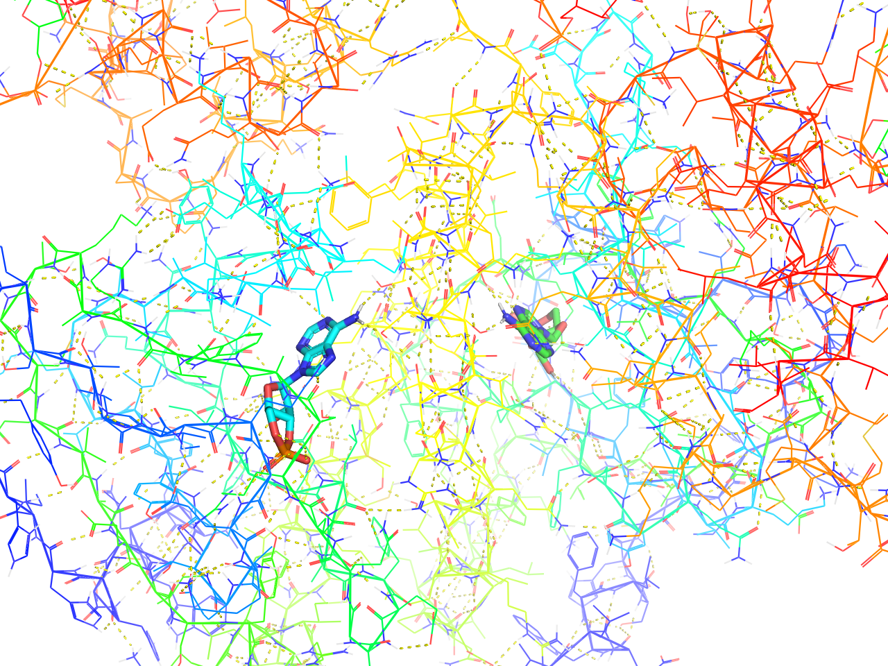
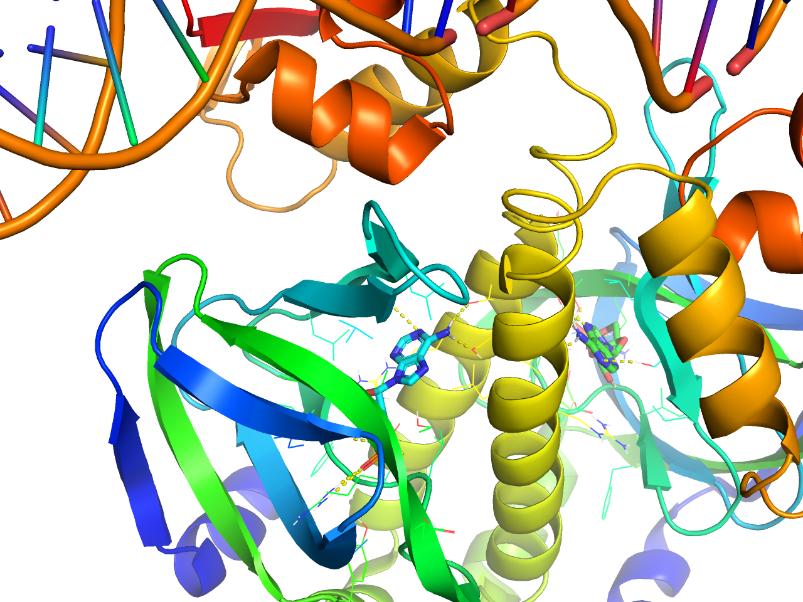
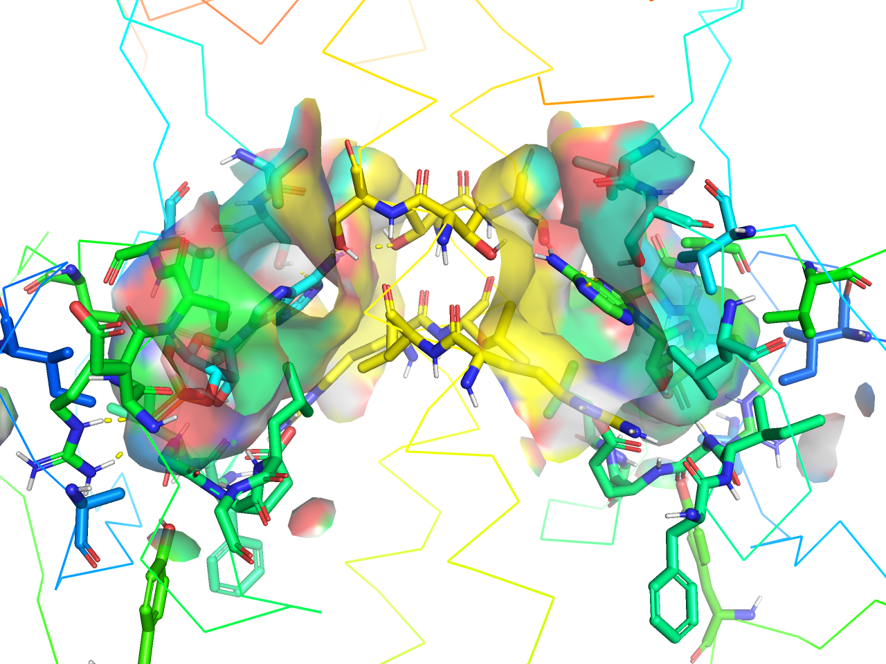
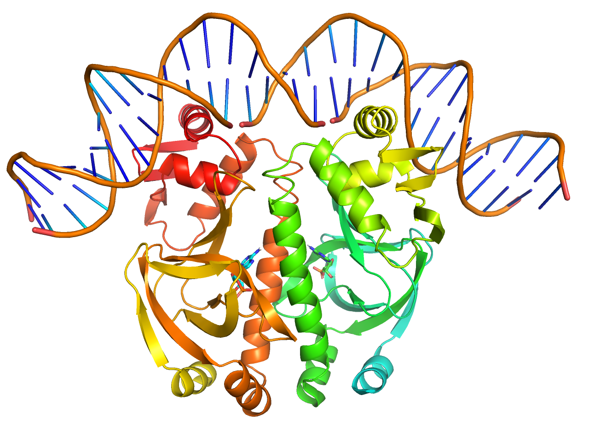
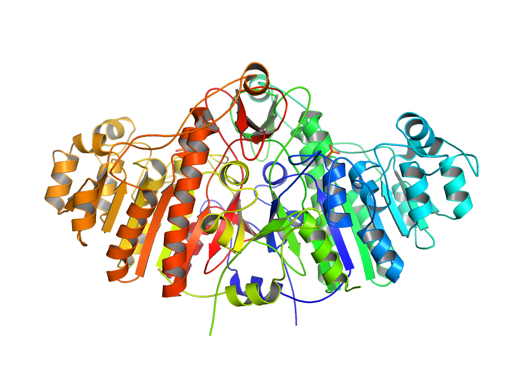
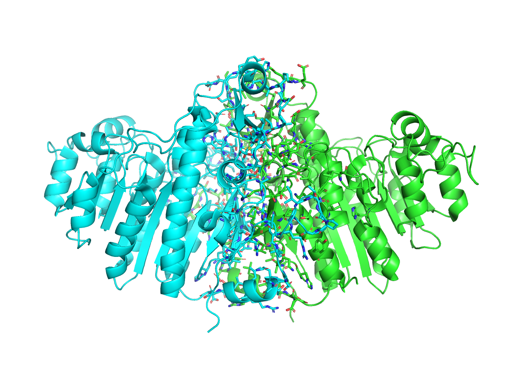
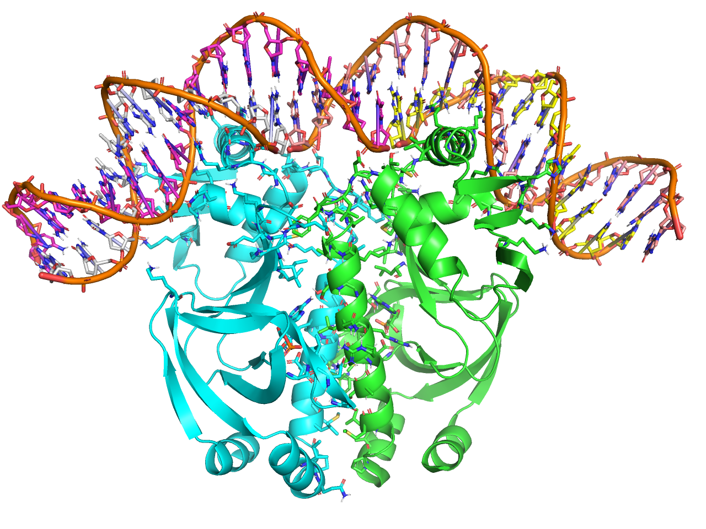

## 表示形式のプリセット
PyMOLのオブジェクトパネルのAボタンの中には`preset`と言うメニューがあります。これを使うと、様々な表示形式に一発で変換できます。

- classified
- simple
- simple (no solvent)
- ball and stick
- b factor putty
- technical
- ligands
- ligand sites
    - cartoon
    - solid surface
    - solid (better)
    - transparent surface
    - transparent (better)
    - dot surface
    - mesh surface
- pretty
- pretty (with solvent)
- publication
- publication (with solvent)
- protein interface
- default

以上のプリセットが用意されています（ver. 2.3.0 時点）。

このプリセットが選択された時、内部処理的には一度デフォルト形式である`classified`を設定してから選択されたプリセットの描画設定を上書きしていく形で適用しています。ただし`pymolrc`に書かれたいくつかの設定値（`transparency`, `surface_quality`, `surface_type`, `sphere_scale`, `stick_radius`, `stick_color`, `cartoon_highlight_color`, `cartoon_fancy_helices`, `cartoon_smooth_loops`, `cartoon_flat_sheets`, `cartoon_side_chain_helper`など）は`auto_show_classified`としてPyMOL起動時に記憶され、`classified`は描画形式以外この値を利用します。

プリセットの定義は、`modules/pymol/preset.py` の中に書かれてあります。 https://github.com/schrodinger/pymol-open-source/blob/master/modules/pymol/preset.py も参考にすると良いでしょう。

ここではギャラリー風に紹介していきます。

### classified
現在PyMOLのデフォルト設定に最も近い描画形式です。タンパク質構造はCartoon表示、リガンドはSphere表示です。デフォルト設定との細かな違いとして、水分子がwire-nonbonded表示されないなどが挙げられますが、デフォルトの見た目に戻したいときはこの設定を呼び出すと良いでしょう。

色設定は変化しません。

> preset.classified("objectname",_self=cmd)

### simple
タンパク質構造は主鎖だけをシンプルに表示するribbon表示、リガンドはStick表示になります。また、チェインごとに自動で色分けがなされます。

> preset.simple("objectname",_self=cmd)

### simple (no solvent)
上記simple表示について、溶媒の表示がなくなったものです。

> preset.simple_no_solv("objectname",_self=cmd)

### ball and stick
各原子を小さめのボールで表し、結合を白色のスティックで表示します。色分けは変化しません。

> preset.ball_and_stick("objectname",_self=cmd)

### b factor putty
温度因子であるB factorをもとに色付けし、さらに温度因子が大きいほど太くチューブ状に表示します。温度因子は青色ほど低く、赤色ほど高くなっています。この表示では主鎖構造のみが表示されます。

> preset.b_factor_putty("objectname",_self=cmd)

### technical
各チェインのN末端からC末端にかけて青色→赤色となるようなRainbowカラーリングが適用されます。また、水素結合が自動的に検出され、`<objectname>_pol_conts`というオブジェクトが生成されます。水素結合を表示させたくない場合はオブジェクトパネル上でこの`<objectname>_pol_conts`の表示をOFFにすればOKです。

> preset.technical("objectname",_self=cmd)

### ligands
上述のRainbowカラーリングが施され、基本的には主鎖構造のみのribbon表示になりますが、リガンドから一定範囲のみ側鎖を含んだline表示が行われ、リガンドへの水素結合自動検出処理が行われます。

カメラもそのリガンド周辺にズームしてくれますが、リガンドが複数ある場合はそれらの中間にカメラを合わせてしまうようです。

> preset.ligands("objectname",_self=cmd)

### ligand sites
上記ligands設定の拡張版と言えます。様々な表示形式が用意されています。いずれのプリセットでも水素結合を検出し、`<objectname>_pol_conts`というオブジェクトを生成します。

#### Cartoon
タンパク質をCartoon表示のままRainbowカラーリング、リガンドをStick表示で、周辺の一定範囲のみline表示にします。

> preset.ligand_cartoon("1alk",_self=cmd)

#### solid surface
タンパク質をribbon表示, Rainbowカラーリング, リガンドをStick表示, 周辺の一定範囲のみsurface表示にします。

> preset.ligand_sites("1alk",_self=cmd)

#### solid (better)
上記solid surfaceプリセット表示のsurfaceクオリティが上がったものです。設定としては`set surface_quality, 1`を追加しています。

> preset.ligand_sites_hq("1alk",_self=cmd)

#### transparent surface
上記solid surfaceの透明度を上げ(`set transparency, 0.33`)、周辺の残基をstick表示にしたものです。

> preset.ligand_sites_trans("1alk",_self=cmd)

#### transparent (better)
上記transparent surfaceプリセット表示のsurfaceクオリティが上がったものです。設定としては`set surface_quality, 1`を追加しています。

> preset.ligand_sites_trans_hq("1alk",_self=cmd)

#### dot surface
上記solid surfaceの表面表示をdotにしたものです。

> preset.ligand_sites_dots("1alk",_self=cmd)

#### mesh surface
上記solid surfaceの表面表示をdotにしたものです。

> preset.ligand_sites_mesh("1alk",_self=cmd)

### pretty
生体分子のレインボー表示、リガンドをstick形式で表示します。

> preset.pretty("objectname",_self=cmd)

### pretty (with solvent)
上記prettyに加えて溶媒やリガンドをnb_spheres表示にします。

> preset.pretty_solv("objectname",_self=cmd)

### publication
cartoon表示において、ループ構造のスムージング設定`set cartoon_smooth_loops, 1`, ヘリックスやシートの内部を灰色に設定`set cartoon_highlight_color, grey50`, ヘリックスのファンシー化`set cartoon_fancy_helices, 1`, シート構造の平坦化（初期設定でON）`set cartoon_flat_sheets, 1`, 側鎖構造のみの表示（初期設定でON）`set cartoon_side_chain_helper, 0`を行います。

> preset.publication("objectname",_self=cmd)

### publication (with solvent)
上記の溶媒表示版です。

> preset.pub_solv("objectname",_self=cmd)

### protein interface
異なるチェインの境目から4.5 Å以内に一部でも含まれる残基をStick表示にします。

> preset.interface("objectname",_self=cmd)

### default
PyMOL 1時代はこのシンプルなライン表示だけの形式がデフォルト表示でした。Defaultとついていますが、現在はデフォルト設定ではなくなり、classified presetに取って替わられています。

> preset.default("objectname",_self=cmd)
