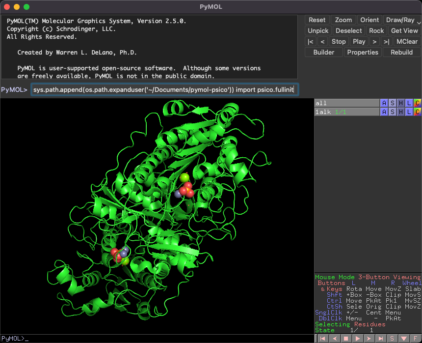

## PyMOLプラグインのインストール方法
### プラグインのダウンロード
例えば私が管理しているもので、 <a href="https://github.com/YoshitakaMo/pymol-psico">https://github.com/YoshitakaMo/pymol-psico</a> があります。これは大元のpsicoからクローンしてきたものです。これを、例としてホームディレクトリ以下の`Documents`ディレクトリにインストールします。

```bash
cd ~/Documents
git clone https://github.com/YoshitakaMo/pymol-psico.git
```

以上でこのpymol-psicoディレクトリをコピーしてくることができます。中身のプラグインはすべてpython言語で書かれています。オープンソース版でPyMOLをインストールした場合には、この文法はインストールに使用したpythonのバージョンに依存します。

### 使用のための初期設定

このプラグインを使える状態にするには、先程のpymol-psicoディレクトリにPyMOL側からPATHを通し、さらに初期化コマンドを入れて上げる必要があります。これは、pymolを開いて以下のコマンドを入力してあげると可能です。

```python
sys.path.append(os.path.expanduser('~/Documents/pymol-psico'))
import psico.fullinit
```

入力する場所はここ（下の `PyMOL>`でも良い）



1行目はPATHの追加コマンドです。先程、psicoディレクトリを`~/Documents`にインストールしたので、上の例では`(os.path.expanduser('~/Documents/pymol-psico'))`となっていますが、`~/Documents`以外のディレクトリに置いた場合は適宜このPATHを変更してください。2行目は、psicoモジュールの初期化コマンドです。Pythonの`import`コマンドでpsicoを使えるようにします。

しかし、これを毎回PyMOLを立ち上げるたびに入れるのは面倒です。そこで、**PyMOLを開いた時に最初に読み込まれる設定ファイル、`~/.pymolrc`に上の設定を書いておきましょう**。（参考：[3.1 FileのEdit pymolrcの項](../ch03/file.md#edit-pymolrc)）そうすると、PyMOL起動時に自動で上のプラグインが使えるようになります。
