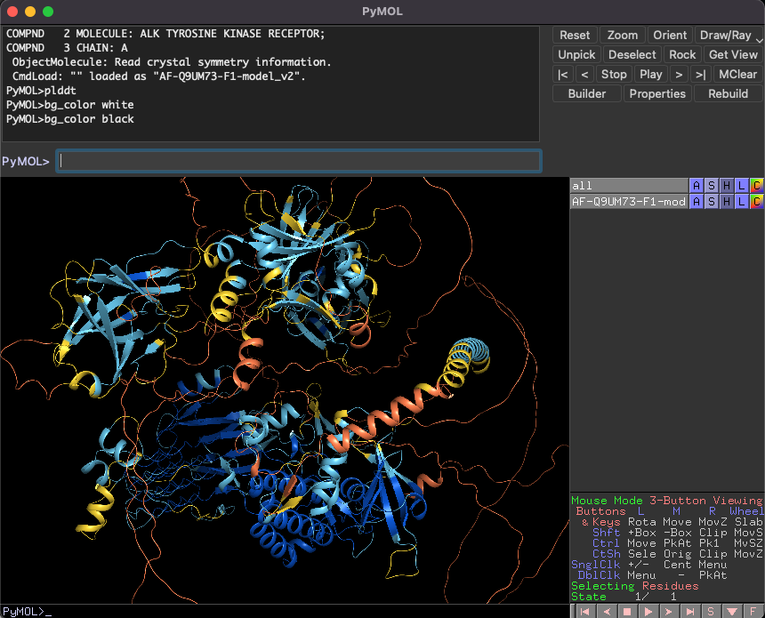
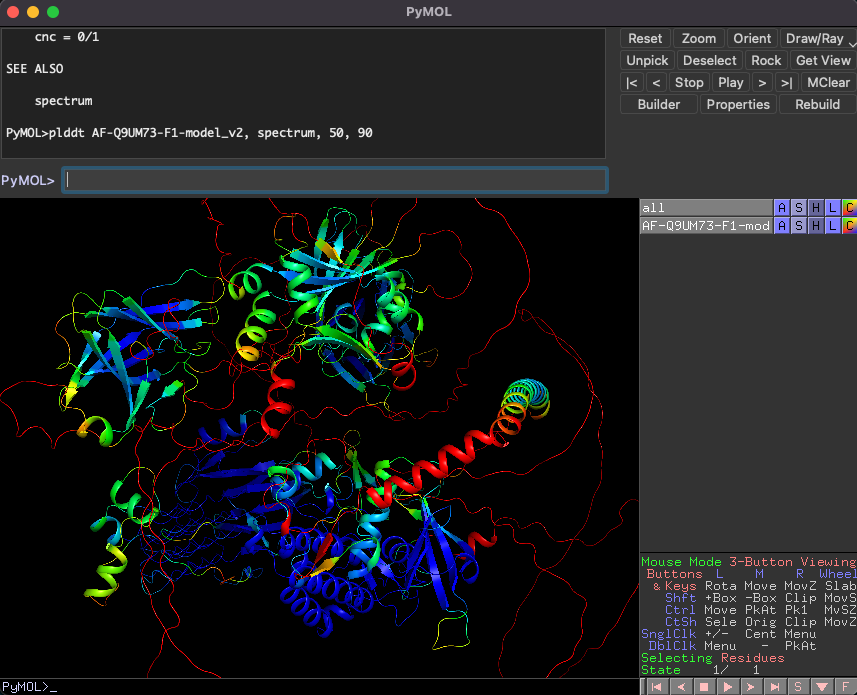

## pLDDTカラーリングプラグイン

[プラグインのインストール方法](installation.md)の手順に従って森脇の**pymol-psico**のインストールがうまく行っていれば、改めて起動した後にPyMOLのコマンドラインで`plddt`というコマンドが使えるようになっています。このコマンドはAlphaFold2またはColabFoldで予測された構造に対し、予測のpLDDT値に応じて色分けを行ってくれます。

<video width="100%" height="100%" controls autoplay loop>
<source src="./image/plddt.mp4" type="video/mp4">
</video>

デフォルトでの色分けは[AlphaFold Protein Structure Database](https://alphafold.ebi.ac.uk/)で使われている配色に準じています。

別のカラーリングスキームとして`spectrum`があります。例えば`plddt (selection), spectrum, 50, 90`とすると、(selection)に入れたオブジェクトについてpLDDT値の下限（赤色）を50に上限（青色）を90としてグラデーション配色してくれます。

詳細は`help plddt`を御覧ください。