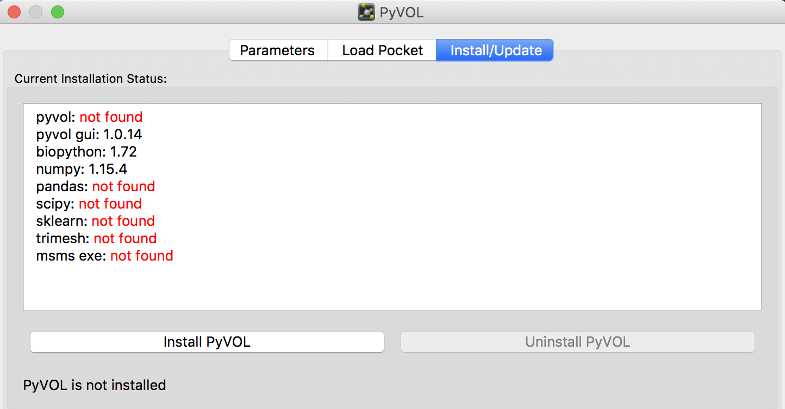
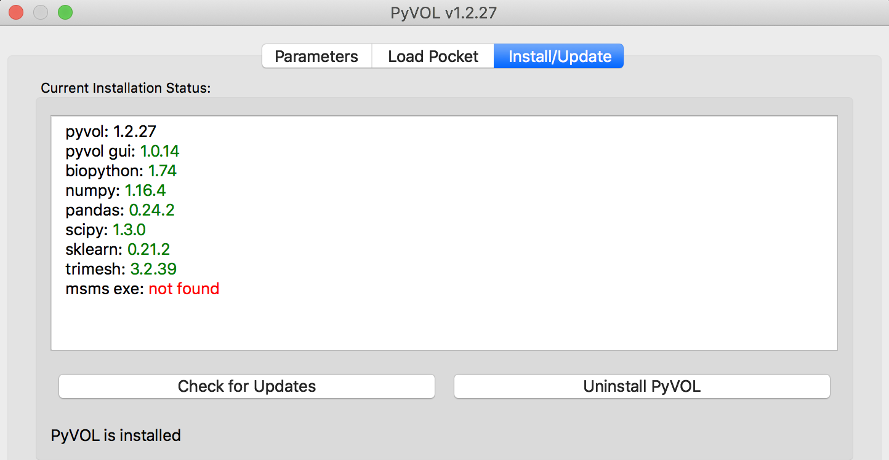

## PyVOL GUIプラグイン
2019年10月24日、[BioRxivにPyMOLプラグインの**PyVOL**というのを開発したよという論文](https://www.biorxiv.org/content/10.1101/816702v1)が投稿されました。


これはタンパク質の中の空隙、つまり基質や薬剤などが入りそうな空間を検出し、体積の値の表示もしてくれるプラグインのようです。ちょっと興味があったのでインストールすることにしてみました。

### 使用可能な環境
-   Linux OSまたはmacOS 10.14.6 (Mojave)以前。**10.15 (Catalina)では今のところ動作しません。**（現在対応中だそうです）

### PyVOLのインストール
以下のGitHubにてこのプラグインをメンテナンスしてくれているようです。
[https://github.com/schlessingerlab/pyvol/](https://github.com/schlessingerlab/pyvol/)

ここの [https://github.com/schlessingerlab/pyvol/blob/master/pyvolgui.zip](https://github.com/schlessingerlab/pyvol/blob/master/pyvolgui.zip) にプラグインのZIPファイルが置いてあるのでDownloadボタンを押すと、`pyvolgui.zip`というファイルがダウンロードされます。これを展開すると、中には`pyvolgui`と`pyvol_plugin`というディレクトリの2つがあるのですが、たぶん`pyvolgui`だけで動作してくれるように思えます。よって、このディレクトリをPyMOLのプラグインディレクトリにコピーしてあげます。
お使いのmacOSにて、インストーラー版でPyMOLをインストールした場合（Licenseを求められる方）は`/Applications/PyMOL.app/Contents/share/pymol/data/startup/`に、Homebrewを使ってOpen-source版をインストールした場合（Licenseがいらない方）には`/usr/local/Cellar/pymol/2.3.0/libexec/lib/python3.7/site-packages/pmg_tk/startup`に、それぞれコピーしてあげます。Linuxの場合はpymolがインストールされているディレクトリを見つけて`python3.x/site-packages/pmg_tk/startup`あたりを探ればたどり着けるんじゃないですかね（適当）。

コピーしたら、PyMOLを起動している場合はいったん閉じて改めて起動します。すると、PluginメニューのところにPyVOLが増えているはずです。


このPyVOLを選択してみて、メニューが開けたら成功です。


### 追加のプログラムのインストール
#### インストーラー版
PyVOLを動かすためにはいくつかのライブラリやプログラムを追加でインストールさせてあげる必要があります。上のPyVOLメニューで**Install/Update**のタブを開き、ここの左に表示されている`Install PyVOL`ボタンを押します。



1分くらい待っていると追加プログラムがすべてインストールされ、使用可能な状態になります。


ちなみに**macOS catalinaでは動作しませんでした**（Mojaveまでは動作します）。

```
subprocess.py", line 1522, in _execute_child
    raise child_exception_type(errno_num, err_msg, err_filename)
OSError: [Errno 86] Bad CPU type in executable: 'msms'
```

これはcatalinaになってから32bitのプログラムを切り捨てたことに起因しています。現在公式で対応中だそうです。

#### Open-Source版
Open-source版の場合は、もしかしたら追加のプログラムを手動でインストールする必要があるかもしれません。もしかしたら上と同じやり方で動作させることができるかもしれないので、先にそっちを試してください（雑）。Homebrewでインストールしていた場合、`msms exe`を除く他のPythonライブラリは以下の1コマンドでインストールできます。

```
pip3.7 install bio-pyvol
```



`msms exe`についてですが、これは http://mgltools.scripps.edu/downloads のところからMSMS 2.6.1をダウンロードして解凍すると、中に`msms.MacOSX.2.6.1`が存在しますので、それを利用します(macOS Mojave以前の場合)。これを、`/usr/local/bin/msms`として利用できるようにコピーしてあげます。

```
cp ~/Downloads/msms_MacOSX_2.6.1/msms_MacOSX_2.6.1 /usr/local/bin/msms
```

この後、Open-source PyMOLを一度再起動してこのInstall/Updateタブを見てみたときに、msms exeのところが`/usr/local/bin/msms`と表示されていればOKです（本当は`/usr/local/bin`以下はHomebrewでインストールしたもののみにしておきたいところですが……）。

Linux OSの場合は64 bit版`msms`が公開されているので、それをダウンロードして同様に`/usr/local/bin`以下にコピーすれば動作します。

以上でPyVOLが利用可能になります。

### 簡単な使い方
タンパク質を選択しておいてからPyVOLプラグインのParametersタブのRunボタンを押すだけです。Load Pocketのタブでは描画方法を色々変えることもできます。（詳細はいつか書きます）


